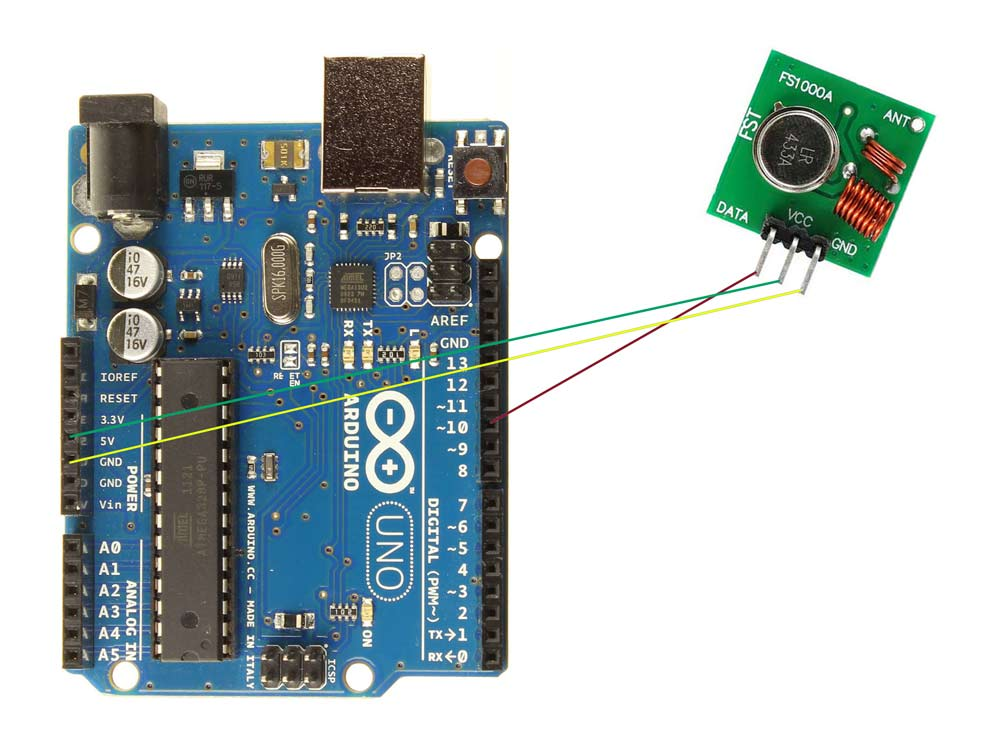
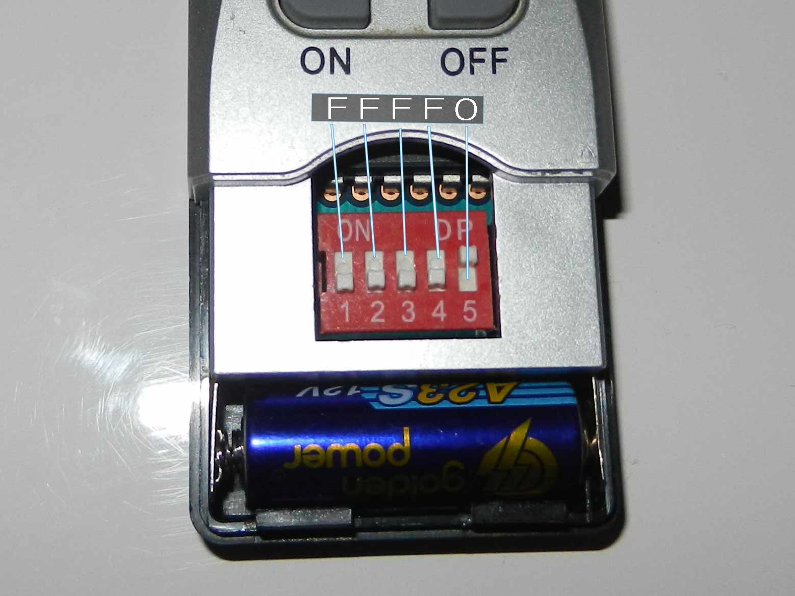
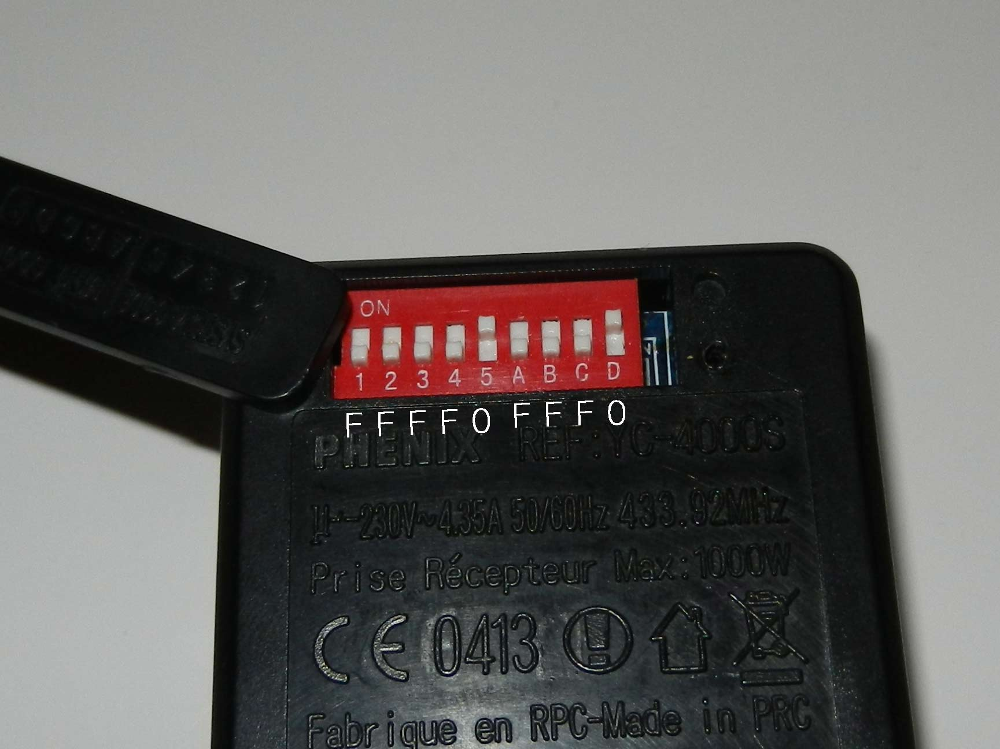
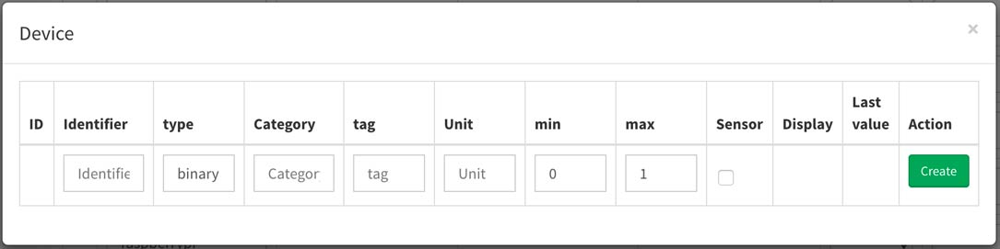
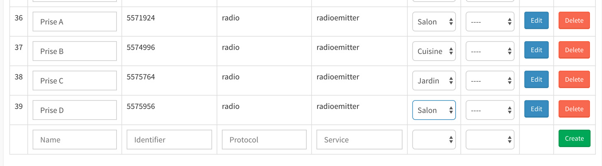
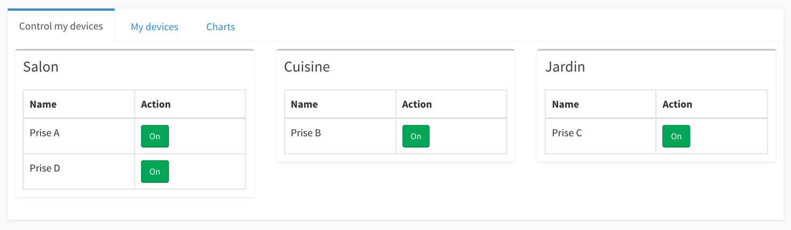

:::danger Update: 21/07/2020
Ce tutoriel est destiné à Gladys v3, il ne fonctionne pas avec Gladys v4 !
:::

Salut à tous,

Comment faire en sorte que Gladys puisse contrôler les appareils électriques chez nous ? Beaucoup d'appareils électriques ( lampes de chevet, machine à café ), ne sont pas connectés mais s'allument directement quand on les branche. Avec des prises télécommandées, il devient possible de connecter ces appareils à Gladys.

L'objectif de ce tutoriel est d'arrive à contrôler des prises <a href="">433Mhz Phénix</a> depuis Gladys.

<!--truncate-->

## Le matériel

- Des prises télécommandées Phénix ( qu'on peut acheter pour une vintaine d'euros [ici](http://amzn.to/1TzNH8u) )
- [Un kit émetteur/récepteur 433Mhz](http://amzn.to/1eZmJYH)
- Un arduino [Nano (4€)](http://amzn.to/1M82tlv) ou [Uno (20€)](http://amzn.to/2pEYSWT)
- Des [câbles M/F](http://amzn.to/2pEZoUP) pour connecter l'émetteur RF 433Mhz à l'arduino.

## Le montage

Le montage est simple, il suffit de brancher l'émetteur 433Mhz à l'arduino suivant le montage suivant :

- Arduino 5V - VCC sur l'émetteur 433Mhz
- Arduino GND - GND sur l'émetteur 433Mhz
- Arduino pin 10 - DATA sur l'émetteur 433Mhz

Ce qui nous donne :



Vous pouvez bien entendu utiliser un arduino Nano, le montage est rigoureusement le même, étant donné que l'arduino Nano a les mêmes PINs.

N'oubliez pas de mettre une antenne (un petit fil de 17cm peut faire l'affaire) sur le port ANT de l'émetteur 433Mhz, cela améliore grandement la portée de l'émetteur!

## Comprendre le fonctionnement des prises 433Mhz Phénix

### La partie reverse-engineering

Le fonctionnement des prises est très simple.

Les prises Phénix ont différents channels ( afin d'éviter les interférences avec des voisins ), et sur chaque channel il est possible de gérer 4 prises télécommandées A, B, C et D.

Je me suis donc amusé à reverse-engineerer le protocole des prises. En écoutant le code binaire envoyé par la télécommande grâce à un récepteur 433Mhz branché à un arduino, on comprend très facilement à quoi correspond chaque bit.

Voici les codes que j'ai obtenu en écoutant les signaux envoyés par la télécommandes :

**Channel 5, prise A, On :**

```
Decimal: 5571921 (24Bit) Binary: 0101010100 00010101 010001 Tri-State: FFFF0 0FFF F0F PulseLength: 325 microseconds Protocol: 1
```

**Channel 5, prise B, On :**

```
Decimal: 5574993 (24Bit) Binary: 0101010100 01000101 010001 Tri-State: FFFF0 F0FF F0F PulseLength: 325 microseconds Protocol: 1
```

**Channel 5, prise A, Off :**

```
Decimal: 5571924 (24Bit) Binary: 0101010100 00010101 010100 Tri-State: FFFF0 0FFF FF0 PulseLength: 325 microseconds Protocol: 1
```

Petite remarque: Les valeurs décimales, binaires, et Tri-States sont juste la même valeur sous différents formats. Exemple, pour la première ligne: 5571921 = 010101010000010101010001 = FFFF00FFFF0F. ( Pour passer de 5571921 à 010101010000010101010001 on fait simplement une conversion décimal => binaire, pour passer à FFFF00FFFF0F on remplace juste 01 par F et 00 par 0\.

On comprend assez vite à quoi correspond chaque partie du code.

**Les 10 premiers bits**

Les 10 premiers bits correspondent au channel de la prise. Voilà comment était configurée ma télécommande :



On comprend vite que :

- "interrupteur en bas" = F
- "interrupteur en haut" = 0

Ainsi, Channel 5 = FFFF0 = 0101010100

**Les 8 bits suivants:**

Les 8 bits suivants correspondent au numéro de la prise.

- A = 0FFF
- B = F0FF
- C = FF0F
- D = FFF0

**Les 6 derniers bits:**

Les 6 derniers bits correspondent à l'action à effectuer, "On" ou "Off".

Le code est simplement :

- On = F0F
- Off = FF0

J'ai résumé sur une photo de la configuration de mes prises comment on retrouve le code :



### Déduire les différents codes

Afin de pouvoir ajouter dans Gladys vos périphériques, vous allez avoir besoin pour chaque prise du code décimal d'extinction de chacune de vos prises (Gladys calculera d'elle même le code décimale d'allumage en faisant +1 sur le code d'extinction)

Voilà dans mon cas les différentes valeurs:

| Channel | Prise | Action | Code TriState  | Code binaire               | Code décimal |
| ------- | ----- | ------ | -------------- | -------------------------- | ------------ |
| 5       | A     | Off    | FFFF0 0FFF FF0 | 0101010100 00010101 010100 | 5571924      |
| 5       | B     | Off    | FFFF0 F0FF FF0 | 0101010100 01000101 010100 | 5574996      |
| 5       | C     | Off    | FFFF0 FF0F FF0 | 0101010100 01010001 010100 | 5575764      |
| 5       | D     | Off    | FFFF0 FFF0 FF0 | 0101010100 01010100 010100 | 5575956      |

Bien entendu si vous changez de channel, mettez à jour le code décimal en fonction dans Gladys.

## Contrôler les prises dans Gladys

Pour contrôler les prises dans Gladys, nous allons nous appuyer sur deux modules: Serial et Radioemitter.

- Installez tout d'abord le module Serial dans Gladys. (Dans le dashboard Gladys, allez dans l'onglet "Modules" => "Store" => Cliquez sur le module => "Installer" )
- Puis, sans rebooter, installez le module Radioemitter
- Téléversez ce [code arduino](https://github.com/gladysassistant/gladys-radioemitter/blob/master/arduino-code.ino) sur votre arduino grâce à [l'IDE Arduino](https://www.arduino.cc/en/main/software). Vous devez avoir les librairires `ArduinoJson` et `RCSwitch` installés dans l'IDE. Pour installer ces librairies, dans l'IDE (version > 1.6) allez à "Sketch" => "Include Library" => "Manage Libraries". Puis cherchez "ArduinoJson" et cliquez sur "install". Pareil pour "RCSwitch".
- Rebootez Gladys
- Connectez votre arduino en USB au Raspberry Pi
- Cliquez sur le bouton "Configuration" du module Serial dans la vue "modules" du dashboard Gladys. Cela devrait chercher votre arduino sur le ports USB du Raspberry Pi, et ajouter votre arduino dans la liste des devices dans Gladys.
- Créez un device dans Gladys (dans la vue "Mes devices") avec les informations suivantes:

![Créer device Gladys])../static/img/articles/fr/controler-des-prises-telecommandee-433mhz/screenshot-device.jpg)

**Attention:** Vous devez remplacer le "identifier" par le code décimal de votre prise, en suivant le système que j'ai expliqué plus haut. Vous pouvez utiliser mon tableau si vous êtes sur le channel 5, ou recalculer les codes décimaux par vous même. Si vous voulez être sûr des codes, vous pouvez toujours écouter le code envoyé par la télécommande grâce au récepteur 433Mhz et utiliser un programme sur Arduino comme [ReceiveDemo_Simple.ino](https://github.com/sui77/rc-switch/blob/master/examples/ReceiveDemo_Simple/ReceiveDemo_Simple.ino), vous avez juste à appuyer sur le bouton "Off" de la télécommande et voir le code qui s'affiche dans le moniteur série sur l'IDE Arduino.

- Puis, cliquez sur le bouton "Edit" du device, et créez le deviceType suivant :



C'est bon, votre prise est déclarée dans Gladys, et est prête à être contrôlée !

Pour la contrôler, vous pouvez tout simplement cliquer sur le bouton "On/Off" dans Gladys du DeviceType binary que vous avez créé. Si ce Device est dans une pièce, il devrait apparaitre dans la vue Device groupée par pièce dans Gladys.

Voilà ce que j'obtiens chez moi:





## Conclusion

J'espère que ce tutoriel vous a plus, il a été écrit à l'origine en 2014, et a été remasterisé en 2017 afin d'être compatible Gladys v3 (enfin!).

N'hésitez pas à poser vos questions sur le [forum Gladys](https://community.gladysassistant.com/) ou en commentaire.
