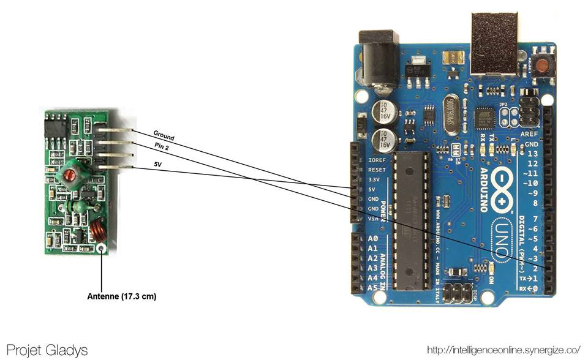

Le Raspberry est un outil formidable pour ses ports GPIOs, mais ceux-ci sont parfois trop limités pour des interactions électroniques beaucoup plus poussées.

Le majeur problème qui m'a poussé à acheter un arduino est la réception de signaux 433Mhz. Dans un de mes derniers tuto je vous expliquais comment recevoir des signaux 433Mhz sur le Raspberry, en utilisant un petit programme "RFSniffer". Cette solution fonctionne, mais surtout à des fins de tests. Le problème est que le Raspberry n'est pas temps réel. Du coup, pour vérifier si un signal 433Mhz n'est pas émis, il doit en permanence checker le récepteur, ce qui sature le CPU, autour de 30/40% ( ce qui est énorme pour juste "attendre" un signal). Si RFSniffer est lancé H24, la consommation et l'échauffement du Raspberry seront élevés ! Et c'est là que l'arduino intervient : et si l'on connectait le récepteur 433Mhz à un arduino, qui s'occuperait de le gérer, et qui ne préviendrait le Raspberry qu'en cas de réception de signal, via le port USB ! C'est ce que nous allons faire dans ce tuto. L'arduino nous permettra aussi par la suite d'utiliser du matériel électronique plus facilement qu'avec le Raspberry, et donc de "soulager" le CPU du Rasp.

<!--truncate-->

## Le matériel

Pour ce tuto, nous aurons besoin :

- Un arduino uno ( 18€ - acheté pour ma part [ici](http://amzn.to/1Dx5l3w) )
- Une alimentation pour arduino ( chez moi elle ne sert à rien car le Rpi donne assez de courant à l'arduino via USB, mais il est vivement conseillé d'en acheter une, car en fonction de l'usage la puissance délivré par le Rpi peut-être insuffisante - par exemple [ici](http://amzn.to/1CRuOtI))
- Si vous souhaitez connecter votre récepteur RF 433Mhz, il vous faudra des [câbles M/F](http://amzn.to/1S3iQ6M)

## Mettre en place l'arduino

Si vous ne connaissez pas bien le fonctionnement d'un arduino, rassurez vous : c'est très simple ! Je vous conseille d'ailleurs vivement si vous débutez d'aller faire un tour sur le tutoriel sur Openclassrooms : [Arduino pour bien commencer en électronique et en programmation](https://openclassrooms.com/fr/courses/2778161-programmez-vos-premiers-montages-avec-arduino).

Mais en gros c'est très simple, il vous suffit de télécharger un petit utilitaire sur votre PC Windows/Mac/Linux ( sur [le site d'arduino](http://arduino.cc/en/Main/Software) ), vous codez depuis l'interface dans un langage très proche du C, puis en connectant votre carte en USB à votre PC, le soft envoie tout seul le programme compilé sur la bête :)

## Envoyer un signal de l'arduino au Raspberry via USB

Nous allons connecter l'arduino au Rpi en USB, et tenter de les faire communiquer entre eux. Par exemple en envoyant du texte de l'arduino vers le Rpi.

### Le code d'envoi sur l'arduino

Copiez collez le code suivant dans le soft arduino, et envoyez le vers votre arduino (si vous ne savez pas comment faire, regardez le tuto Openclassrooms dont le lien est plus haut, c'est hyper bien expliqué ;)

```c
void setup() {
    Serial.begin(9600);
    Serial.print("Lancement du programme !");
}

void loop() {
    Serial.print("Un tour de boucle!");
    delay(1000);
}
```

Explication : au lancement du programme ( dès que l'arduino est sous tension, le programme tourne. Pour relancer le programme, vous pouvez cliquer sur le bouton "reset" à côté du port USB ), la fonction setup() est exécutée, le port série est configuré, avec un débit de donnée de 9600 bits/sec, puis il envoit "Lancement du programme !" via USB. Ensuite, il envoie toutes les secondes "Un tour de boucle" via USB.

### Tester le code directement sur votre PC

Pour tester le code directement, il vous suffit d'ouvrir le moniteur série ( "Outils" => "Moniteur série" ), pour voir ce que l'arduino envoie à votre PC par USB.

### Recevoir un message sur le Raspberry

Pour que cela soit fonctionnel via Gladys, je vais faire le code de réception en NodeJS. Mais cela aurait pu être fait en python, ou autre. Si vous voulez le faire en python, j'ai trouvé un [super tuto](http://electroniqueamateur.blogspot.fr/2014/05/communication-par-usb-entre-raspberry.html) !

### Le code Node.js :

On installe tout d'abord le module npm "serialport" qui va nous permettre de lire les données du port série.

```
npm install -g serialport --unsafe-perm
```

On récupère le nom du port USB du Rpi ou est connecté l'arduino, en faisant la commande :

```
ls /dev/tty*
```

Lancez cette commande avec l'arduino branché, et débranché, et voyez quel nom disparaît et apparaît : c'est le nom du port USB!

Puis on exécute le code suivant : ( en remplaçant "ttyACM0" par le nom du port USB où est connecté votre arduino )

```javascript
var serialport = require("serialport");
var SerialPort = serialport.SerialPort;
var sp = new SerialPort("/dev/ttyACM0", {
  parser: serialport.parsers.readline("n"),
});
sp.on("data", function (data) {
  console.log(data);
});
```

Vous devriez voir apparaître les données envoyées par l'arduino via USB dans la console du Rpi !

## Faire fonctionner le récepteur RF 433Mhz sur l'arduino

- Connectez tout d'abord votre récepteur à l'arduino suivant ce schéma :



- Téléchargez la librairie [RCswitch](https://code.google.com/p/rc-switch/downloads/list)
- Extraire le zip et placer le dossier "RCswitch" dans le dossier "C:UsersUSER_NAMEDocumentsArduinolibraries" de votre PC.
- Relancez le soft arduino sur votre PC!
- Téléchargez [le programme pour arduino](https://github.com/gladysassistant/Gladys-arduino), ouvrez le dans le logiciel arduino, et chargez le dans l'arduino.
- Vous pouvez tester le bon fonctionnement du code en lançant le moniteur série ( "Outils" => "Moniteur série" ), et en déclenchant un détecteur de mouvement/ouverture de porte 433Mhz à côté de l'arduino. Si quelque chose s'affiche dans le moniteur, c'est bon!

## Récupérer les valeurs de l'arduino sur le Raspberry

Il nous suffit de lire le code json renvoyé par l'arduino, avec presque le même code que plus haut ( attention à avoir le module serialport bien installé )

```javascript
var serialport = require("serialport");
var SerialPort = serialport.SerialPort;

var sp = new SerialPort("/dev/ttyACM0", {
  parser: serialport.parsers.readline("n"),
});

sp.on("data", function (data) {
  var result = JSON.parse(data);
  console.log(result[0]["value"]);
});
```

Ici la variable result[0]['value'] contient le code du capteur sans-fil qui a émit.

## Conclusion

Maintenant que nous avons cet arduino connecté à notre Raspberry, le Raspberry peut se concentrer sur des actions plus "haut niveau", et laisser l'arduino gérer le hardware !
