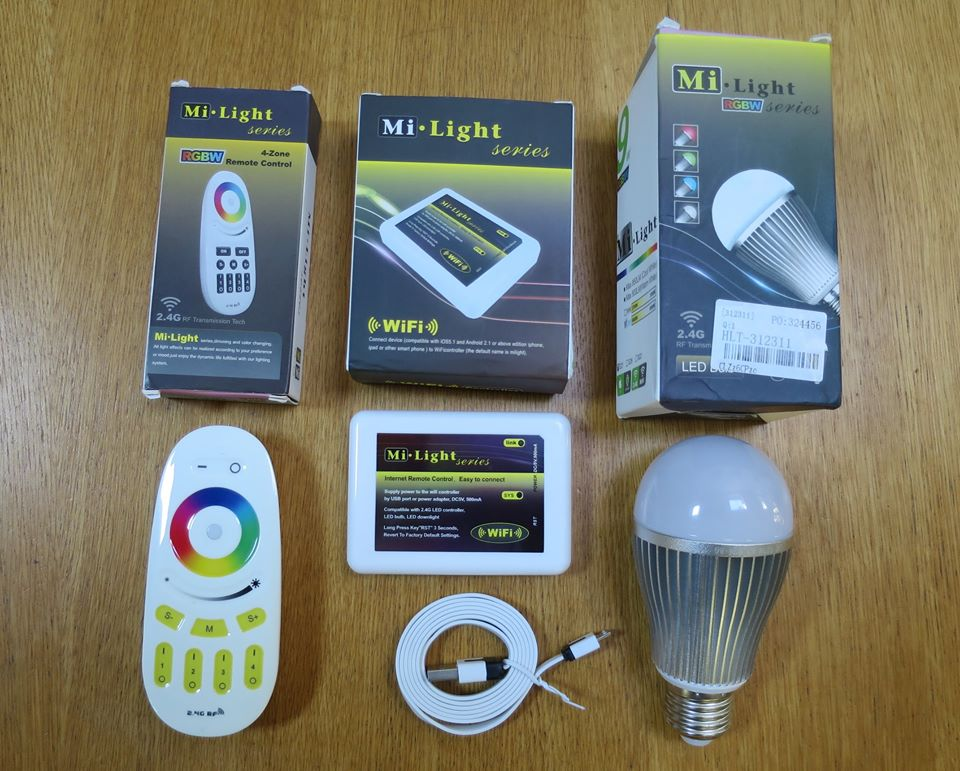

  Update: 21/07/2020: Ce tutoriel a été écrit il y a plusieurs années, il ne concerne pas Gladys v4 ! 

Jusqu'à là, nous ne pouvions commander avec Gladys que les équipements branchés sur des prises grâce aux prises télécommandées RF, mais ça ne permettait pas de contrôler les lumières du logement. Je vous propose ici un test des ampoules WIFI Mi-light, ainsi que comment les piloter depuis notre Raspberry Pi!

<!--truncate-->

## Le matériel

Les ampoules Mi-Light sont les équivalents low cost des Philips Hue. J'ai trouvé cet été ces ampoules sur un site chinois, à l'époque en promotion pour environ 20€ l'unité. Pour faire un commentaire sur ces ampoules, je ne m'attendais pas à une telle qualité ! L''ampoule est vraiment de bonne facture, répond instantanément au commande qu'elles viennent de la télécommande ou du smartphone. Tout est réglable, la couleur, l'intensité de la lumière, et il existe même des modes prédéfinis (passage en fondue de chaque couleur, éclairage stroboscopique, tout est possible vu qu'il s'agit de LEDs dans l'ampoule, aucun risque de griller quoi que ce soit si on allume très rapidement l'ampoule).

Pour faire fonctionner les ampoules, c'est comme avec les Hue, il faut une ou plusieurs ampoules + un pont Wifi pour faire le lien entre les ampoules qui communiquent en 2,4Ghz, et le réseau Wifi.

- L'ampoule peut être trouvée par exemple [ici](https://www.amazon.fr/gp/search/ref=as_li_qf_sp_sr_il_tl?ie=UTF8&tag=gladproj-21&keywords=milight lamp&index=aps&camp=1642&creative=6746&linkCode=xm2&linkId=36a351a4cfb9f88f723d78883908fefe). Il y a plusieurs points à faire attention en commandant : Si vous voulez un éclairage puissant, vérifier bien que c'est une ampoule 9W (il existe une version moins puissante, mais moins cher, à voir selon votre usage et la pièce où vous allez mettre l'ampoule). Aussi, l'ampoule à un mode "éclairage classique", qui est soit un éclairage blanc (Cold White), soit un éclairage blanc chaud (Warm White), l'éclairage blanc est relativement artificielle et ça n'est pas forcément agréable dans une pièce à vivre... J'ai reçu par erreur une ampoule "froide", et j'avoue que j'utilise surtout du coup les couleurs du coup. Faites attention ! Regardez aussi si une télécommande est fournie, c'est assez pratique pour commander l'ampoule hors application. Le site de Mi-Light n'en fournie pas, le chinois la fournie il me semble ! (Pour information les ampoules sont de type E27 ici, le standard des ampoules à visser).

- Le pont Wifi peut être trouvé [ici](https://www.amazon.fr/gp/search/ref=as_li_qf_sp_sr_il_tl?ie=UTF8&tag=gladproj-21&keywords=milight wifi&index=aps&camp=1642&creative=6746&linkCode=xm2&linkId=13dcf2f18dfbefbfaf90bde9b38e22b2).

## Installation

L'installation est relativement simple et est expliqué sur un petit manuel dans la boite du module Wifi, ainsi que sur le site de Mi-light [ici](http://www.milight.com/support/). Mais voici un petit résumé de l'installation :

- Téléchargez l'application Mi-light sur [Android](https://play.google.com/store/apps/details?id=com.irainxun.wifilight&hl=fr) ou [iOS](https://itunes.apple.com/fr/app/milight/id680443167?mt=8)
- Branchez le module Wifi
- Allez dans les paramètres Wifi de votre smartphone, et connectez vous au réseau "Milight"
- Allez sur l'application Milight, dans "AP Configuration", puis entrez les informations de connexions au Wifi de votre box. Une fois les informations rentrées, l'application va vous demander si vous voulez redémarrer le module Wifi, dites "oui" !
- Il ne vous reste plus qu'à appairer l'ampoule ! Pour cela, installez votre ampoule, et allumez la lumière pour qu'elle reçoive du courant. Vous avez 3 secondes pour appuyer sur un bouton de zone (les boutons du bas sur l'application). Quand la lampe est appairée, elle clignotera 3 fois.

## Contrôler l'ampoule avec le Raspberry Pi

Maintenant que notre ampoule fonctionne avec l'application, il est intéressant de pouvoir la contrôler depuis le Raspberry pour que Gladys puisse avoir le contrôle sur notre éclairage.

Pour cela, il suffit d'envoyer des paquets UDP au pont Wifi ! J'ai trouvé une librairie NodeJS qui permet le contrôle des Mi-light en JavaScript : [AppLamp](https://gist.github.com/AppLamp-API).

Téléchargez les fichiers "wifibox.js", et "commands.js" de la librairie, puis créez un fichier "lampe.js" par exemple. Voilà un exemple d'utilisation de la librairie :

    var WifiBoxModule = require('./wifibox.js');
    var cmd = require('./commands.js');
    var box = new WifiBoxModule("192.168.0.255", 8899 );
    box.command(cmd.rgbw.on(0));

Cette exemple va juste allumer toutes les ampoules de toutes les zones (0 => toutes zones, 1=> zone 1, 2=> zone 2, etc.. )

Remarque : Comme indiqué dans l'exemple de la librairie, il n'y a pas besoin de connaître l'IP exact du module Wifi, il suffit de faire une requête sur l'adresse de broadcast de votre réseau. ( Si vous ne savez pas comment connaître l'adresse de broadcast de votre réseau, un petit tour sur Google vous aidera sûrement, il y a plein de tutos de réseaux qui parle du sujet, ce n'est pas compliqué !)

## Aller plus loin

Si vous voulez utiliser pleinement tout le potentiel de ces lampes, lisez le fichier "commands.js" de la librairie, toutes les fonctions sont détaillées, et le code est bien commenté. Attention, si vous voulez envoyer plusieurs requêtes à la suite, pensez à espacer vos requêtes de 50ms minimum pour éviter que des paquets soient perdus !

## Conclusion

Nous sommes maintenant capable de contrôler les ampoules de notre logement ! Et pour un prix relativement abordable par rapport à des solutions comme les Philips Hue... On peut imaginer maintenant un nombre incalculable de scénarios. Les lampes peuvent désormais s'allumer progressivement le matin dans les chambres (pour un réveil plus en douceur qu'une lampe qui s'allume brusquement, ou qu'une musique). On peut imaginer différents scénarios, en cas d'intrusion clignotement des lampes en rouges, pour les soirées des modes multicolore et stroboscopique, les possibilités sont infinis !

Si vous avez des idées de scénarios, n'hésitez pas dans les commentaires ;) Ou sur le forum n'hésitez pas à partagez vos différents scripts !
