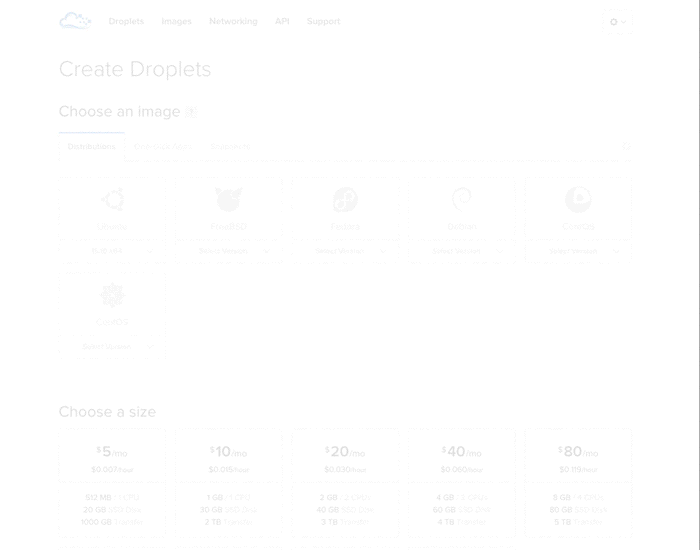
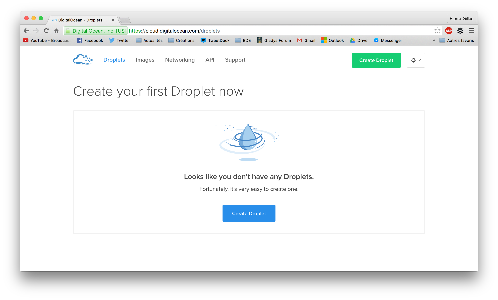
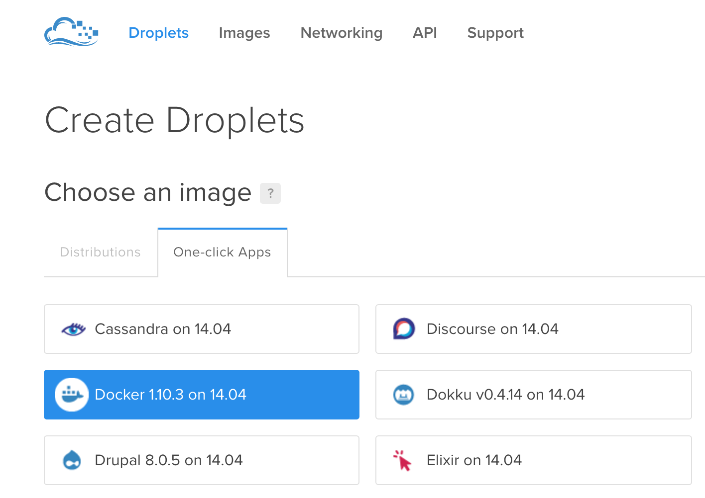
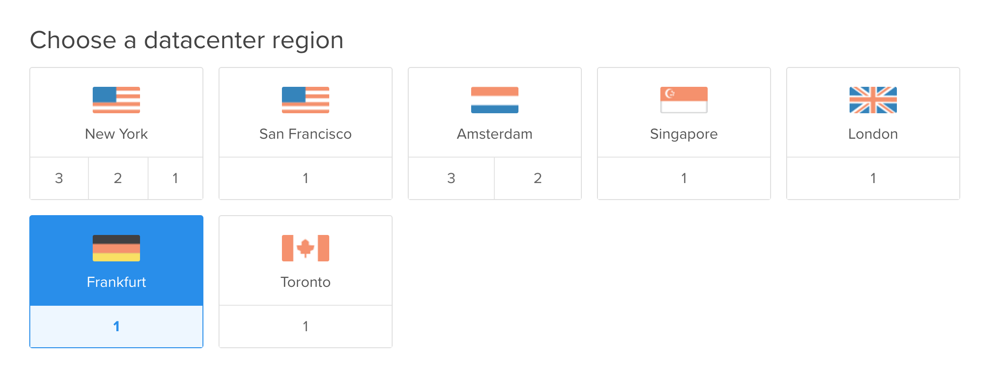
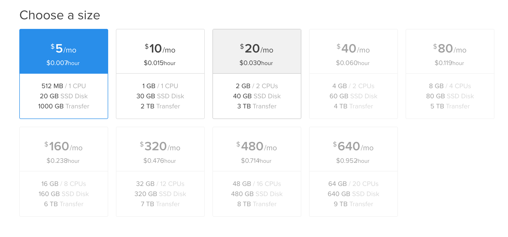
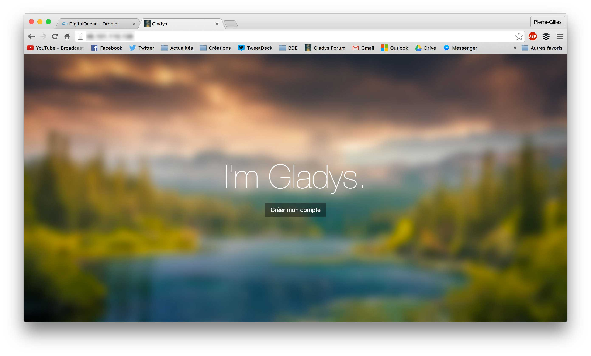

<div class="alert alert--danger" role="alert">
  Update: 21/07/2020: Ce tutoriel a été écrit il y a plusieurs années, il ne concerne pas Gladys v4 ! 
</div>

Salut à tous !

Comme je vous disais la semaine dernière, Gladys 3.0 apporte le support de Docker, une techno dont je suis pas mal fan !

Dans ce tutoriel, je vais vous montrer comment mettre en place Gladys sur un serveur en 5 minutes (max). J'aurais aimé faire ce tutoriel en vidéo, mais je me suis rendu compte que ma carte son USB était vraiment de mauvaise qualité, et que le micro que j'avais acheté rendait du coup assez mal sur cette carte son. Je ferais sûrement une vidéo plus tard quand j'aurais réglé ce problème.

<!--truncate-->

## Le serveur



Pour ce tutoriel je vous propose de tester Gladys sur DigitalOcean, je ne sais pas si vous connaissez, c'est une startup qui propose des serveurs à déployer en quelques clics pour des prix vraiment abordables.

Pour vous donner un ordre d'idée, pour 5$ par mois, on a un serveur 1 CPU + 512Mo de RAM + 20go de SSD + 1To de transfert. Et ce qui est intéressant, c'est que l'on peut payer à l'heure, ce qui ramène ici à 0.007$/'heure, plutôt pas mal pour prototyper comme ici. ( si on fait tourner le serveur une heure, on ne paiera quasi rien... )

**Petite remarque:** Je ne suis aucunement affilié à DigitalOcean, je m'en sers régulièrement pour prototyper des petits trucs car on a son serveur en 30 secondes, et que c'est vraiment simple d'usage. Après pour de l'hébergement plus complet (avec du stockage performant, un CDN, etc... ) je privilégie plutôt Amazon Web Service.

Pour ce tutoriel, je vous propose mon lien de parrainage qui vous offrira 10\$ de crédit, soit 2 mois de Gladys en ligne gratuit ! ( j'espère que ça marche ), ça vous évitera de payer juste pour tester :) ( et je touche des crédits aussi normalement, enfin honnêtement ça m'est plutôt égal, je n'ai pas de besoin particuliers en serveurs chez eux)

Pour se créer un compte, ça se passe du coup ici => [DigitalOcean](https://m.do.co/c/4cdf825eddf1).

## Créer le droplet

Une fois que vous avez créé votre compte DigitalOcean, il faut créer ce qu'ils appellent un "Droplet" (une VM en gros).



Tout d'abord, sélectionnez "Create droplet".



Puis, dans l'onglet "One-click apps", sélectionnez "Docker".



Vous devez ensuite sélectionner un datacenter où votre serveur sera lancé. L'emplacement n'a pas beaucoup d'importance, mais je vous conseille de prendre un serveur proche de vous, sinon vous aurez une latence pas forcément agréable. J'ai mis Frankfurt pour ma part.



On sélectionne ensuite le tarif que l'on souhaite, ici 5\$ suffira amplement, Gladys tourne très bien dessus !


Ensuite, DigitalOcean vous propose d'entrer une clé SSH pour pouvoir vous connecter au serveur, je vous recommande très fortement de le faire, se loguer avec mot de passe c'est pas super secure.

Pour mettre en place les clés SSH, je vous conseille [ce tutoriel](https://www.digitalocean.com/community/tutorials/how-to-use-ssh-keys-with-digitalocean-droplets).

**Note:** Si vous n'arrivez vraiment pas à vous servir des clés SSH, vous pouvez toujours laisser l'option décochée, DigitalOcean vous enverra le mot de passe root par mail. C'est pas secure sur le long terme, mais bon pour prototyper... :)

Vous pouvez désormais cliquer sur "Create Droplet" et voir votre serveur se déployer ! Normalement en 30 secondes il devrait être en ligne :)

## Se connecter au serveur

Maintenant que le serveur tourne, vous pouvez désormais vous connecter au serveur en SSH.

Si vous êtes sur Mac/Linux, tapez dans votre terminal :

```
ssh root@your-ip-address-here
```

**Remarque :** Vous devez avant avoir ajouté le serveur à la liste des clés authorisées sur votre machine ( cf tutoriel précédent ) avec la commande :

```
cat ~/.ssh/id_rsa.pub | ssh root@[your.ip.address.here] "cat >> ~/.ssh/authorized_keys"
```

Sur Windows vous pouvez utiliser [Putty](http://www.putty.org/).

**Remarque 2:** Si vous n'aviez pas donné de clé SSH à DigitalOcean, lors de la connexion en SSH le terminal vous demandera de taper le mot de passe root que DigitalOcean vous aura envoyé par mail. Sur Windows vous devez normalement pouvoir spécifier à Putty un mot de passe.

## Lancer MariaDB

Nous allons maintenant pouvoir lancer un container MariaDB. Pour cela, vous n'avez qu'à lancer la commande sur le serveur :

```bash
docker run --name gladys-mariadb \
--restart=always \
-v /var/lib/mysql:/var/lib/mysql \
-e MYSQL_ROOT_PASSWORD=mysecretpassword \
-e MYSQL_DATABASE=gladys \
-d mariadb:latest
```

Lorsque vous allez exécuter cette commande, Docker va télécharger l'image MariaDB depuis le Docker Hub, cela devrait prendre 20/30 secondes environ. Pensez à mettre un mot de passe custom ! ( même si cela ne change pas grand chose, vu que nous n'allons pas exposer le container MariaDB à l'extérieur, seul le container Gladys local pourra y accéder )

**Explications**

- `--restart=always` => nous voulons que si le container/la machine crash, il redémarre automatiquement
- `-v /var/lib/mysql:/var/lib/mysql` => Ici, nous montons un volume au container afin que les fichiers enregistrés par MariaDB soit enregistrés sur la machine "parente". Car lorsqu'un container est mis à jour/relancé, tout son contenu est supprimé, il ne faut rien enregistrer dans un container Docker ! Du coup ici les données MariaDB seront préservées même en cas de suppression du container.
- `-e MYSQL_ROOT_PASSWORD=mysecretpassword` et `\ -e MYSQL_DATABASE=gladys \` => on spécifie ici les variables d'environnements qui seront lues par MariaDB pour définir le mot de passe root et le nom de la base de donnée.
- `-d mariadb:latest` => L'option '-d' signifie 'detached', c'est à dire que le container va tourner en arrière-plan. "mariadb:latest" est le nom de l'image que l'on veut lancer ( mariadb est l'image officielle MariaDB Docker), et "latest" signifie que nous voulons la dernière version de MariaDB ( version 10 ici ).

## Initialiser Gladys

Il faut ensuite lancer le script d'init Gladys afin que Sails.js puisse construire les tables dans la base de donnée.

Pour cela, il suffit de faire la commande :

```
docker run --name gladys-node-init \
-v /root/hooks:/src/api/hooks \
-e NODE_ENV=development \
-e MYSQL_HOST=mariadb \
-e MYSQL_PASSWORD=mysecretpassword \
-e MYSQL_PORT=3306 \
-e TZ=Europe/Paris \
--link gladys-mariadb:mariadb \
gladysassistant/gladys \
node init.js
```

## Lancer Gladys

Pour lancer Gladys, il faut taper la commande :

```
docker run --name gladys-node \
--restart=always \
-p 80:8080 \
-v /root/hooks:/src/api/hooks \
-e NODE_ENV=production \
-e MYSQL_HOST=mariadb \
-e MYSQL_PASSWORD=mysecretpassword \
-e MYSQL_PORT=3306 \
-e TZ=Europe/Paris \
--link gladys-mariadb:mariadb \
-d gladysassistant/gladys
```

Pensez aussi ici à remettre votre mot de passe Mariadb.

**Explications:**

- `-p 80:8080` => On map le port 80 du droplet au port 8080 du container, pour pouvoir accéder à Gladys depuis notre navigateur sur le port 80.
- `-e TZ=Europe/Paris` => On définit le fuseau horaire qu'utilisera le conteneur. Vous pouvez consulter [cette liste](https://en.wikipedia.org/wiki/List_of_tz_database_time_zones) sur wikipédia si vous ne savez quelle valeur renseigner.
- J'expliquerais sûrement dans un prochain tuto comment mettre en place un proxy Nginx avec Docker devant le serveur Node.js, afin de pouvoir installer un certificat SSL par exemple, faire du load-balancing, de la compression gzip des assets, mais pour ce tuto l'objectif c'était d'être simple !

## Gladys is live !



Et voilà, Gladys tourne ! Vous pouvez vous rendre sur votre navigateur, taper l'IP de votre serveur, et voir Gladys tourner.

Vous pouvez désormais configurer votre Gladys. Dès qu'un premier compte sera créé, il ne sera plus possible de se créer un compte ( c'est une sécurité de la v3 ). Ainsi vous pouvez tout à fait laisser tourner cette instance de Gladys, personne ne pourra y accéder à part vous.

## Voir les logs

Si à un moment, vous avez besoin de voir les logs de Gladys, c'est très simple, tapez la commande :

```
docker ps
```

Cela va vous afficher la liste des containers qui tournent. Pour voir les logs d'un container, tapez :

```
docker logs ID_DU_CONTAINER
```

Pour l'ID, inutile de le taper en entier, vous pouvez taper les 2 premiers caractères, cela suffit à Docker pour le différencier ( sauf si vous avez un autre container avec le même début d'ID, dans ce cas tapez plus de caractères )

## Conclusion

Et voilà, en quelques minutes on a pu mettre en place une instance de Gladys v3 !

N'hésitez pas si vous avez des questions, et bonne Pâques à tous !
