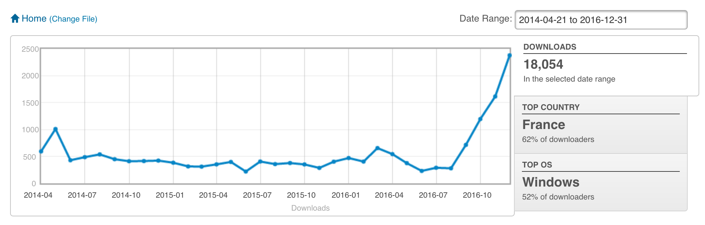
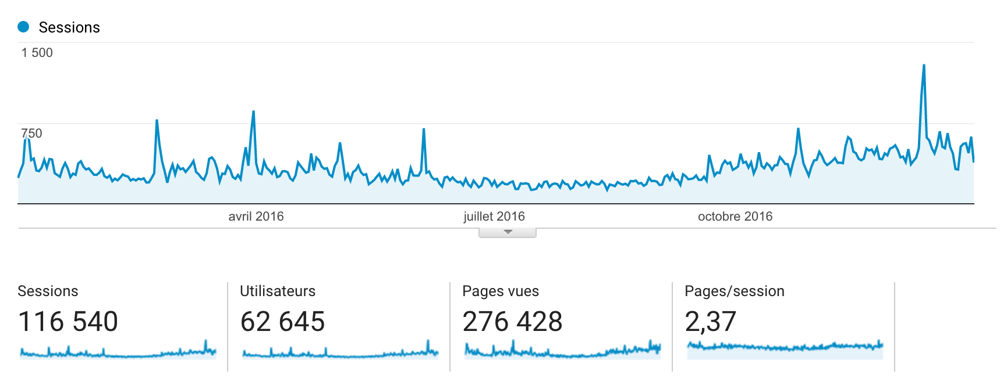
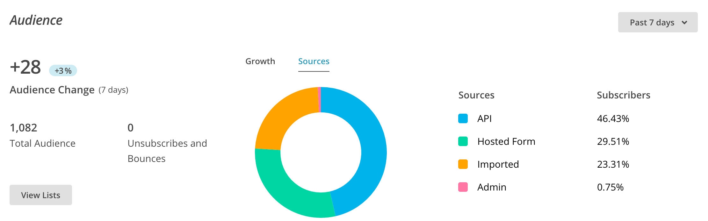
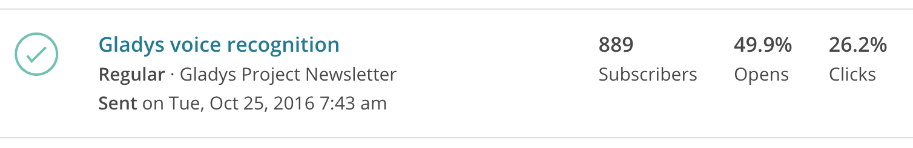

Salut à tous !

Je voulais revenir avec vous sur cette année 2016 qui a été plutôt riche en nouveautés pour le projet Gladys, et vous présenter ce que j'ai prévu pour 2017.

<!--truncate-->

## Quelques statistiques sur le projet

### Les téléchargements

L'année 2016 a été plutôt spectaculaire en terme de croissance sur le projet, car nous avons dépassé les **18 000 téléchargements** de l'image de Gladys pour Raspberry Pi ! Et cela en comptant uniquement les téléchargements Sourceforge, c'est sans compter les téléchargements GitHub, les git clone ni les installations via NPM. Je suis encore choqué de la croissance mensuelle sur les 5 derniers mois de l'année 2016, je vous laisse juger sur la courbe :

( oui, nous tournons à plus de 800 téléchargements par semaine de Gladys juste sur Sourceforge ^^)

### Les visiteurs sur le site

Le nombre de visiteurs sur le site a lui aussi été en augmentation avec **62 000 visiteurs uniques** sur le site cette année !

Le beau pic que l'on voit sur la fin de l'année, c'est lorsque j'ai posté Gladys sur Reddit, ça a vraiment apporté un petit coup de boost au projet, et ça a apporté beaucoup d'utilisateurs internationaux ( principalement américains ). [Le post](https://www.reddit.com/r/homeautomation/comments/5hqp1t/gladys_a_jarvislike_opensource_home_assistant/) a fini a 147 upvotes sur ce sub-reddit, ce qui est vraiment pas mal comparés aux autres posts sur ce channel.

### Le forum

Sur [le forum](https://community.gladysassistant.com), nous sommes désormais plus de **500 membres**, avec environ **6 000 messages postés** !

Merci encore à tous ceux qui intéragissent sur le forum, c'est vraiment un endroit d'échange passionnant et je trouve chaque jour de nouvelles idées pour Gladys grâce à vos remarques.

J'aimerais d'ailleurs mettre en place un forum séparé pour nos amis anglophone, car nous avons de plus en plus d'utilisateurs internationaux... J'hésite à mettre en place un Discourse, après je ne sais pas ce que ça vaut en terme de SEO et si c'est si pratique que ça à utiliser. Si certains ont des idées d'autres systèmes/des retours sur Discourse, je suis preneur !

### Les réseaux sociaux

Sur Twitter, vous êtes désormais 1 590 followers à suivre le compte [@gladysassistant](https://twitter.com/gladysassistant).

Sur Facebook, vous êtes plus de 200 à avoir liké [la page Gladys Assistant](https://www.facebook.com/gladysassistant).

Sur Instagram, vous êtes 267 à suivre [@gladysassistant](https://www.instagram.com/gladysassistant/).

J'insiste, je n'ai jamais acheté de followers sur aucunes plateformes, tout cela est naturel et j'espère que ces nombres ne vont que continuer à croître en 2017 :)

### La newsletter

La bonne surprise de cette fin d'année, c'est [la newsletter du projet](http://eepurl.com/bdrXCv) qui vient de passer le cap des 1 000 inscrits ! J'envoie assez peu de mails, mais c'est toujours agréable quand j'en envoie de voir que vous êtes autant réceptif et que ces emails ne sont pas envoyés dans le vide :D On est sur un taux d'ouverture de 50% en moyenne et de 20/25% de clics, c'est assez bon et j'espère que ça va le rester en 2017 !

Un exemple de ce que vois côté MailChimp lorsque j'envoie un mail :

### Les évènements/conférences

J'ai beaucoup été contacté cette année pour venir parler de Gladys à des évènements/conférences, et c'était vraiment un plaisir pour moi de venir à chaque fois! Croyez-moi, voir en vrai les gens qui vous suivent depuis plusieurs années, qui vous racontent leur expérience avec Gladys, leur installation et comment ils s'éclatent chez eux grâce au projet, ça fait juste super chaud au coeur.

Je vous ai fais un petit récapitulatif photo des différents évènement que j'ai pu faire cette année :

<blockquote class="twitter-tweet" data-lang="fr">
Quelques photos de mon talk à l&#39;<a href="https://twitter.com/utc_compiegne">@utc_compiegne</a> pour la conférence USEC  &quot;L&#39;ingénierie par et pour l&#39;innovation&quot; ! <a href="https://t.co/hn7OBCCWpE">pic.twitter.com/hn7OBCCWpE</a>
&mdash; Gladys Assistant (@gladysassistant) <a href="https://twitter.com/gladysassistant/status/751323790697783296">8 juillet 2016</a></blockquote>

<blockquote class="twitter-tweet" data-lang="fr">
Présentation de Gladys à la conférence USEC  &quot;L&#39;ingénierie par et pour l&#39;innovation&quot; ! Crédits : Charles Herlin <a href="https://t.co/QchfylAowd">pic.twitter.com/QchfylAowd</a>
&mdash; Gladys Assistant (@gladysassistant) <a href="https://twitter.com/gladysassistant/status/751328794556960768">8 juillet 2016</a></blockquote>

<blockquote class="twitter-tweet" data-lang="fr">
Derniers ajustements sur les slides pour <a href="https://twitter.com/Les_Futurs">@les_futurs</a> demain à la <a href="https://twitter.com/hashtag/TourMontparnasse?src=hash">#TourMontparnasse</a> ! <a href="https://twitter.com/hashtag/tw?src=hash">#tw</a> <a href="https://t.co/x6ec92hb8Z">https://t.co/x6ec92hb8Z</a> <a href="https://t.co/VIRrSBxGKg">pic.twitter.com/VIRrSBxGKg</a>
&mdash; Gladys Assistant (@gladysassistant) <a href="https://twitter.com/gladysassistant/status/736232774768721921">27 mai 2016</a></blockquote>

<blockquote class="twitter-tweet" data-lang="fr">
Quelques photos du <a href="https://twitter.com/HumanTalks">@HumanTalks</a> Compiègne à <a href="https://twitter.com/utc_compiegne">@utc_compiegne</a> du 10 Mai dernier ! <a href="https://t.co/jaHJFeO3D9">pic.twitter.com/jaHJFeO3D9</a>
&mdash; Gladys Assistant (@gladysassistant) <a href="https://twitter.com/gladysassistant/status/734041027414216708">21 mai 2016</a></blockquote>

<blockquote class="twitter-tweet" data-lang="fr">
Venez voir Gladys à <a href="https://twitter.com/MakerFaireParis">@MakerFaireParis</a> et elle vous offre le café ! ( si vous lui demandez ) <a href="https://twitter.com/hashtag/MFP16?src=hash">#MFP16</a> <a href="https://t.co/A1BLHz43DA">pic.twitter.com/A1BLHz43DA</a>
&mdash; Gladys Assistant (@gladysassistant) <a href="https://twitter.com/gladysassistant/status/726320343648985089">30 avril 2016</a></blockquote>

<blockquote class="twitter-tweet" data-lang="fr">
Super visite de <a href="https://twitter.com/42born2code">@42born2code</a> après les présentations ! <a href="https://twitter.com/hashtag/MFP16?src=hash">#MFP16</a> <a href="https://twitter.com/hashtag/tw?src=hash">#tw</a> <a href="https://t.co/0sL7KzKzRX">https://t.co/0sL7KzKzRX</a> <a href="https://t.co/SFlaOKaPDD">pic.twitter.com/SFlaOKaPDD</a>
&mdash; Gladys Assistant (@gladysassistant) <a href="https://twitter.com/gladysassistant/status/712388462800936961">22 mars 2016</a></blockquote>

<blockquote class="twitter-tweet" data-lang="fr">
Fin de <a href="https://twitter.com/hashtag/ParisMakers?src=hash">#ParisMakers</a> ! Super expérience, plein de rencontres et de nouveaux contacts ! <a href="https://twitter.com/hashtag/mak?src=hash">#mak</a>… <a href="https://t.co/gE24dIMnch">https://t.co/gE24dIMnch</a> <a href="https://t.co/mTFaVZ6IUa">pic.twitter.com/mTFaVZ6IUa</a>
&mdash; Gladys Assistant (@gladysassistant) <a href="https://twitter.com/gladysassistant/status/702533171267694592">24 février 2016</a></blockquote>

Si vous êtes intéressés par un talk sur Gladys dans votre structure en 2017, n'hésitez pas à me contacter sur la page contact du site.

## Les nouveautés de 2016

### Une version 3 de Gladys

La nouveauté majeure de cette année, c'était la sortie de Gladys v3 en Septembre 2016. L'objectif de cette version 3 était de repenser totalement la gestion des périphériques dans Gladys. Au lieu d'avoir plein de modules qui réinventent la roue à chaque fois, les périphériques domotiques sont désormais gérés de façon abstraite dans Gladys nativement, et les modules n'interviennent plus que dans la partie "communication avec les périphériques". Ils font office de drivers en quelque sorte.

En terme de structure de donnée, cela ressemble à ça :

Cette amélioration a permis de réduire considérablement le temps de développement d'un module. Concrètement, pour des technos assez simple comme les ampoules Milight ou les Philips Hue, en quelques heures on peut écrire un premier module fonctionnel.

### La reconnaissance vocale dans Gladys

Et oui, il y a désormais un module de reconnaissance vocale dans Gladys !

J'en avais parlé dans un article sur le blog : [De la reconnaissance vocale sur Raspberry Pi avec Gladys ? Oui ! ](https://gladysassistant.com/fr/blog/voice-recognition-gladys)

J'ai mis en place une solution de reconnaissance vocale dans Gladys fonctionnant comme la plupart des solutions aujourd'hui: un programme offline qui écoute en permanence et attend un mot clé ( comme le fameux "Ok Google", "Dis Siri", "Alexa" sauf qu'ici c'est "Gladys" ), puis stream la voix vers un serveur pour reconnaitre précisement le contenu de la phrase qui suit le mot clé. Ici j'ai utilisé l'API Google Speech, après ce n'est pas obligatoire de l'utiliser, on peut passer par d'autres solutions pour les allergiques à Google.

### La gestion de la musique

C'était quelque chose que beaucoup d'entre vous demandait et qui a été ajouté dans la version 3.3 de Gladys, la musique est désormais gérée nativement ! Le principe est le même que pour les devices, Gladys gère de façon "abstraite" la musique et derrière contacte un module pour la partie hardware. J'ai commencé avec un module Sonos et je partirais sûrement sur un module pour ceux qui veulent jouer leur son directement sur le jack du Raspberry Pi.

Pour ceux qui ont loupés l'article => [Gérez votre musique dans Gladys avec des enceintes Sonos ! ](https://gladysassistant.com/fr/blog/gerer-musique-gladys-sonos).

### La compatibilité Z-Wave

Elle était réclamée depuis longtemps, et elle est désormais là, Gladys est depuis la v3 compatible avec le protocole Z-Wave. Tous les périphériques Z-Wave ne pas encore gérés parfaitement dans Gladys, mais la plupart des périphériques sont reconnus.

## Mes projets pour 2017

### La gestion du calendrier

Quelque chose qui était présent dans la v2 de Gladys, mais qui n'est toujours pas adapté totalement pour la v3, c'est la gestion du calendrier. Je veux prendre exactement le même chemin que j'ai pris pour les devices et la musique : un calendrier "abstrait" dans Gladys, avec des connecteurs vers différentes API en ligne via des modules ( Google Calendar, CalDav ).

### Un store de scripts

De la même manière qu'il y a un store de modules sur Gladys, j'avais commencé à coder un store de scripts.. Malheureusement je ne l'ai jamais mis en ligne. Je vais reprendre son développement car ça me parait capital de pouvoir partager ses scripts de façon simple !

### Plus de compatiblités

Comme je le disais sur Twitter, j'ai reçu pas mal de nouveaux périphériques. Pour vous dire d'où vient ce matériel, mon école d'ingénieur ( l'UTC ) me soutient désormais dans mon projet et me fournit du matériel pour me permettre d'aller plus loin dans Gladys. De nombreuses compatibilités vont donc arriver au cours de l'année !

<blockquote class="twitter-tweet" data-lang="fr">
I just received these devices for Gladys, a lot of compatibilities coming soon ! :) <a href="https://t.co/OgQkf2J7om">pic.twitter.com/OgQkf2J7om</a>
&mdash; Gladys Assistant (@gladysassistant) <a href="https://twitter.com/gladysassistant/status/795950923315023872">8 novembre 2016</a></blockquote>

<blockquote class="twitter-tweet" data-lang="fr">
I received all these <a href="https://twitter.com/FibaroGlobal">@FibaroGlobal</a> <a href="https://twitter.com/hashtag/Zwave?src=hash">#Zwave</a> products for Gladys today ! And a <a href="https://twitter.com/hashtag/RFXCom?src=hash">#RFXCom</a> :) it&#39;s Christmas ! <a href="https://t.co/v1SiHu9iZ1">pic.twitter.com/v1SiHu9iZ1</a>
&mdash; Gladys Assistant (@gladysassistant) <a href="https://twitter.com/gladysassistant/status/796346888849129473">9 novembre 2016</a></blockquote>

### Une documentation plus claire

La reproche n°1 qui est faite au projet, c'est qu'il n'est pas facile de comprendre comment mettre en place Gladys chez soit. L'installation est facile, mais une fois sur le dashboard, beaucoup sont perdus et ne savent plus où aller pour en faire plus avec Gladys.

J'aimerais mettre en place un guide complet d'installation. Je ne sais pas quelle forme il devrait avoir.. Un manuel PDF ? Des tutoriels sur le site principal ? Sur le site développeur ?

Je vais y réfléchir et essayer de faire progresser le projet sur ce point, car actuellement effectivement c'est beaucoup trop brouillon sur cette partie et je perds souvent du temps à répondre à des questions récurrentes là où un simple tutoriel d'installation répondrait à à 90% des questions.

J'ai déjà commencé dans cette voie fin 2016 en publiant une documentation complète de l'API REST, mais cette documentation s'adresse déjà plus aux utilisateurs expérimentés.

Une autre chose que j'aimerais mettre en place, c'est un tutoriel d'utilisation de Gladys à l'onboarding pour bien expliquer chaque partie du dashboard de Gladys.

### Internationalisation du projet

Actuellement, malgré que Gladys et le site du projet soit 100% en anglais, je communique encore beaucoup en français... Et c'est normal, j'ai commencé ce projet en français et mes utilisateurs sont encore principalemenent français.

Pourtant, grâce à des posts sur Reddits/Hacker News, Gladys commence à se faire un nom à l'étranger, et de plus en plus de mails/tweets que je reçois sont des messages en anglais d'étrangers souhaitant eux aussi participer au projet. Et ce n'est pas encore très clair pour eux où commencer, le forum est en français, il y a peu de commentaires en anglais sur les posts, et tous les articles sur le blog sont en français.

Mon objectif pour 2017 est donc d'arriver à mettre en place tout l'écosystème que nous avons en français en anglais, et d'essayer d'aller petit à petit sur un projet complètement international. Je vais essayer de m'inspirer des plus grand projets open-source au niveau de cette gestion des différentes langues, pour voir les meilleurs outils pour arriver à s'organiser. Si vous avez des remarques là dessus, n'hésitez pas en commentaire :)

### Un nouveau projet surprise

J'ai travaillé en décembre sur un projet un peu différent, mais complètement lié à Gladys. C'est encore une surprise, je devrais en dire plus dans les mois qui suivent... C'est un apport qui va nous permettre de faire beaucoup plus dans Gladys ! Je n'en dis pas plus... ;)

## Conclusion

Encore un grand merci à tous ceux qui me suivent depuis maintenant plus de 3 ans et demi ! Le temps passe vite, et si le projet avance autant c'est parce que vous êtes là à soutenir le projet, à tester mes expériences plus ou moins folles et à jouer vous aussi avec Gladys !

Hâte de voir la suite du projet, hâte de voir ce que l'on va créer tous ensemble cette année, hâte de faire exploser les statistiques encore une fois ;)

Bonne année à tous !
