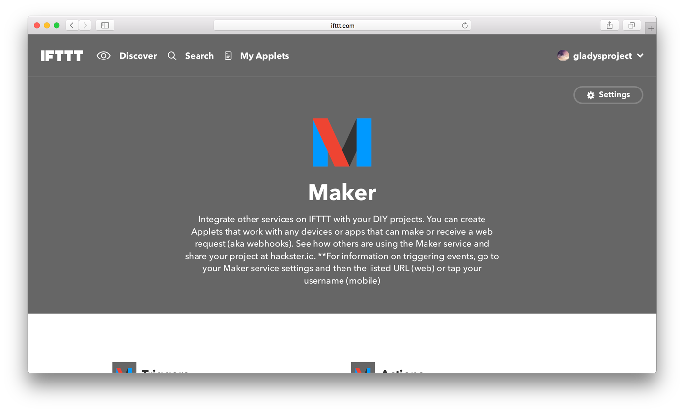

  Update: 21/07/2020: Ce tutoriel est destiné à Gladys v3, il ne fonctionne pas avec Gladys v4 ! 

Salut à tous !

Vous connaissez probablement IFTTT, "If This Then That", un service en ligne qui permet de déclencher des actions à partir de différents Triggers. Depuis 2015, IFTTT a ouvert un channel "Maker" qui permet de déclencher des recettes IFTTT à partir d'une simple requête HTTP.

Nous allons dans ce tuto utiliser ce channel Maker pour lancer depuis Gladys des scénarios IFTTT.

<!--truncate-->

## Création du compte IFTTT

La première étape est simple, il faut tout d'abord vous créer un compte en ligne sur [https://ifttt.com](https://ifttt.com).

## Un premier scénario

Une fois le compte créé, nous allons pouvoir créer un premier scénario. Ici, nous allons créer un scénario qui va enregistrer dans un spreadsheet Google Drive l'heure où vous quittez la maison. Ce n'est qu'un exemple, derrière les actions possibles sont infinis, IFTTT a plein d'intégrations, peut envoyer des notifications, des SMS, contrôler des périphériques, etc...

### Créer un applet

Commencez par cliquer sur "New Applet" dans le menu en haut à droite.

### Configurer un trigger

Cliquez sur "This" pour ajouter un trigger à ce scénario, puis dans la liste des services cherchez le service "Maker".

Vous devriez arriver sur un écran vous demandant de connecter ce service. Cliquez sur "Connect".

Une fois le channel connecté, il faut sélectionner "Receive a web request" pour dire que l'on va créer un scénario qui se déclenche lorsqu'on enverra une requête HTTP à IFTTT.

Dans la fenêtre suivante, il faut rentrer l'event que nous allons écouter. Ici pour l'exemple ce sera l'évènement "left-home".

### Configurer une action

L'objectif de ce scénario est d'enregistrer dans une spreadsheet Google Drive les horaires à laquelle vous quittez la maison. Nous allons donc ajouter une ligne à un fichier drive à chaque appel API.

Commencez par sélectionner le service Google Drive.

Puis sélectionnez l'action "Add row to spreadsheet".

Vous pouvez ensuite configurer le format de votre spreadsheet excel, je vous conseille de la laisser telle quelle pour ce tutoriel ! Cliquez sur "Create action" pour finir le processus.

### Configurer le channel maker

Il vous faut maintenant configurer le channel Maker et récupérer l'URL à appeler depuis Gladys, URL qui contient un token de sécurité unique vous permettant de vous connecter à IFTTT depuis Gladys.

Pour cela, allez dans l'onglet "Services" puis recherchez le channel "Maker".

D'ici, cliquez sur "Settings" en haut à droite. Vous devriez voir une page vous donnant une URL de la forme "https://maker.ifttt.com/use/xxxxxxxx". Ouvrez cette URL dans votre navigateur en la copiant. Vous devriez tomber sur une page comme celle-ci :

Copiez-collez l'URL `https://maker.ifttt.com/trigger/{event}/with/key/YOUR_KEY`, et remplacez `{event}` par `left-home` pour arriver sur une URL `https://maker.ifttt.com/trigger/left-home/with/key/YOUR_KEY`. Vous pouvez testez directement sur la page l'intégration pour voir si une ligne apparait bien dans votre spreadsheet. Pour vérifiez, allez sur Google Drive, les dossiers "IFTTT" => "Maker" => "left-home" devraient être présents, le dossier "left-home" devrait contenir une spreadsheet excel avec une ligne par event déclenché.

## Configurer un scénario dans Gladys

Commencez déjà par vérifier que votre installation Gladys est bien à jour, et que Gladys a bien les bonnes données locales Gladys (les types de scénarios, etc... Pour mettre à jour les données Gladys => "Paramètres" => "Mettre à jour les données Gladys".

Ensuite, allez dans la page "Scénarios" sur le dashboard, et créez un scénario. Commencez par sélectionner un trigger dans la catégorie "Utilisateur" :

Puis, prenez l'évènement "Départ de l'utilisateur".

Vous pouvez ensuite skipper la partie "Condition" pour directement aller dans la partie "Actions". Sélectionnez ici "Lance une requête HTTP" ou "Send an HTTP request" si vous êtes en anglais dans Gladys.

Cliquez sur "Enregistrer", et hop c'est bon !

Si vous voulez tester ce script, vous pouvez tout simplement utiliser la box Gladys qui vous permet de créer des events depuis la page d'accueil (pour ajouter une box au dashbaord => "Paramètres" => "box" => puis sélectionnez la box, mettez la position en X et Y sur le dashboard, puis validez)

Sinon, vous pouvez toujours faire une requête HTTP sur Gladys en mettant l'URL suivante dans votre navigateur :

`http://IP_GLADYS/event/create?token=TOKEN_ACCES_GLADYS&code=left-home&user=VOTRE_ID_USER&house=ID_DE_VOTRE_MAISON`

## Conclusion

J'espère que vous aurez compris comment relier Gladys à IFTTT ! Ce n'est ici qu'un exemple mais bien entendu les possibilités sont infini. Vous pouvez désormais contrôler depuis Gladys n'importe quel périphérique que IFTTT gère :)

N'hésitez pas à partager en commentaire vos idées de scénarios ou vos questions !
