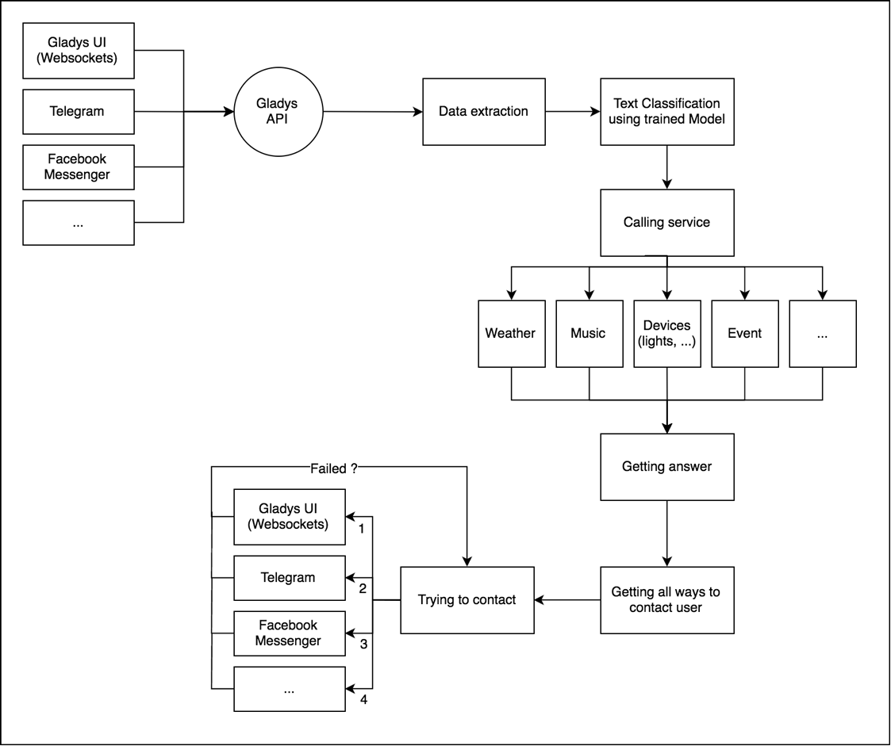
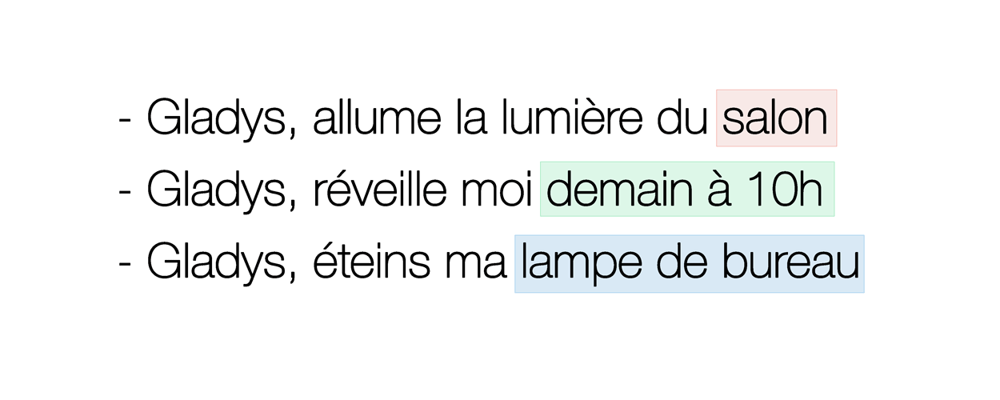
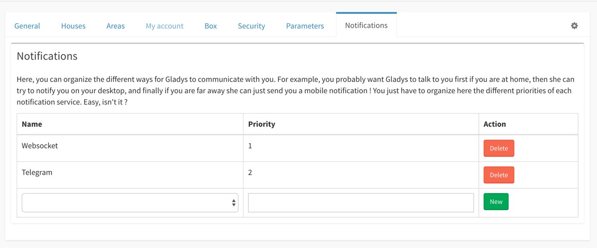
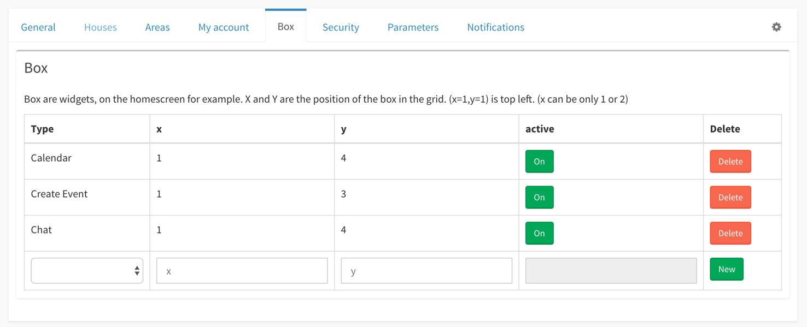
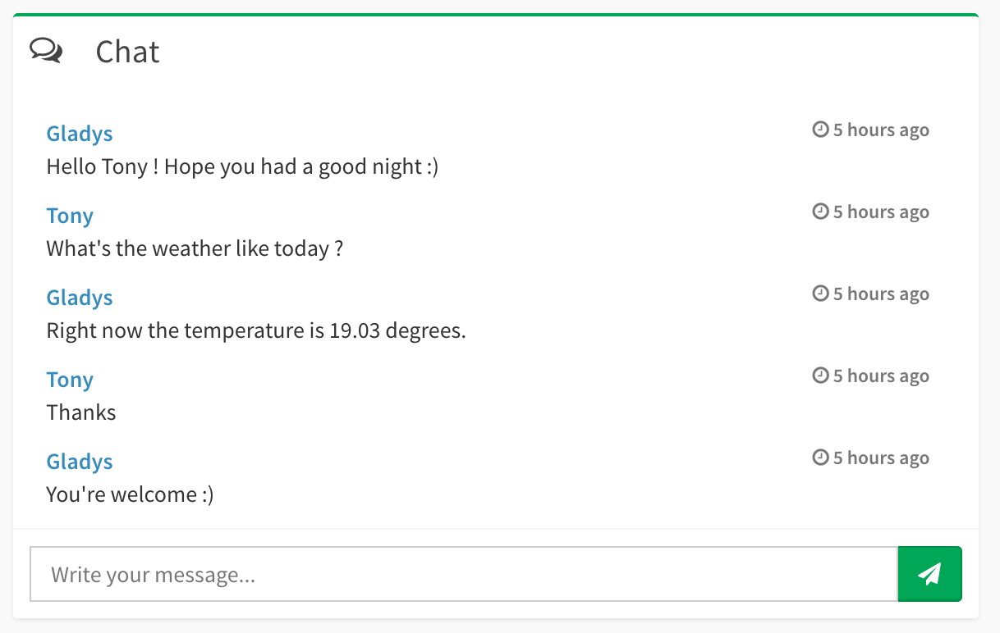

Salut à tous !

Voilà un bout de temps que je travaille sur cette fonctionnalité, c'est la possibilité de discuter avec Gladys. La difficulté de cette feature est qu'il faut analyser le contenu des questions que l'on pose à Gladys afin de répondre de la façon la plus pertinente possible.

Il existe des solutions en ligne d'analyse de phrases ( Wit.ai par exemple ), mais l'objectif dans Gladys était de travailler localement sans dépendances externes. J'ai donc pour cette feature développé une technologie d'analyse de phrases fonctionnant 100% localement !

Le but de ce post est de vous expliquer en détail comment fonctionne cette feature qui vient d'arriver avec Gladys 3.5.

<!--truncate-->

## L'architecture globale

Je vous ai préparé un petit schéma de l'architecture Gladys pour que vous compreniez mieux comment tout cela fonctionne !

Pour commenter ce schéma, nous avons en entrée une question de l'utilisateur envoyé via un channel de communication. Cela peut-être un message envoyé via l'interface Gladys via websocket, un message envoyé via Telegram, via Facebook Messenger, ou via l'API Gladys tout simplement.

Ce message est reçu par Gladys et est enregistré dans Gladys dans la table "message". Nous arrivons à la première étape, l'extraction.

### L'extraction

L'extraction consiste à faire passer la phrase à travers une série de filtres : date, pièces de la maison, noms de devices dans Gladys, etc...

L'objectif est de trouver les informations importantes relatives à la phrase. L'objectif n'est pas de détecter son sens, l'objectif est juste d'extraire des informations.

L'étape extraction va détecter les informations et les transformer en des données formatées pour Gladys.

Ces données derrière resortent de la façon suivante :

**Phrase 1 :**

    {
        "deviceTypes": [],
        "rooms": [{
            "name": "Salon",
            "house": 1,
            "permission": null,
            "id": 1,
            "createdAt": "2015-03-25T17:42:27.000Z",
            "updatedAt": "2016-03-19T22:02:35.000Z"
        }],
        "times": [],
        "replacedText": "Allume la lumière du %ROOM%"
    }

**Phrase 2 :**

    {
        "deviceTypes": [],
        "rooms": [],
        "times": [{
            "ref": "2017-04-09T13:35:33.191Z",
            "index": 13,
            "text": "demain à 9h",
            "tags": {
                "FRCasualDateParser": true,
                "FRTimeExpressionParser": true,
                "ENMergeDateAndTimeRefiner": true
            },
            "start": {
                "knownValues": {
                    "day": 10,
                    "month": 4,
                    "year": 2017,
                    "hour": 9,
                    "minute": 0,
                    "second": 0
                },
                "impliedValues": {
                    "millisecond": 0
                }
            }
        }],
        "replacedText": "Réveille moi %TIME%"
    }

**Phrase 3 :**

    {
        "deviceTypes": [{
            "name": "lampe de bureau - binary",
            "service": "wemo",
            "protocol": "wifi",
            "id": 6,
            "type": "binary",
            "tag": "lampe de bureau",
            "unit": null,
            "min": 0,
            "max": 1,
            "device": 5,
            "roomName": "Chambre",
            "roomId": 7
        }],
        "rooms": [],
        "times": [],
        "replacedText": "Éteins ma %DEVICE_TYPE%"
    }

## La classification

### C'est quoi la classification ?

En machine learning, la classification consiste à déterminer pour un nouvel élément dans quel catégorie il appartient en se basant sur un lot de donnée dont la catégorie est déjà connue.

Pour être plus exact, et pour citer [Wikipédia](https://en.wikipedia.org/wiki/Statistical_classification) :

> In machine learning and statistics, classification is the problem of identifying to which of a set of categories (sub-populations) a new observation belongs, on the basis of a training set of data containing observations (or instances) whose category membership is known.

Un exemple de la vraie vie, c'est Gmail qui arrive à trier les emails SPAM des non-SPAM grâce au machine learning. Le principe est simple, Gmail à des quantitées d'email déjà classifié SPAM et non-SPAM, et il va entrainer un modèle avec ces données.

- "Réunion demain" => "NON-SPAM"
- "Promotion -80% sur le steak haché !!" => "SPAM"

Ainsi, lorsqu'un nouvel email arrive, Gmail fait passer ce nouvel email dans son classificateur, qui va classifier le mail et lui attribuer un tag "SPAM" ou "NON-SPAM" grâce au modèle entrainé précédemment.

### La classification dans Gladys

Dans Gladys, la classification sert à déterminer la ou les commandes présentes dans une phrase.

Grâce à votre aide, j'ai pu constituer une base de données de questions à poser à Gladys, phrases qui sont déjà classifiée.

Une entrée de la base de donnée ressemble à ça :

     {
        "service": "calendar",
        "label": "get-next-event",
        "language": "fr",
        "sentences": [
            {
                "uuid": "10e7f1ba-f0a2-4b77-ae11-350156a184e5",
                "text": "Quel est mon prochain rendez-vous ?"
            },
            {
                "uuid": "641b2f46-8d7e-47da-ab4d-c3eb0b0c114f",
                "text": "Donne moi le prochain évènement dans mon calendrier"
            }
        ]
    }

Comme vous pouvez le voir, plusieurs phrases peuvent être classifiée avec un même tag. En entrainant un modèle avec plein de phrases, Gladys est capable de déterminer pour chaque nouvelle phrase qui arrive la probabilité que cette phrase appartienne à tel ou tel label.

Ainsi, **même si vous posez une question à Gladys qui n'est pas dans la base de donnée, Gladys peut trouver de quoi il s'agit**. Et c'est ça qui est intéressant !

Il ne s'agit pas d'un bête matching avec des regex qui cherchent des mots clés, ici nous avons une boite noire entrainée pour reconnaitre ce que vous voulez dire, basée sur une base de donnée de phrases, extensible à l'infini **sans toucher au code, juste en rajoutant de la data**. C'est ça qui est beau avec le machine learning :)

### L'appel au service

Une fois la phrase classifiée, nous avons deux informations à notre disposition :

- Ce que l'utilisateur veut, sous forme d'un label, exemples : `set-device-on`, `get-time`, `get-next-event`.
- Toutes les données pratiques nécessaires à l'exécution de la commande. Exemples: une date pour le réveil, l'ID du device à allumer, l'ID de la pièce où allumer la lumière.

Toutes ces données sont mise dans une variable, et envoyé au service qui a été détecté pour traiter la requête de l'utilisateur.

Si l'utilisateur demande à Gladys de le réveiller à 9h demain, alors la fonction `gladys.alarm.command()` sera appelé avec la date de l'alarme à créer.

### La réponse

Pour répondre à l'utilisateur, c'est à la responsabilité du service appelé de retourner un label de retour correspondant à un type de réponse.

Par exemple, le service d'alarme retourne `alarm-created` quand il a bien créé l'alarme. En cas d'erreur du service, ou de non-réponse de celui-ci, Gladys retourne au moteur de réponse un label par défaut afin de répondre quand même à l'utilisateur.

De la même manière que Gladys a une base de donnée de question, elle possède une base de donnée de réponses, qui dynamiquement sont remplies avec les données présentes dans la question.

## Configuration dans Gladys

Afin d'utiliser ces fonctionnalités, il vous faut une installation de Gladys fonctionnelle en 3.5.

Pensez ensuite à mettre à jour les données Gladys ( "Paramètres" => "Mettre à jour les données Gladys" ) afin de recupérer le lot de phrases le plus récent.

Puis vous pouvez ajouter dans les notifications l'option "websocket" dans votre liste ( ce qui va dire à Gladys de vous envoyer les notifications via websocket dans l'interface Gladys si vous êtes sur l'interface ).

Et enfin ajoutez à votre dashboard la box "Chat".

Vous devriez voir apparaître dans Gladys sur votre dashboard une box ressemblant à ça :

C'est votre premier point d'entrée pour parler à Gladys ;)

## Conclusion

Tout ce que vous avez pu lire dans cet article est bel et bien présent dans Gladys, dans une mise à jour déployée aujourd'hui, Gladys 3.5 !

Maintenant que cette technologie fonctionne, il ne reste plus qu'à remplir ces bases de données afin de permettre à Gladys d'apprendre à reconnaitre un maximum de phrases, et ainsi être l'assistant parfait dont nous rêvons tous...

Pour rappel, toutes ces données Gladys sont dans le repository Github [gladysassistant/gladys-data](https://github.com/gladysassistant/gladys-data), n'hésitez pas à y jeter un oeil.

Je vais publier très prochainement un tuto expliquant comment connecter Gladys avec Telegram, afin que vous puissiez profiter de Gladys même sur mobile !

Bonne fin de week-end à tous ;)
