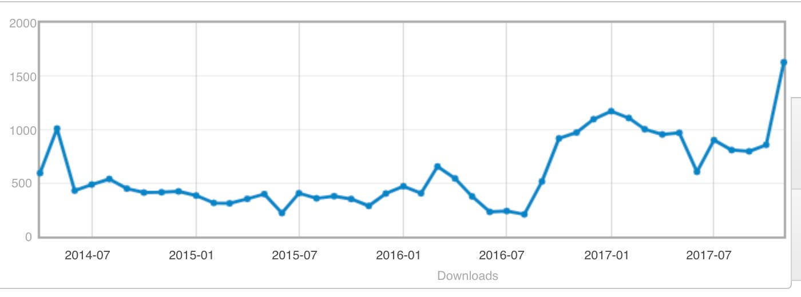
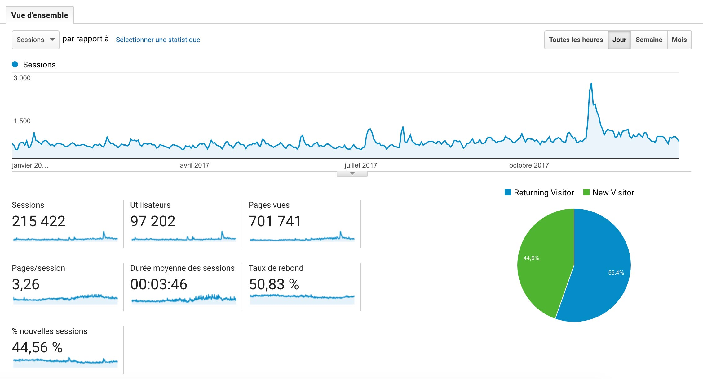
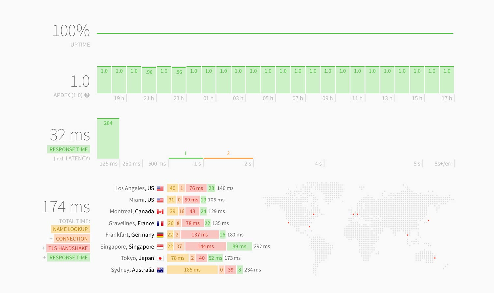
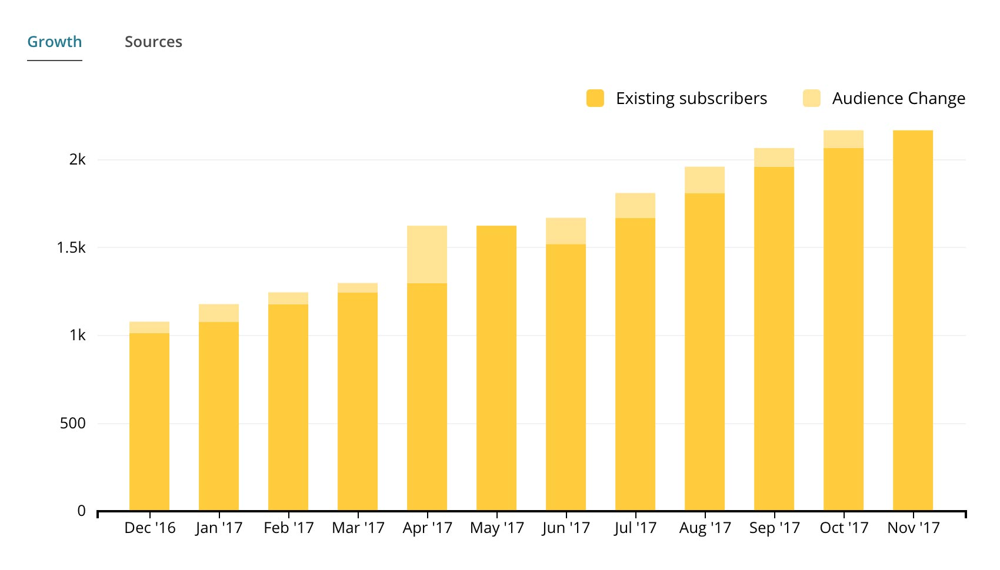
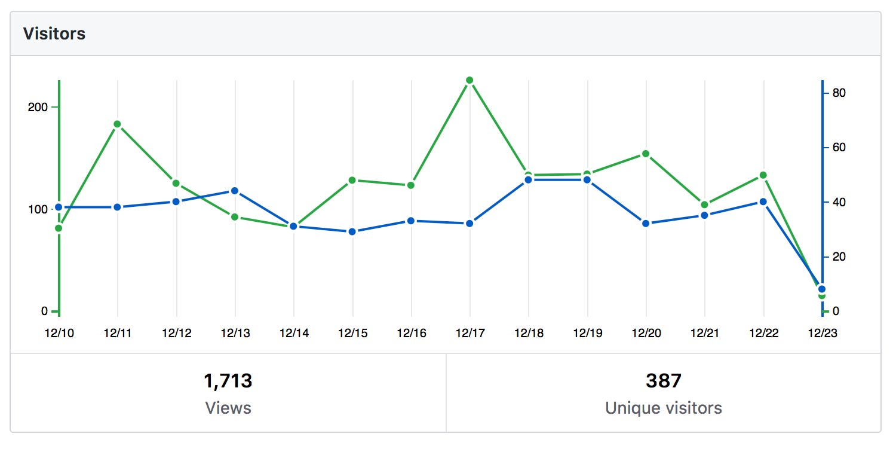

Salut à tous,

C'est la tradition, chaque année je sors en période de fête un article bilan de l'année.
L'objectif est de vous présenter les différentes stats autour du projet, et de revenir sur quelques événements marquants de l'année pour le projet !

<!--truncate-->

### Les téléchargements Gladys

La première statistique intéressante, c'est le nombre de téléchargements de l'image Raspbian Gladys !

Je suis heureux de vous annoncer que cette année nous avons passé la barre des **27 000 téléchargements** de Gladys ! 🚀🚀 Et ce, uniquement sur l'image Raspbian (c'est sans parler des clones GitHub). On voit une nette croissance du nombre de téléchargements sur les derniers mois, et ça fait plaisir 😀

### Le site Gladys

#### Le traffic sur le site

Cette année, le site atteint des records de visites avec **700 000 pages vues** et quasiment **100 000 visiteurs uniques** cette année ! Champagne 🍾🍾 Et dire que j'annoncais l'année dernière le passage des 1 millions de pages vues toutes années confondues sur le site, cette année on se rapproche du 1M pages vues/an !

#### D'un site PHP à un site statique Jekyll + CDN

Cette année, nous avons vécu une évolution majeure: J'ai entièrement re-écrit le site Gladys de zéro.

A la base, le site était écrit en PHP avec une petit base de donnée MySQL, et hébergé sur un petit mutualisé en Irlande. Pour moi, avoir un backend dynamique en PHP sur ce site n'avait aucune utilité car au final à part quand je publiais un article, le site était complètement statique.

J'ai donc remplacé ce site par un site statique avec Jekyll, hébergé sur une VM avec un simple Nginx dans Docker. J'ai rajouté un CDN devant (CloudFlare) afin que le site soit distribué partout sur terre, en cache aux quatres coins de la planète. Ce CDN m'ajoute aussi une protection DDOS car au final quand vous accèdez au site Gladys, vous passez forcément par CloudFlare et donc si quelques tente d'attaquer le site, il attaque CloudFlare et pas moi.

On a donc des performances de fou depuis !

⚡️⚡️ Oui, même de Singapour, Tokyo ou Sydney le site Gladys est disponible toute l'année en moins de 292ms ⚡️⚡️

### Le forum Gladys

Cette année, j'ai enfin laissé tombé le vieux forum phpbb hébergé sur un vieux mutualisé pour laisser place à un système de forum beaucoup plus moderne : Discourse !

Enfin des discussions interactives, des identifications type "@pierre-gilles" à la Slack/Twitter, des notifications web, des notifications mails, une vraie façon d'uploader des photos, de formatter son code avec coloration syntaxique, une expansion des liens automatique, un compteur de vues, de clics sur les liens, bref: bien mieux pour échanger.

En Avril 2017, j'ai donc fais la grande migration (Bon j'avoue c'était stressant).

J'ai pris une bonne VM pêchu à la place du vieux mutualisé, j'ai exporté la base de donnée du forum phpbb, et j'ai lancé le script d'import Discourse. Tout s'est passé plus ou moins sans problème, et hop finit l'ancien forum, on était enfin sur quelque chose de moderne et solide.

Et bien 9 mois après je peux vous dire que les statistiques d'usages sont renversantes !

En 9 mois, le forum a envoyé plus de **191.4k emails** ! Oui, vous avez bien lu, le forum envoie en moyenne plus de 21 000 notifications emails par mois depuis 9 mois ! C'est juste dingue.

Autant dire que ça bosse sur le forum, et on peut s'en rejouir :)

J'essaie tant bien que mal de suivre ce qui se passe sur le forum, mais vu l'affluence j'essaie de ne répondre que sur les sujets où mon aide est vraiment requise.

Heureusement le forum compte désormais 3 modérateurs hyper actif: @AdrienDesola, @C4rlit0 & @LepetitGeek !

Ils font un travail considérable sur le forum, encore merci à eux pour leur aide 🙏🙏

Le nouveau forum est disponible ici => [https://community.gladysassistant.com](https://community.gladysassistant.com).

### La newsletter Gladys

Depuis un bout de temps, j'envoie des emails réguliers sur la newsletter du projet. L'objectif est de vous tenir au courant de l'avancée du projet, des nouvelles, des prochains événements Gladys, enfin de tout ce qui se passe sur le projet.
J'essaie globalement d'envoyer un ou deux emails par mois, et ce n'est pas du SPAM pour le coup, c'est moi qui écrit ces petits mails avec amour pour vous tenir au courant.

Au fil des années, cette newsletter est suivie par de plus en plus de gens et on peut s'en rejouir !

Aujourd'hui, je suis heureux de vous annoncer que la newsletter est lue par **plus de de 2 500 personnes**, avec en moyenne plus de 100 nouveaux inscrits tous les mois :) (et ça ne fait que s'accélerer sur les derniers mois)

### Le GitHub du projet

Le repository est de plus en plus visité/starré, rien que la semaine dernière par exemple, le repository [gladysassistant/Gladys](https://github.com/gladysassistant/Gladys) a été cloné 119 fois, et visité 1 713 fois !

N'hésitez pas à aller donner une étoile au projet, cette valeur est très importante pour GitHub et ses développeurs, c'est ce qui montre la popularité d'un projet open-source et c'est ce qui permet à Gladys de gagner en popularité.

Le repository est disponible ici => [https://github.com/gladysassistant/Gladys](https://github.com/gladysassistant/Gladys).

### Les réseaux sociaux

- Vous êtes 2106 followers à suivre [@gladysassistant sur Twitter](https://twitter.com/gladysassistant).
- Vous êtes 520 à avoir liké [page Facebook Gladys Assistant](https://www.facebook.com/gladysassistant).
- Vous êtes 403 followers à suivre [@gladysassistant sur Instagram](https://www.instagram.com/gladysassistant/)

Je le redis comme j'avais dis l'année dernière, je n'ai jamais acheté de followers, tout est naturel 😊

Si vous ne suivez pas Gladys partout, c'est le moment !

### Les événéments Gladys

L'année dernière, j'avais commencé toute une série d'événements Gladys dans différents lieux : Ecole 42, Tour Montparnasse, Hôtel de ville de Paris, Maker Faire Paris, UTC à Compiègne.

Cette année, cette saison d'événements a repris de plus belle avec une encore plus grande ambition : rencontrer la communauté Gladys à travers toute la France ! L'objectif est de faire des conférences/meetup un peu partout en France pour parler de Gladys, voir ce que les utilisateurs font avec et surtout échanger autour d'un verre.

Le premier meetup a eu lieu à Paris, et de nombreux meetups sont en préparation pour les mois à venir.

Un aperçu de cette formidable communauté Gladys lors du dernier meetup =>

import InstagramEmbed from 'react-instagram-embed';

<InstagramEmbed
url='https://www.instagram.com/p/BczWc-zg2Qz/'
maxWidth={320}
hideCaption={false}
containerTagName='div'
protocol=''
injectScript
/>

### Un placement sur le site officiel de Raspberry Pi

Cela faisait plusieurs années que j'essayais de me faire remarquer par la fondation Raspberry Pi, et cette année j'ai enfin réussi à avoir un article sur leur blog yeaah 🤘

Le 3 Novembre 2017, suite à ma vidéo du mode romantique dans Gladys, la fondation a dédié un article sur leur blog à Gladys, suivi de plusieurs publications sur leur Twitter (363k abonnés) et leur Facebook (303k likes), autant dire un bon coup de pub !

L'article est à lire sur le blog de Raspberry Pi => [https://www.raspberrypi.org/blog/gladys-project-home-assistant/](https://www.raspberrypi.org/blog/gladys-project-home-assistant/)

La vidéo est à revoir sur YouTube =>

<iframe width="560" height="315" src="https://www.youtube.com/embed/gkPph-2-oBQ" frameborder="0" gesture="media" allow="encrypted-media" allowfullscreen></iframe>

### Conclusion

Encore une belle année qui s'achève. Ecrire cet article a été l'occasion pour moi de relire les 2 articles que j'avais fais en [2016](/fr/blog/bilan-annee-2016) et en [2015](/fr/blog/bilan-2015-et-projets-pour-2016), ça fait plaisir de voir que les choses évoluent, que les chiffres ne font qu'augmenter et que vous êtes de plus en plus sur le projet 👌

Encore une fois, merci à tous de suivre Gladys, merci à tous de rendre ce projet possible, merci à tous d'être autant impliqué !

Bonnes fêtes de fin d'années à tous 🎉🥂
