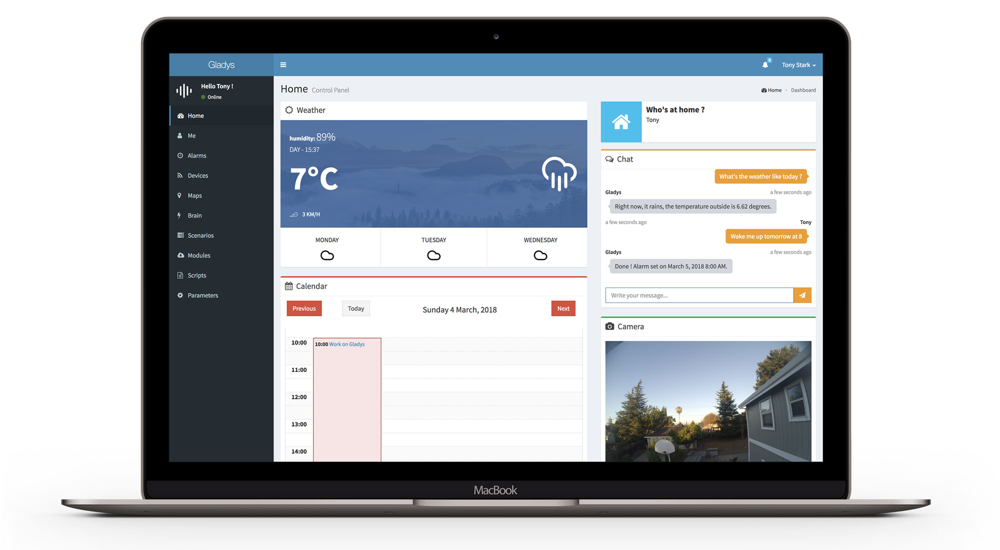

Hey everyone,

Last december, when I was organizing Gladys first meetup in Paris, @C4rlit0 et @LepetitGeek (two very active members of the community) came to me to tell me they were working on a big new pull request.

They were working on the complete redesign of Gladys UI, a big piece of work!

A few weeks after the event, the PR landed on Gladys GitHub repository. Then, we worked together to release this major upgrade. The goal was not just to upgrade the UI, but to correct lots of pain points the community had identified.

I'm happy to announce that this release is now available, and is called Gladys 3.8! 🚀

<!--truncate-->

## New things

### A brand new design

The main change of this upgrade is the new design of Gladys UI. The theme has been upgraded to the latest version, and all components now look more modern:



Pretty, no ? 😉

### New boxs

As you can see on the screenshot, there are now lots of new boxs on Gladys dashboard. The reason is that we simplified the development of box in Gladys 3.8.

Now, to create a box in Gladys, it's as simple as creating an HTML file in Gladys. A full tutorial "how to create a box in Gladys" is on its way :)

To demonstrate the new possibilities, we developed 9 boxs in Gladys:

- Calendar box
- Weather box
- Chat box
- A Camera box (that allows you to see what an IP camera sees. It's even working with the Raspberry Pi camera. I can write a tutorial if you are interested, just ask in the comments!)
- The "Who's at home" box
- The graph box that displays values from sensors
- Music box
- The event box that allows you to throw events in one click
- The "change house mode" box

This is just the beginning. As it's now simple to create a new box, we will create lots of them in the coming months!

### Alarms

One week ago on the community forum, a user asked me "Why is it useful to ask Gladys to create an alarm, because after you need to create a scenario based on this alarm, it's not easy!".

He was right.

The problem with the previous version of Gladys, is that there weren't any way to differentiate an alarm that need to wake up a user, and a simple reminder/cron task just here to execute a recurring script.

In Gladys 3.8, you now have the possiblity to specify if an alarm is a "wake up" alarm or not. And by default, when you ask Gladys "Wake me up tomorrow at 8", the alarm created is a "wake up alarm".

It means you just have to create one "wake up" scenario, that will be executed for any "wake up alarm" ringing. Dead easy!

### Lots of fixes

This upgrade brings lots of little fixes too. For example, when you were using the weather box, you had to enable HTTPS on Gladys in the past because the browser needed your geolocation to calculate the weather. Now, by default, Gladys fallback to your house latitude and longitude if your geolocation is unavailable.

See all fixes in the [CHANGELOG](https://github.com/gladysassistant/Gladys/blob/master/CHANGELOG.md).

### A new Raspbian image

One of the biggest change of this upgrade, is that we rebuilded from scratch Gladys Raspbian image.

Now, Gladys image runs:

- Raspbian Stretch latest version (compatible with the Pi Zero W !)
- Node.js 8 LTS
- MariaDB latest version
- Nginx latest version
- Open-Zwave latest version

## How to upgrade

If you never installed Gladys, or you don't need the data in your current Gladys installation, you can just install Gladys again from the installation page. Download the new Raspbian image, and you're ready to go!
If you want to migrate your old installation to this new version, here is how to do it.

### Backup MySQL

The first step is to backup MySQL on your old installation. To do that, log in on your Raspberry Pi in SSH and execute the following command:

```
mysqldump -uroot -proot gladys > backup-gladys.sql
```

**Warning** : If you have modified the MySQL password before, change it in the command too.

Then, download this backup file on your machine (the `backup-gladys.sql` file). You can use tools like [FileZilla](https://filezilla-project.org/), or in SFTP.

### Flash your SD card

Then, you can now install the new version of Gladys on your SD card. You need to download the new image on the [installation](/en/installation/) page of the website.

Clone this image on your SD card (it may be safer to do that on a new SD card, to avoid losing your old installation if the process goes wrong.). You can follow Gladys main installation tutorial.

### Load your old data into MariaDB

You need to import your backup into the database.

Connect in SSH, and execute the following statements:

Stop Gladys:

```
pm2 stop gladys
```

Delete current database:

```
mysql -uroot -proot -e 'DROP DATABASE gladys;'
```

Create a new database:

```
mysql -uroot -proot -e 'CREATE DATABASE gladys CHARACTER SET utf8 COLLATE utf8_general_ci;'
```

Import the backup file into the database (you need to have the file on your new installation)

```
mysql -uroot -proot gladys < backup-gladys.sql
```

Then, start Gladys init script:

```
cd gladys && node init.js
```

If you've got any warning during this init, ignore them.

Then, restart Gladys:

```
pm2 restart gladys
```

Boom. Your installation is now ready!

### Modules

Warning: After this installation, your modules from your old installation won't be installed. You need to log into Gladys, go to the "modules" view, and click on "Upgrade" on each module, one by one. This will install again the modules.

## Conclusion

I'm really happy to release this tonight. I hope you'll enjoy this release :)

Don't hesitate if you have any feedbacks!
