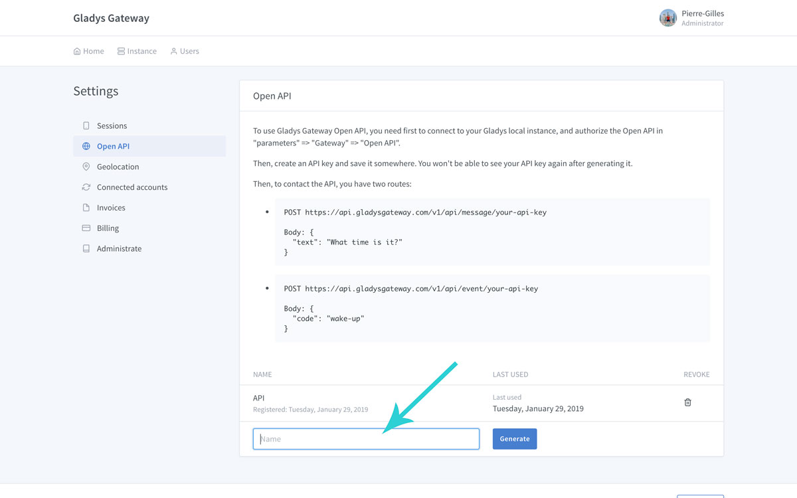
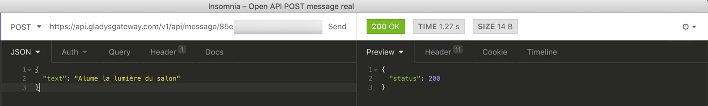
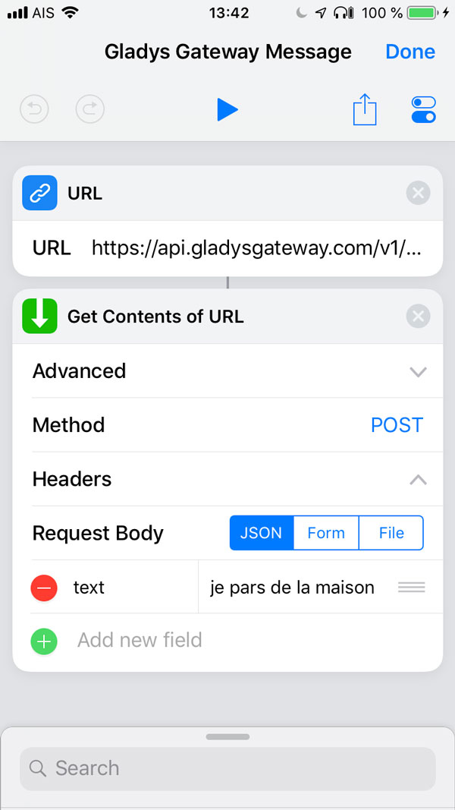
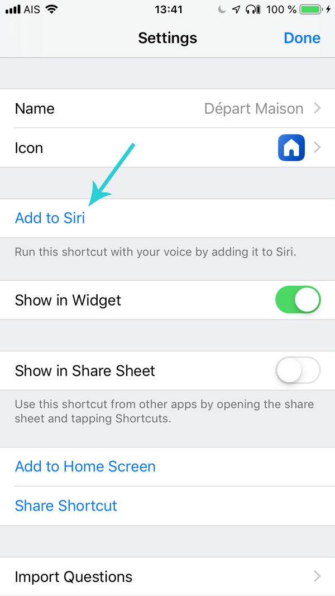
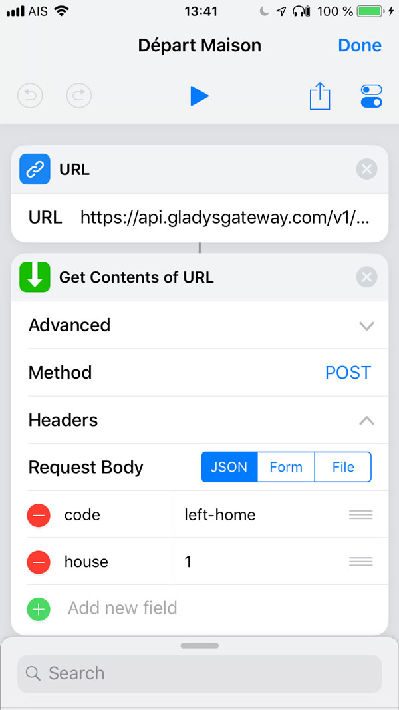
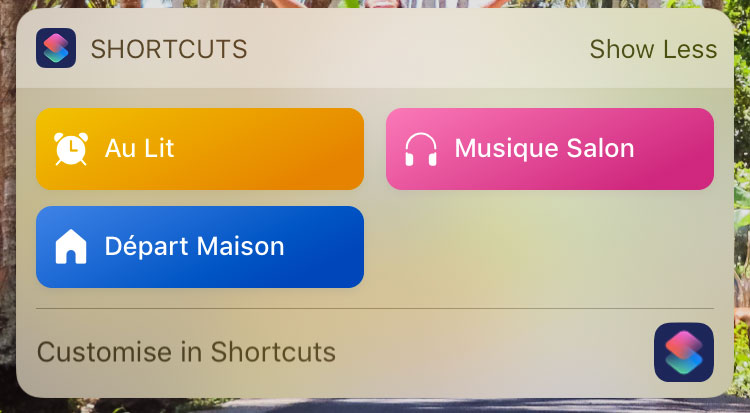

<div class="alert alert--danger" role="alert">
  Update: 21/07/2020: Ce tutoriel est destiné à Gladys v3, il ne fonctionne pas avec Gladys v4 ! 
</div>

Salut à tous!

Je le disais dans mon dernier article, mon focus sur l'année 2019 est sur le développement du Gladys Gateway et de Gladys 4.

Aujourd'hui, je suis heureux d'annoncer le lancement de l'Open API du Gladys Gateway, qui permet un ensemble de nouvelles possibilités, notamment la possibilité de contrôler votre instance Gladys via Siri de n'importe où dans le monde.

<!--truncate-->

## Configurer l'Open API du Gateway

### Mettre à jour Gladys

La première étape est de mettre à jour Gladys dans sa dernière version. Vous devez avoir Gladys en version >= 3.12.0.

Pour mettre à jour, lancer le script "/home/pi/rpi-update.sh" sur votre Raspberry Pi.

### Activer l'Open API du Gladys Gateway

Rendez-vous dans votre Gladys local dans l'onglet `Paramètres` => `Gladys Gateway`, puis tout en bas de la page, activez l'Open API.

J'ai décidé que l'Open API devait être activée à la demande de l'utilisateur.

En effet, l'Open API étant un moyen de communiquer directement avec votre instance Gladys via le Gateway, la communication n'est pas chiffrée de bout en bout ici: ce qui est logique, "de bout en bout", signifie que la communication est chiffrée depuis le client (votre navigateur) jusqu'à l'autre client (le Raspberry Pi). Hors ici, le premier client on ne le maitrise pas, il peut être votre client HTTP Postman/Insomnia local, votre navigateur, Siri, etc... Ainsi, La communication est chiffrée entre le client et l'API en HTTPS, puis entre le Gateway et votre Gladys en websocket TLS.

### Créer une clé d'API

L'étape suivante consiste à créer une clé d'API dans le Gladys Gateway. Rendez-vous à [plus.gladysassistant.com](https://plus.gladysassistant.com), connectez-vous à votre compte Gladys Gateway.

**Note:** Si vous n'avez pas de compte Gladys Gateway, il faut souscrire à Gladys Plus.

Rendez-vous dans l'onglet `Settings` en haut à droite, puis `Open API`.

Vous devriez arriver sur cet écran:



Donnez un nom à votre clé d'API, puis cliquez sur `Generate`.

La clé d'API va s'afficher temporairement. Copiez-collé là quelque parts, car elle disparaitra à jamais après ça pour des raisons des sécurités (les clés d'API sont stockés en hash côté serveur).

## Tester l'API

**Note:** Cette étape est facultative, c'est juste pour vous pour comprendre !

Téléchargez un client HTTP comme [Insomnia](https://insomnia.rest/).

Créez une nouvelle requête en cliquant sur `New Request`.

Donnez un nom à votre requête et sélectionnez `POST` à droite, puis `JSON`.

Enfin, cliquez sur `Create`.

### Appeler l'API pour une commande vocale

Remplacez l'URL par `https://api.gladysgateway.com/v1/api/message/:VOTRE_CLE_API`

Pensez à remplacer votre clé d'API!

Dans le body JSON, mettez:

```
{
  "text": "Je pars de la maison"
}
```

Ou n'importe quel phrase que vous voulez dire à Gladys!



Pressez `Send`, normalement Gladys devrait recevoir votre requête et effectuer l'action.

### Appeler l'API pour créer un évènement Gladys

Il y a aussi la possibilité d'appeler l'API pour créer un évènement dans Gladys via une autre route.

L'URL est la suivante: `https://api.gladysgateway.com/v1/api/event/:VOTRE_CLE_API`

Et le Body:

```
{
  "code": "left-home",
  "house": 1
}
```

Le code étant le code d'un événement Gladys, [liste complète ici](https://github.com/GladysAssistant/gladys-data/blob/master/events/fr.json).

Ici l'attribut "house" est l'ID de la maison.

## Configurer Siri

Nous allons maintenant créer un ShortCut Siri.

Pour cela, téléchargez l'application [Apple Shortcut](https://itunes.apple.com/us/app/shortcuts/id915249334?mt=8).

Cliquez sur `Create Shortcut`.

Dans la bar de recherche, cherchez `Url` et cliquez sur l'élément URL.

Dans le champs URL, ajoutez l'URL que nous avons utilisez précédemment (`https://api.gladysgateway.com/v1/api/message/:VOTRE_CLE_API`)

Ensuite, cherchez `Get Contents of URL`, et cliquez sur l'élément.

Dans `Advanced`, changez la method à `POST`.

Dans Request Body, cliquez sur `Add new field` => `Text`.

Donnez lui comme `Key` = "Text" et comme `Text` mettez votre phrase.



Ensuite, cliquez sur le bouton de configuration en haut à droite, et cliquez sur `Add to Siri`.



Donnez une phrase à Siri, exemple: `Je pars de la maison`.

Cliquez sur `Done`.

Voilà, c'est fait!

Pour créer un évènement, cela ressemblerait à ça:



Vous pouvez tester l'intégration en cliquant sur le bouton `Play` ou sur le shortcut directement depuis l'écran d'accueil, ou tout simplement en demandant à Siri.

Si vous voulez utiliser ce shortcut sans parler, vous pouvez même l'ajouter à l'écran d'accueil de votre iPhone ou via un widget pour activer cette scène.



## Conclusion

Ce n'est qu'un simple exemple de ce qu'il est possible de faire avec l'open API du Gateway, mais ce Gateway ajoute plein de possibilités: je pense à Tasker, un webhook IFTTT, et bien d'autres!

N'hésitez pas à donner vos exemples en commentaire ou sur le forum ;)
