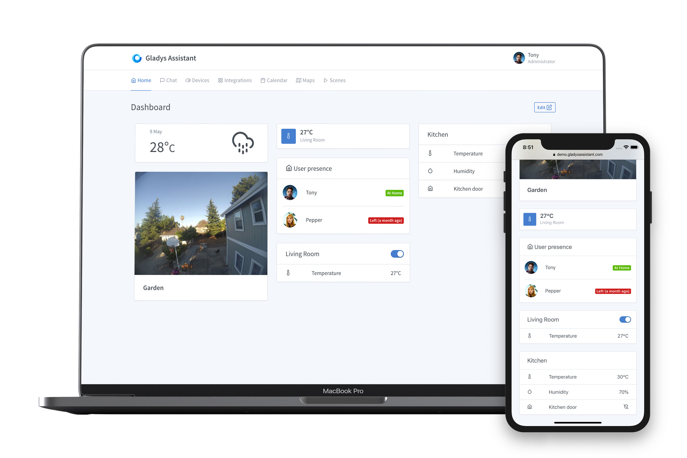
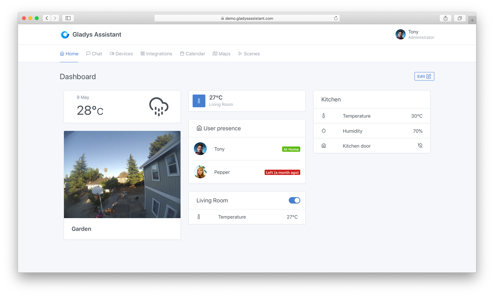
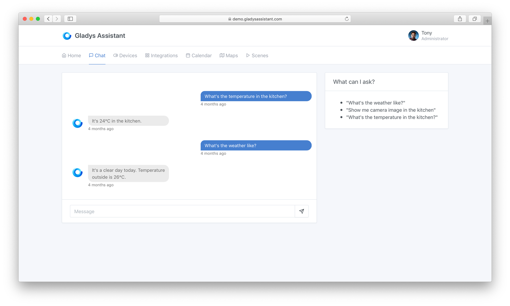
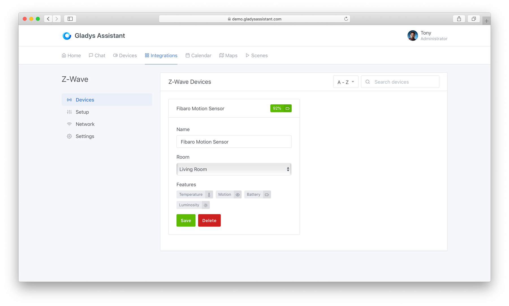
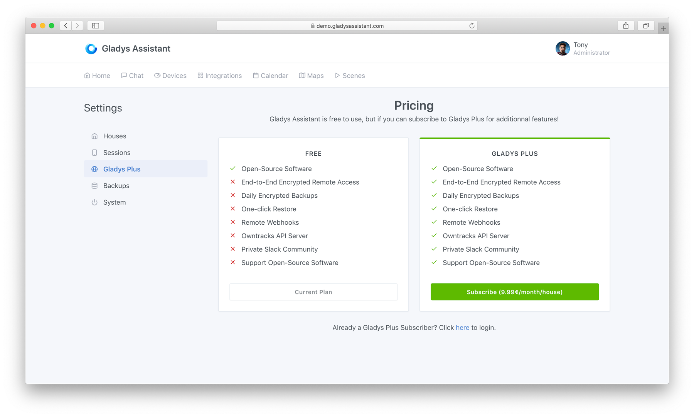
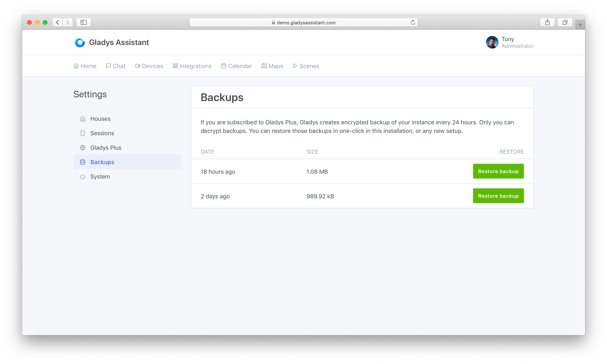
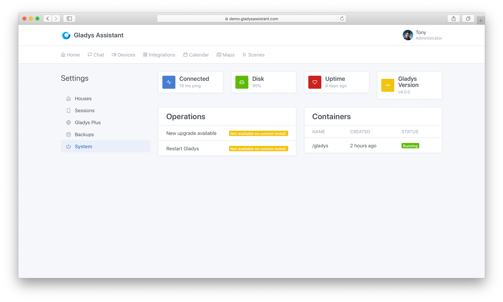
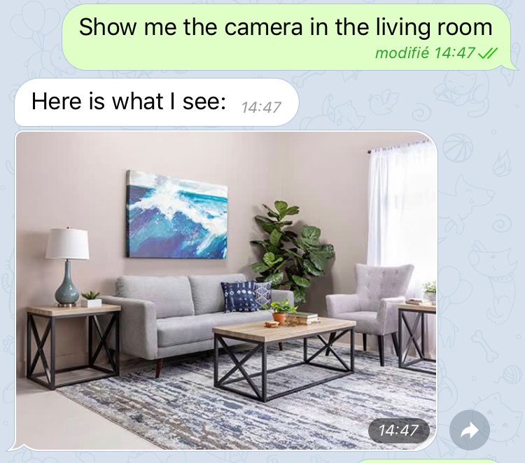

Hi everyone!

In December, I published a [manifesto](https://docs.google.com/document/d/1zqH0vvIRICOiXsgJVHRanInBgJ8aoTWtnrNpyASW9b0/edit?usp=sharing) explaining my vision of the future of Gladys.

And now, after 7 months of hard work, I'm happy to release today the first alpha version of Gladys 4!

<!--truncate-->

## What's new?

Gladys 4 is a **full rewrite** of Gladys.

Last year, we were stuck on Gladys 3 because of technological choice made at the beginning of the project (6 years ago).

So I started from a blank page, and with the community we chose new technologies for the future of Gladys.

Inside Gladys 4, you'll find:

- Node.js + Express server-side
- A PWA powered by [Preact](https://github.com/developit/preact/) on the frontend.
- Sqlite for the database

My goal with Gladys 4 was to build a fast, lightweight and stable software.

I spent a lot of time experimenting, testing, finding the right libraries, to ensure that the software remains stable and secure over time.

The whole architecture is designed so that the installation and maintenance of Gladys is easy, even for a beginner.

## How Gladys 4 looks like

Demo time!

### The different screens

The main dashboard of Gladys, fully customizable

The "Chat" view, to talk with Gladys:

The Z-Wave configuration page, now integrated natively in Gladys:

The Gladys Plus configuration page. Gladys Plus is Gladys paid plan.

It gives you access for 9.99€/month to additional features like end-to-end encrypted remote access and daily backups!

Daily backups:

System view:

A feature I love is the ability to text Gladys that you want to see the kitchen, and she messages you back on Telegram with a view from the room camera:

### Small UI details that are important

My main philosophy in Gladys 4, was that the UI is the most important part of the software.

I spent days on small UX details (loading, error states, blank states) to ensure that the experience is as good as possible for the user.

### Migrating services from v3 to v4.

For now, only 4 services: Z-Wave, Camera, Telegram and DarkSky are migrated to Gladys 4. Those services are not entirely finished, but most of the work is done.

Some services are currently work in progress: Sonos, Bluetooth, Philips Hue and Caldav Calendar.

## Testing Gladys 4 alpha online

The simplest way to try Gladys 4 is to use our online demo website:

[demo.gladysassistant.com](https://demo.gladysassistant.com/dashboard)

That's the biggest advantages of using a separate frontend, we can host a static version with demo data inside.

## How to install Gladys 4 alpha

⚠️ Warning: This release is only available for advanced user. It's not a final release, some bugs are probably still in the code, and it's not plug and play yet.

### On MacOS/Windows

As Gladys 4 runs inside Docker, it's super easy to deploy it on MacOS/Windows thanks to Kitematic.

[Installing Gladys Assistant 4 alpha on MacOS/Windows](/docs/installation/macos-windows).

### On a Raspberry Pi

On a Raspberry Pi, it's the same. You can run Gladys 4 Alpha Docker image built for ARM.

[Installing Gladys Assistant 4 Alpha on Raspberry Pi](/docs/).

## What's next?

I'm now waiting for your feedback, and I'm continuing my work on Gladys 4.

Next week, I'm flying back to France and will start visiting Gladys users, to test this alpha release directly on their setup.

I would like to thank everyone who contributed to this alpha release:

- GitHub contributors: VonOx, atrovato, bertrandda, NilkOne et cicoub13. Special thank to VonOx, who did an amazing work on Docker build: ARM cross-compiling was not that easy. Same for atrovato who worked hard on the Bluetooth service. I can't wait to try it.
- A big thanks to Gladys Plus contributors. It's thank to your financial support that I can spend more time on open-source.

Thanks! 🙌

## Support my work

I recently stopped the sales on the Gladys Starter Pack, who was only designed for Gladys v3.

If you want to support my work on open-source, you can:

- Support monthly Gladys throught Gladys Plus for 9.99€/month. It's the best way to support my work, and it gives you access to lots of new features!
- Donate in Bitcoin: 3KQiX1FtbdXLXPH9UfLSyuzRMDRGY52EiA
- Or with [PayPal](https://www.paypal.me/gladysproject/20) (But Bitcoin is better 😉)

Thank you all for your positive messages during all those months of hard work.

I can't wait to hear your feedback about this alpha release.
