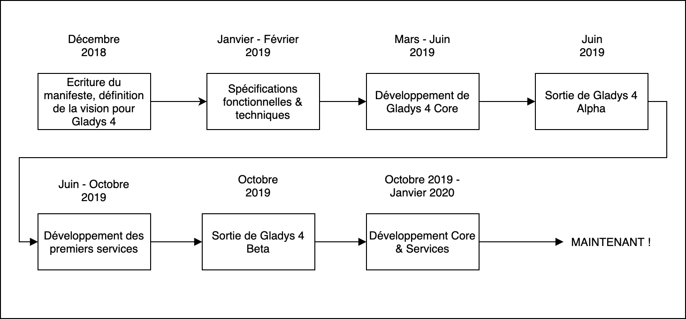
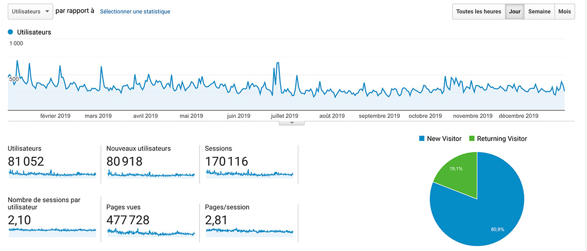

Hi all !

Each year, I publish a review article for the year. I had done it in [2018](/blog/2018-year-review-of-gladys-assistant), [2017](/blog/bilan-gladys-2017), [2016](/blog/bilan-annee-2016) and [2015](/blog/bilan-2015-et-projets-pour-2016).

Welcome to the 2019 version of the article 😁

<!--truncate-->

## What happened in 2019?

This year has been quite a different year from other years, as it's the first year I've been from start to finish part-time on Gladys.

This additional availability allowed me to launch a major project: Gladys 4.

A major project because Gladys 4 is an entirely new product which does not share anything with Gladys 3. It is more than a complete rewrite in terms of code, it is a whole new reflection in terms of product and experience. user.

Throughout this year, with the help of the community, we have imagined, designed and implemented the future of Gladys.

In June 2019, after several months of development, I released [a first alpha version of Gladys 4] (/blog/premiere-alpha-gladys-4). The goal of this version was to allow developers to migrate Gladys 3 modules to Gladys 4 services.

In October, following the feedback and service developments made by the community, I released a first beta, this time supplied with a turnkey Raspbian image, allowing a simple installation of Gladys 4.

<blockquote class="twitter-tweet">
[BREAKING] Today, I’m launching <a href="https://twitter.com/gladysassistant?ref_src=twsrc%5Etfw">@gladysassistant</a> 4 Beta! 🚀🚀  It’s the results of months of hard work from the whole Gladys community.  The UI is clean, the system is lightweight and fast, and we have more and more integrations coming everyday!  See ➡️ <a href="https://t.co/8bcQWrzh7v">https://t.co/8bcQWrzh7v</a>
&mdash; Pierre-Gilles Leymarie ✈️ (@pierregillesl) <a href="https://twitter.com/pierregillesl/status/1185254263309635585?ref_src=twsrc%5Etfw">October 18, 2019</a></blockquote> 

This version is now running with more than 200 users, and has allowed me to receive a set of feedback on the product. We are still a long way from the number of Gladys 3 users, but migrating everyone was not the objective of this beta!

Today, I am working hard to get out of beta and offer a version of Gladys 4 "RC" (Release Candidate) before an official release.

## Gladys user conferences and meetings

In addition to development, 2019 was also the year of ** many Gladys user meetings ** across France, since I went to Lyon, Valence, Niort, Rennes, Orléans, Dijon and Lille to meet users Gladys "in real life".

<blockquote class="twitter-tweet">
Adding tons of new Z-Wave devices to <a href="https://twitter.com/gladysassistant?ref_src=twsrc%5Etfw">@gladysassistant</a> 4 thanks to Link39 installation in Lyon! 🔥🔥 <a href="https://t.co/Nlblva6wFB">pic.twitter.com/Nlblva6wFB</a>
&mdash; Pierre-Gilles Leymarie ✈️ (@pierregillesl) <a href="https://twitter.com/pierregillesl/status/1151594985717948416?ref_src=twsrc%5Etfw">July 17, 2019</a></blockquote> 

The goal of these meetings was to see home automation installations of Gladys users, to discuss with these users and to understand their use.

With each Gladys user, I was very well received: we had a good discussion, developed together for Gladys, a lot of laughs too 😄 It was the opportunity to eat together, to have a drink! 🍻

I have fond memories of this tour, and I'm really happy to have been able to meet these users in real life after years of chatting online.

I would of course continue, the concept is great and you are all super nice!

## Some statistics

### The Gladys website

Here are the site visits for the year 2019!

If you compare against the year 2018, it is down.

Considering the fact that the year 2019 was rather a year dedicated to product development, there was little communication, little / no marketing work so that we talk about Gladys on other sites / magazines, it It is therefore normal that the traffic is down.

I hope for a nice peak in 2020 for the launch of Gladys 4 😀

### Les réseaux sociaux

Sur les réseaux sociaux:

- [@gladysassistant on Twitter](https://twitter.com/gladysassistant) has 2 721 followers
- [Gladys Assistant Facebook](https://www.facebook.com/gladysassistant) has 761 likes
- [@gladysassistant on instagram](https://www.instagram.com/gladysassistant) has 545 followers

And 1 772 on [my personal Twitter](https://twitter.com/pierregillesl), which jumped well this year, having for my part communicated a lot about Gladys on this one.

### The newsletter

In terms of the newsletter, 3,687 of you follow the Gladys Assistant newsletter.

- 3,197 subscribers in French
- 490 subscribers in English

Growth of + 9.3% compared to last year 📈

### The GitHub Gladys Assistant

We are 1320 stars ⭐ on the [main Gladys repo](https://github.com/GladysAssistant/Gladys)

This is + 32% compared to last year!

I'm counting on you to take us to 10,000 🚀🚀

## Projects for 2020

My n°1 goal is obviously to release this version 4 of Gladys.

I am very happy with this new version. I am convinced that it will mark a turning point for the project and that it will shake up the world of home automation!

On the commercial side, the release of this new version will probably boost sales of Gladys Plus.

The functionalities offered by Gladys Plus in v4 are so rich: encrypted remote control (even camera images), daily system backups, Open API, etc.

I am convinced that new Gladys 4 users will be convinced by this offer, and I can not wait to step up on this plan 🙂

## Conclusion

I have never been so optimistic about the Gladys Assistant sequel! I can't wait to release this key version, and especially can't wait to hear from you 😃

Thank you to everyone who contributed or just followed Gladys in 2019!

You are a golden community 🏅

Happy new year 2020 to all,

Pierre-Gilles Leymarie
