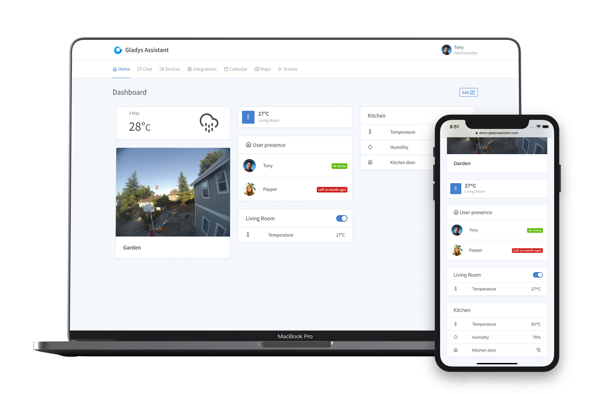
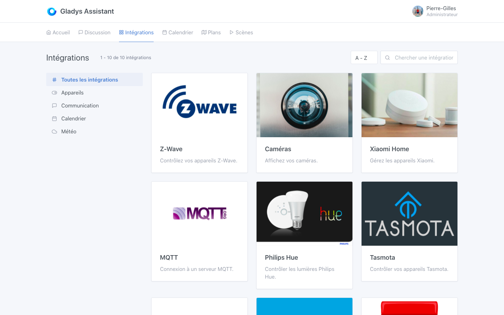
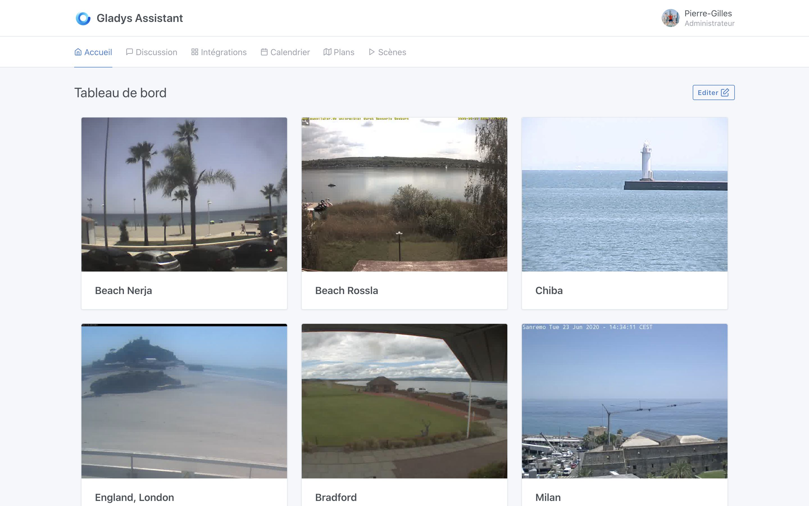
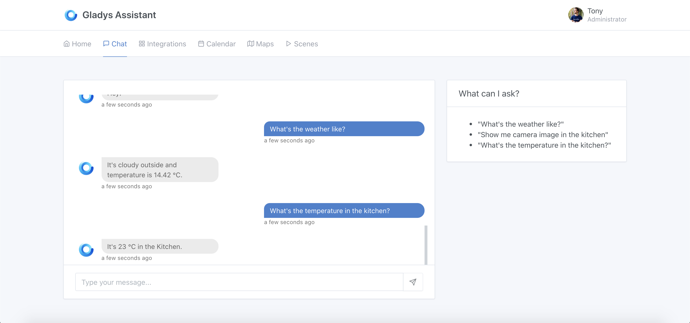
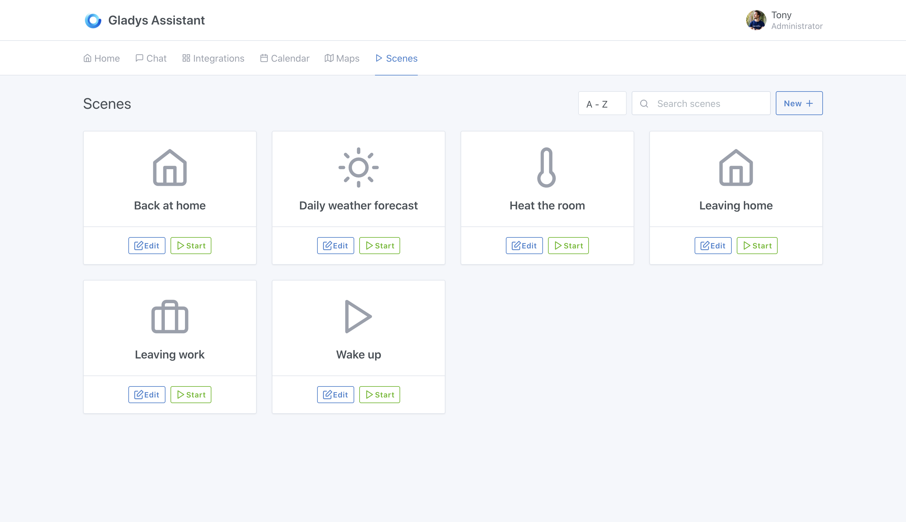

Hi all,

It's a big day, after almost 2 years of work by the whole community, Gladys Assistant 4 is available, for free download as usual!

You can embark on the adventure by following the tutorials:

- [Raspberry Pi Tutorial](/docs/)
- [Manual installation with Docker](/docs/installation/docker/)
- [Test Gladys Assistant on the demo site](https://demo.gladysassistant.com)

Now let's go back to the decisions that led to this fourth version of Gladys Assistant 🙂

<!--truncate-->

## The story behind this v4

In December 2018, I met two members of the community to discuss the future of the project, and together we defined what we wanted for the next major release of Gladys, Gladys Assistant 4. After this meeting, I wrote a technical manifesto that summarized our discussions.

Gladys Assistant v3 was aging, both in terms of development process and technologies used. It was a great product, but the developments were slower and slower and less stable due to technical choices going back to the start of the project.

Maintaining this mammoth was getting harder and harder, and the attractiveness of the project suffered. There were many “mystical” bugs, and everyone was going crazy because of that. It was frustrating to see everyone struggling to do a simple update in Gladys v3, getting stuck on configuration points that should be automatic.

**The bottom line was clear:** for the long term, it was better to start from scratch and learn from all those years of experience, rather than putting duct tape on a product that was not originally designed for be used by so many people for so many years.

For 2 years, we worked together with the community to release version 4, designed with technologies in our opinion more suited to the embedded world.

These two years have been very hard.

Very hard because for 2 years, the project apparently did not move forward: there was no further development on v3, but v4 was not ready for all that.

Very hard because for at least a year, I felt like I was working in a vacuum, working on a product that nobody was using.

It was the crossing of the desert.

But today, it’s the fulfillment. The work paid off, and thanks to the involvement of the whole community, Gladys Assistant 4 is available! 🎉

## Thanks

Before presenting this v4, I would like to thank all of the community members who have done a tremendous amount of work on this version.

- [Alexandre Trovato](https://community.gladysassistant.com/u/AlexTrovato/summary), “the machine”, who is able to propose a pull-request before I finish my response to his message 😁
- [Vincent Kulak](https://community.gladysassistant.com/u/vonox/summary), “the god of Docker”, who set up the entire build process for Gladys Assistant 4.
- [Thibaut Courvoisier](https://community.gladysassistant.com/u/link39/summary), “the Z-Wave pro”, who lets everyone benefit from his rich Z-Wave installation, and his thorough knowledge of the protocol.
- [Thomas Lemaistre](https://community.gladysassistant.com/u/terdious/summary), “the biggest Gladys user of all time”, who constantly pushes the limits of the product with his professional use which he allows you to manage your campsite.
- [Bertrand d'Aure](https://community.gladysassistant.com/u/bertrandda/summary), “Mr. Caldav”, who develops and maintains the CalDav integration and who bends over backwards to make it work for everyone in the world.

But also all the other contributors on Github: https://github.com/GladysAssistant/Gladys#contributors-

## A redesign of the interface: clean, stylish and incredibly fast

Gladys Assistant returns with a new, completely redesigned interface. The interface is simpler, and editable with the mouse very easily.

The interface owes its responsiveness to the frontend framework [Preact](https://preactjs.com/) used in Gladys Assistant 4. A modern and very light framework, ensuring great fluidity for Gladys.

This interface is designed as a PWA ([Progressive Web App](https://fr.wikipedia.org/wiki/Progressive_web_app)) and can therefore be installed on the phone like a regular app (iOS / Android / Mac / Windows / Linux).

You can test the Gladys Assistant 4 interface at [the demo site](https://demo.gladysassistant.com).

## Hundreds of home automation devices already compatible

For several months, the Gladys Assistant community has been working hard to bring the integrations from v3 to v4.

Today, hundreds of home automation devices are already available in Gladys Assistant 4.

To date, Gladys Assistant supports peripherals:

- Z-Wave ([doc](/docs/integrations/zwave/))
- Xiaomi ([doc](/docs/integrations/xiaomi/))
- Philips Hue ([doc](/docs/integrations/philips-hue/))
- Sonoff (Tasmota) ([doc](/docs/integrations/tasmota/))
- RTSP, HTTP and USB cameras ([doc](/docs/integrations/camera/))
- The MQTT protocol ([doc](/docs/integrations/mqtt/))

Many integrations are under development and will join this list in order to control a maximum of devices. And since Gladys Assistant is open-source, you can contribute to this list by submitting a PR on GitHub :)

## Native camera management

Camera management has been natively integrated into Gladys Assistant 4, via RTSP, HTTP and USB protocols.

Gladys retrieves the feeds from all the cameras in the house, and displays them in a single interface. The Gladys instance acts as a proxy, and allows the user to view their cameras outside of their network, without having to expose their cameras to the Internet. Cameras can stay safe locally.

Video streams are compressed in order to achieve maximum interface display performance, even with a large number of cameras.

## From machine learning to the discussion engine

Gladys Assistant is also an assistant that the user can chat with.

Gladys Assistant uses the latest advances in automatic language processing to understand user requests (We use [NLP.js](https://github.com/axa-group/nlp.js)).

You want to ask Gladys Assistant:

- “Turn on the living room light”
- "What's the temperature in the kitchen?"
- "What weather is it ?"
- “Show me the kitchen camera”
- And lots of other questions as the community feeds the dataset!

The dataset used for training the model is fully open-source, and community-powered.

## An open MQTT API to integrate DIY devices

Gladys provides an open MQTT API to allow anyone to integrate DIY devices with Gladys.

It is thus possible to send data to Gladys from an Arduino, an ESP8266, a remote Raspberry Pi, or from any machine compatible with the MQTT protocol.

In the other direction, it is possible for Gladys to control MQTT devices.

Learn more about [the MQTT integration](/docs/integrations/mqtt/).

## A more powerful scene engine than ever

Gladys Assistant 4 allows the user to write complex scenes. It is possible to write sequences of actions both in series and in parallel, with conditions.

A “Cinema” scene to configure your living room lighting?

An “alarm clock” scene activating the coffee machine, different lights from the bedroom to the kitchen?

Everything is possible with Gladys Assistant's scene engine 😄

The scene engine has been tested with heavy loads and will continuously evolve in future versions of the software.

Learn more about [scenes in Gladys Assistant 4](/docs/scenes/intro/).

## Privacy at the heart of the product

Gladys Assistant stores all user data in a local SQLite database. No remote account is required to use Gladys Assistant.

The user remains the master and owner of his installation.

Gladys Assistant is easily installed on any Raspberry Pi via a Raspbian image pre-built with Gladys Assistant (Download [on the documentation for Raspberry Pi] (/ en / docs /)).

It is possible to install Gladys Assistant on any Linux machine: a Synology NAS, a Delta Freebox, a VPS, an old server: anything is possible.

## Automatic and atomic update: foolproof stability.

One of the main goals of v4 is to be a stable and resilient product over the long term. As the product evolves frequently, it was necessary to have an automatic update system that could not compromise a user's installation.

Gladys Assistant therefore runs in Docker, a Linux container system that allows the application to be distributed in the form of an image containing the application and its dependencies. We use the excellent [Watchtower](https://github.com/containrrr/watchtower) to update the container, automatically.

Thus, the distribution of Gladys updates is automated, and works atomically.

An update **cannot** be in a dodgy state: either it succeeds or it fails.

## My ambitions following this launch

My personal ambition on this version is to have **1,000 active users** of this v4 within the next 6 months.

This is not an unrealistic goal, it is even a number that seems small, but I want to focus on quality rather than quantity.

Just in comparison, since its launch, the Raspberry Pi has sold 30 million units.

1,000 Gladys instances represent 0.0033% of the Raspberry Pi market sold, and that's without counting all those who run Gladys on a NAS, freebox or any other computer.

So it's **a very modest goal**, as it is intended to be.

I'd rather have 1,000 passionate users who love Gladys, use it every day, participate in the online community, rather than 10,000 users who just enjoy the product and nothing more.

I think before scaling up, I prefer to focus on creating that core of passionate users who is the strength of this project. Once we have 1,000 fully satisfied users, we can tackle the next goal.

I will post the progress of this goal on social networks and will surely do a review article in a few months 🙂

Once again, thank you all for your help and feedback!

If you want to join us to be part of the core of the 1,000 Gladys Assistant 4 users, it's now and it's happening on [Gladys Assistant installation tutorial](/docs/).

See you soon!

Pierre-Gilles Leymarie
