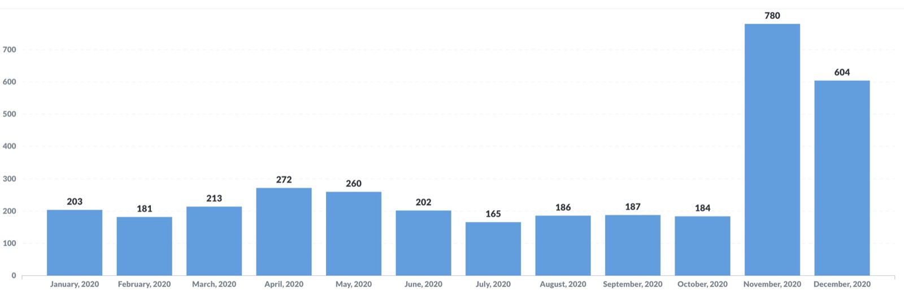

Hi all !

Like every year, it is time for a new annual review for Gladys Assistant !

Let's go for the 2020 year in review :)

<!--truncate-->

## What happened in 2020?

The year 2020 was rich in new features for the project, because in November version 4 of Gladys [was released](/blog/lancement-gladys-assistant-4), a rewritten version from scratch.

Many of you joined the community following this launch, since 780 of you installed Gladys v4 the month of its launch: a very encouraging figure.

Here are the installation statistics for this v4 for the whole of 2020. Before November, v4 was still in beta and only used internally, which explains the low installation figures. The peak is in November, and it stabilizes in December afterwards because many people have tested Gladys without necessarily using it immediately in the long term: this is normal 🙂

Now, the product receives frequent updates from the 17 GitHub contributors on this v4.

On average, excluding holidays, there was ** one new version of Gladys per week ** throughout this year.

## Some statistics

### The Gladys site

Visits to the site were down at the start of the year, but picked up very strongly in November following the launch of v4.

2,600 unique visitors in 1 day, it was a great day! The main source of this traffic was the article of [Maison et Domotique](https://www.maison-et-domotique.com/123220-gladys-assistant-v4-solution-domotique-open-source/) on the subject, as well as that of [Korben](https://korben.info/gladys-assistant.html) a few days later.

The bounce rate has continued to drop following the release of our new site (bounce rate = the percentage of visitors who leave the site without having any interactions with it) It was quite high at the start of the year ( 50%), and is now around 22%.

! [Gladys Assistant 4 site visitors statistics] (../ static / img / articles / fr / limite-2020 / website-visitors.jpg)

### Social networks

On social networks:

- [@gladysassistant on Twitter](https://twitter.com/gladysassistant) has 2,746 followers
- [Gladys Assistant Facebook](https://www.facebook.com/gladysassistant) counts 745 likes
- [@gladysassistant on instagram](https://www.instagram.com/gladysassistant) brings together 555 subscribers

And finally 1,775 followers on [my personal Twitter] (https://twitter.com/pierregillesl)!

### The newsletter

Regarding the newsletter, 3,757 of you follow the Gladys Assistant newsletter.

- 3242 subscribers in French
- 515 subscribers in English

Last year I sent about 20 emails, or between 1 and 2 emails per month.

I only send handwritten emails (with love!), Quality, non-automated content. I am absolutely spam proof like you and spend time writing relevant content. Hope you can feel it!

### The GitHub Gladys Assistant

We are at 1,556 stars ⭐ on the [Gladys Assistant repo](https://github.com/GladysAssistant/Gladys)

This is +16% compared to last year!

I'm counting on you to take us to 10,000 🚀🚀 If each of you could take 5 seconds to go and put a star on the project, that would be just great 😍

## Projects and objectives for 2021

My goal for last year (releasing v4) having been reached, my main goal now is to promote this product and convert as many new users as possible.

So I'm going to divide my time into two missions this year:

- **Product evangelization:** continue my work with specialized journalists, participate in conferences (online!), Write content. In short, to ensure that Gladys Assistant shines and is highlighted in as many places as possible. I am proud of this v4 and want it to be used! It's a virtuous circle: the more users there are, the more contributors, so the better the product gets, which brings in new users.
- **Work on the product and the documentation:** I am aware that the product is new and inevitably some functionalities are missing. However, I find that we have taken a good pace of development and that the tools and processes that we have in place (The features requests tab on the forum, GitHub, CircleCI + CodeCov issues) allow us to work quickly and well. Gradually, functionality by functionality, we will come closer to a home automation software that is complete and rich enough to respond to 90% of cases. Documentation is a point that is particularly close to my heart on this v4. I set the bar high on the quality of the tutorials written on the site, and I'm happy to see that the community writes even more beautiful and complete tutorials than mine 😄 This is how we can attract the 1 000 next users.

In any case, I wish you all a very happy new year 2021 🥳

If you have not yet tested Gladys Assistant 4, now is the time: go to [the documentation](/docs/)!

See you soon.

Pierre-Gilles
