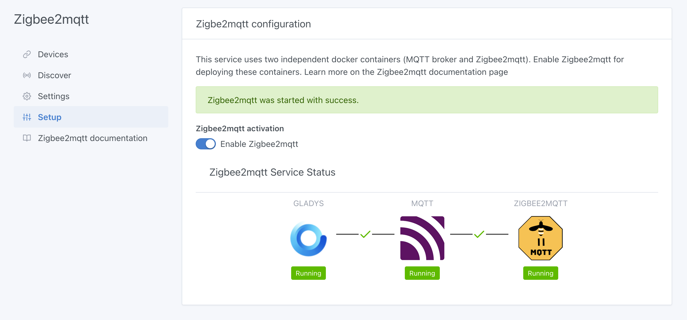
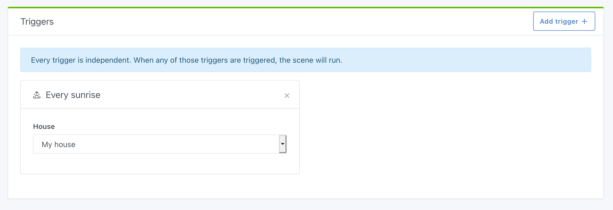
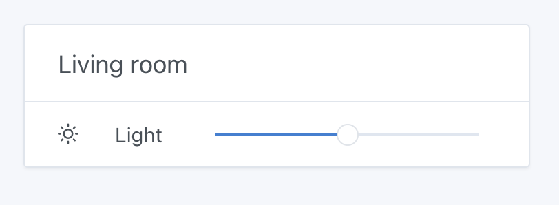
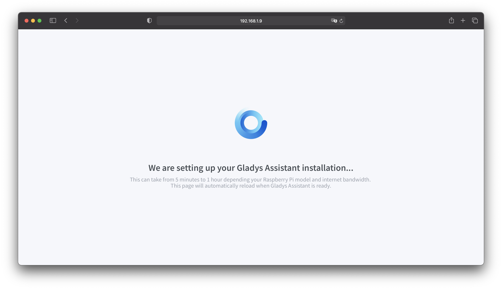

Hi all,

Gladys v4.2.0 is out today! Already!

Since the launch of Gladys Assistant 4 last November, more and more contributors have made their contribution by offering new features on Gladys Assistant.

Since November, we've released **11 new versions of Gladys**. That's almost 3 new releases per month. We're working hard!

## What's new in version 4.2

### Zigbee2mqtt

It's official, the [Zigbee2mqtt](https://www.zigbee2mqtt.io/) integration is now integrated into Gladys 4 🚀

It is therefore now possible to control a wide range of Zigbee peripherals via a Zigbee USB key. Here is the [list of supported devices](https://www.zigbee2mqtt.io/information/supported_devices.html).

This is the result of months of work on the part of many members of the community. Thanks to [Reno](https://community.gladysassistant.com/u/reno/summary) for the first initial development, thanks to [cicoub13](https://community.gladysassistant.com/u/cicoub13/summary) for resuming development, and thanks to [lmilcent](https://community.gladysassistant.com/u/lmilcent/summary) for testing!

For the moment, all the peripherals are not necessarily perfectly managed, which is normal as we do not have all the unimaginable peripherals on earth. There may be some adjustments to be made that we will discover over the course of the use of this integration.

See [the documentation for this integration](/fr/docs/integrations/zigbee2mqtt).

Do not hesitate to give feedback on the forum if you come across a poorly managed device

### Sunrise / sunset

It is now possible to make scenes that are triggered at sunset or sunrise.

Thanks to [Lokkye](https://community.gladysassistant.com/u/lokkye/summary) for the work done on this PR!

### Philips Hue

We've updated the NPM dependency we use in the Philips Hue integration to it's latest version.

Some users had problems with discovering a Philips Hue bridge on their network because we were previously using Philips Hue's N-UpnP scan which is based on their online API.

We changed this function to go through the network UPnP scan, which takes place entirely locally without calls to Philips Hue servers. This should fix the issues some of you were having!

### Brightness control on the dashboard

Thanks to the work of [VonOx](https://community.gladysassistant.com/u/vonox/summary), it is now possible to control the brightness of your bulbs on the dashboard.

### Gladys More

I continued my work on optimizations and performance to improve the speed of access to Gladys Plus!

While researching, I noticed a way to reduce the load on Gladys Plus servers as well as on local instances.

This change drastically improves performance, and I can't wait to see in production what it will look like on larger instances (like Terdious) or instances with small connections (like Mastho).

### Major update of several internal dependencies

We took the opportunity to make major updates to some of the dependencies we use:

- From Node 12 -> to Node.js 14 LTS
- From Sequelize 4 -> Sequelize 6
- We switched to the latest version of [node-nlp](https://github.com/axa-group/nlp.js), the library we use for language recognition in Gladys. According to the tests we did, the language processing model recognizes requests much better! On top of that, new sentences have been added to the weather module for richer discussions with Gladys 😄

Everything was not necessarily easy to do, but we are happy to have done it!

## How to update?

If you installed Gladys with the official Raspberry Pi OS image, your instances will update **automatically** in the coming hours. It can take up to 24 hours, don't panic.

If you installed Gladys with Docker, make sure you are using Watchtower. See the [documentation](/docs/installation/docker#auto-upgrade-gladys-with-watchtower).

With Watchtower, Gladys will update automatically.

## A new Raspberry Pi OS image

I take this opportunity to announce that we have a new Raspberry Pi OS image, which we build automatically based on the same build process that the Raspberry Pi foundation uses!

This image has several advantages:

- It is always up to date. When you install Gladys on a Raspberry Pi, this image will automatically search for the latest version of Gladys during installation. During the first start, you will see a waiting page during the automatic installation of Gladys 🙂

- It is more easier for us, because now we can build a new image automatically as soon as the foundation releases a new Raspberry Pi model.

Many thanks to [VonOx](https://community.gladysassistant.com/u/vonox/summary) for the awesome work done. I could not have done better !!

## Thanks

This new version is the perfect demonstration of the strength of open-source: to be able to do together what we would not be able to do alone.

Once again, the Gladys community has shown that it's here to develop together, test together, and move this project forward.

Thanks to everyone who contributed to this release 👏👏

Pierre-Gilles Leymarie
