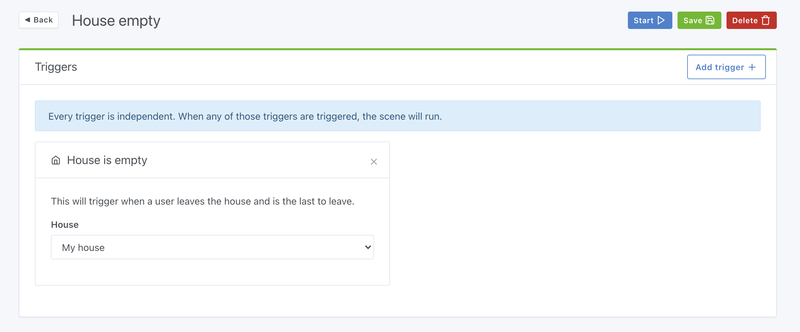
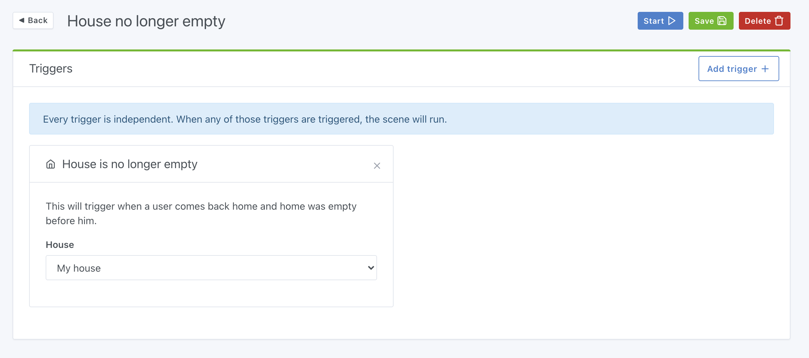
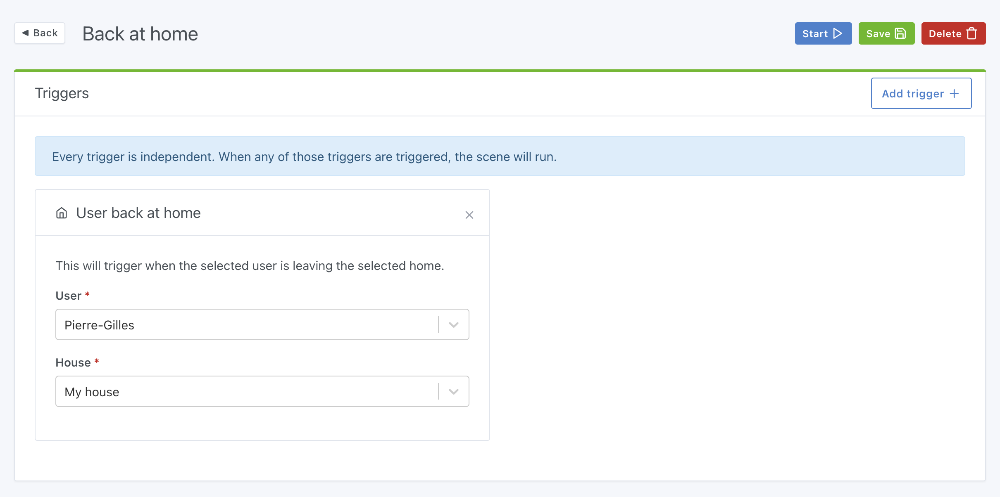
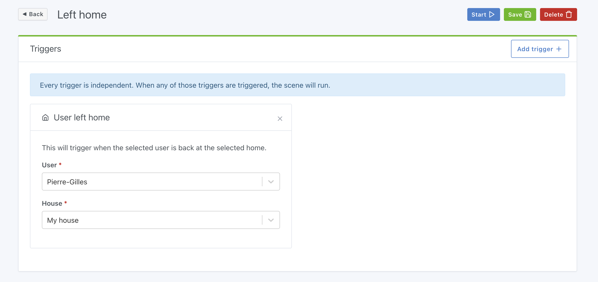
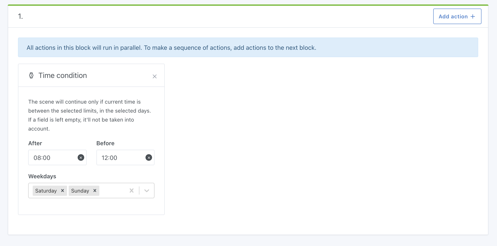
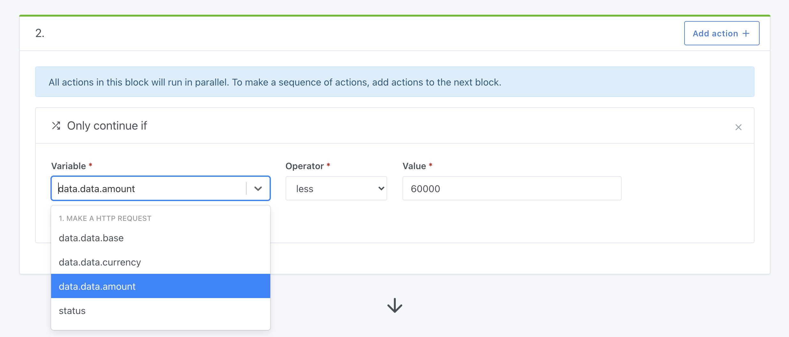

Hi all,

Today is the release of Gladys Assistant v4.3, a new update that puts the scenes in the spotlight!

Scenes are the backbone of home automation.

Having a connected home is not just to control it remotely: it is also to automate what is done regularly, to bring a share of magic to our home and make our daily lives easier.

## What's new in version 4.3

### A new trigger "When the house is empty"

Want to be sure everything is off when the last person leaves the house?

It is now possible to make a scene that will be triggered when the last one leaves the house.

In terms of presense detection, the feature is present from Gladys Assistant v4.1, and can work in different ways:

- Via bluetooth: There are Bluetooth key fobs like the Nut which are very easily detectable by Gladys. The principle is simple: when you leave your home, Gladys will no longer "see" the bluetooth keychain and will mark you as absent, and when you come back, Gladys will detect the keychain and mark you as present.
- In the scenes: it is possible to create a scene which is triggered after a change of state of a sensor for example, which will mark you as present/absent from the house. So you can do more or less what you want to mark yourself as present/absent at home.

### Its opposite, "When the house is no longer empty"

Rather, you want to do another scene that will turn on everything when someone comes home and the house was empty before them.

This is possible with the trigger "when the house is no longer empty":

### More precise, the "back home" trigger

Want to trigger a scene only when a specific user comes home?

There is now a "Back home" trigger that will only fire when the selected user returns home.

Convenient to make a specific scene for each person in the house.

### And its opposite, "Left home"

Same concept but for the departure of the house.

### Time condition

While it is possible to make a scene that is triggered with a certain recurrence (with [scheduled scenes](/docs/scenes/scheduled-trigger)), it was not possible until then to add a time-based condition in the scene.

For example, let's say you want to make a scene:

- "When the living room temperature is < 20°C"
- AND "it is between 9h and 22h"
- THEN send me a message "The temperature is too low"

It is possible with the time-based condition!

Example of a scene that will only run between 8 a.m. and 12 p.m. on weekends:

### Get the result of an HTTP request

Since Gladys v4.0.3, it is possible to make HTTP requests in the scenes.

Convenient for calling an external API in scenes.

From now on, it is possible to retrieve the response of the HTTP call, and to use the result of the request in the scenes.

For example, let's say you want to do a scene that will call Coinbase's API every morning to retrieve the price of Bitcoin, and send you a message with the price.

It is now possible, and here is an example in video:

<video  width="100%" controls autoplay loop muted>
<source src="/static/img/articles/en/gladys-4-3/bitcoin-price.mp4" type="video/mp4" />
  Your browser does not support the video tag.
</video>

Of course this is just one example among many.

You could request a weather API, traffic API, a sensor at home, IFTTT, and many others...

And that's not all! Variables retrieved in the HTTP call can be used in the "continue only if" condition, which allows you to verify that a condition is true.

Example:

- Receive a message only if the outside temperature is < 32°F.
- Receive an alert if a company stock you follow drops by more than 20%

### Correction of bugs and typos in the interface

Many of you have reported small misspellings in the interface, or responsive bugs.

Without going into detail, here is the list of the various corrective commits for this update:

- Fix #1147: make signup process more responsive [`#1147`](https://github.com/GladysAssistant/Gladys/issues/1147)
- Fix #1161: correct french typo [`#1161`](https://github.com/GladysAssistant/Gladys/issues/1161)
- Fix #1162: correct date format in french scheduled trigger [`#1162`](https://github.com/GladysAssistant/Gladys/issues/1162)
- Fix url in signup process [`8ee5793`](https://github.com/GladysAssistant/Gladys/commit/8ee5793bfa1b3153c8c26bc1e4e2c9b8f2144a8a)
- Add switch dimmer to supported feature types in dashboard box [`b740657`](https://github.com/GladysAssistant/Gladys/commit/b7406570a9e96d4590f78c05bca97a84b8978001)

## How to upgrade?

If you installed Gladys with the official Raspberry Pi OS image, your instance will update **automatically** in the coming hours. It can take up to 24 hours, don't panic.

If you installed Gladys with Docker, make sure you are using Watchtower. See the [documentation](/docs/installation/docker#auto-upgrade-gladys-with-watchtower).

With Watchtower, Gladys will update automatically.

## Thanks to contributors

Once again, thank you to everyone who contributed to this release: whether it's coding, suggesting new ideas on the forum, or testing new features, every help is invaluable and makes the product complete!
