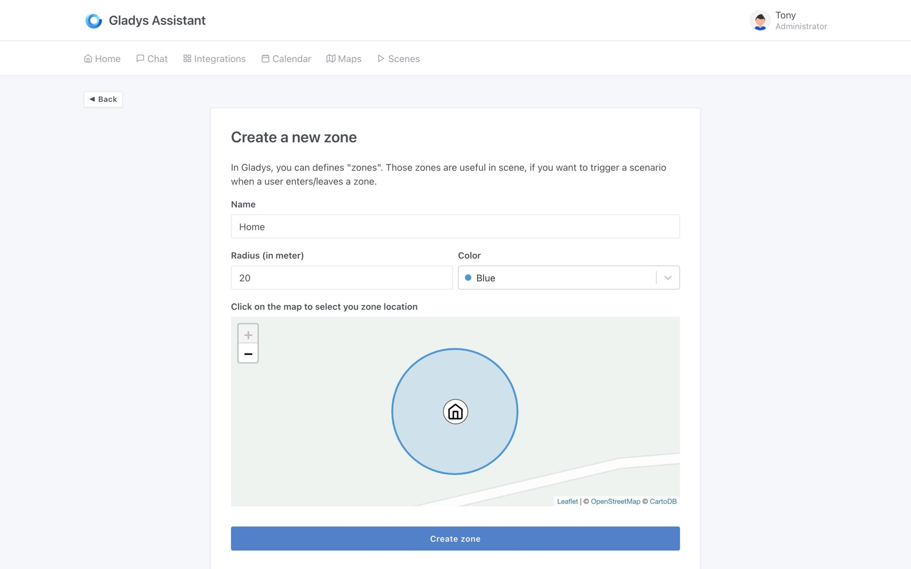
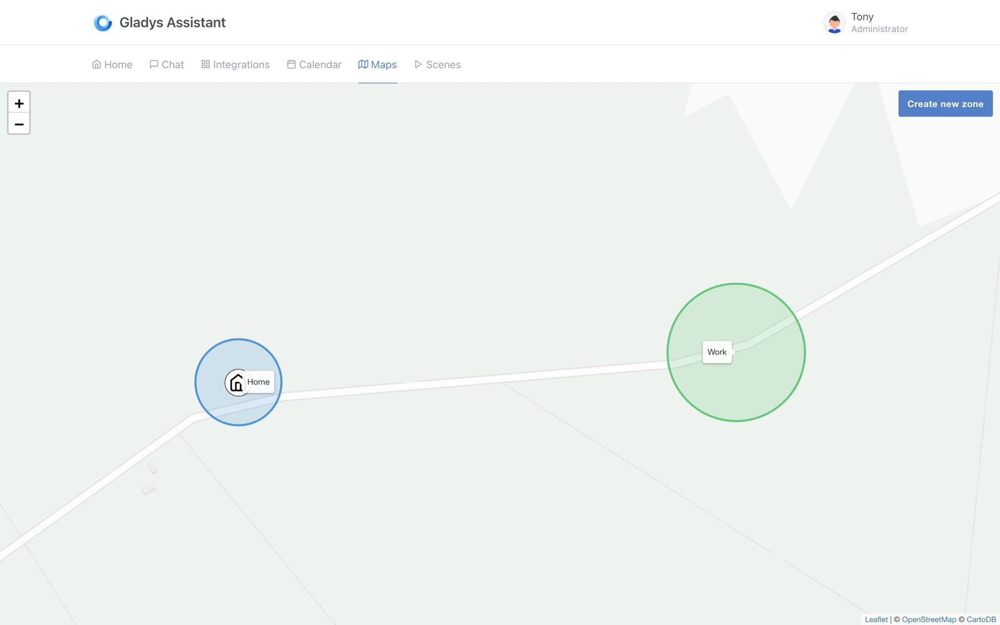
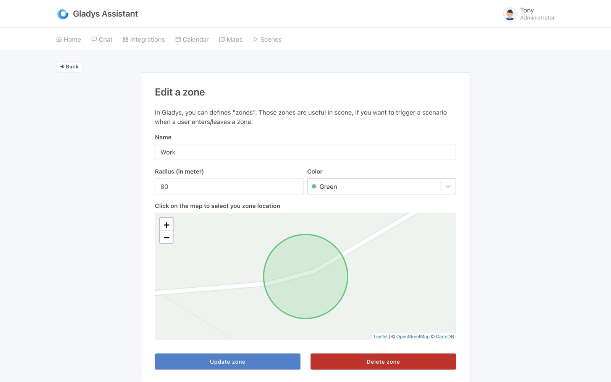
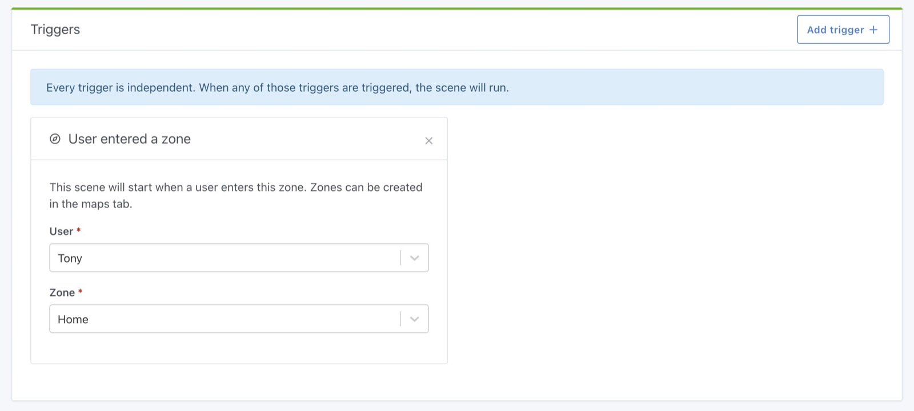
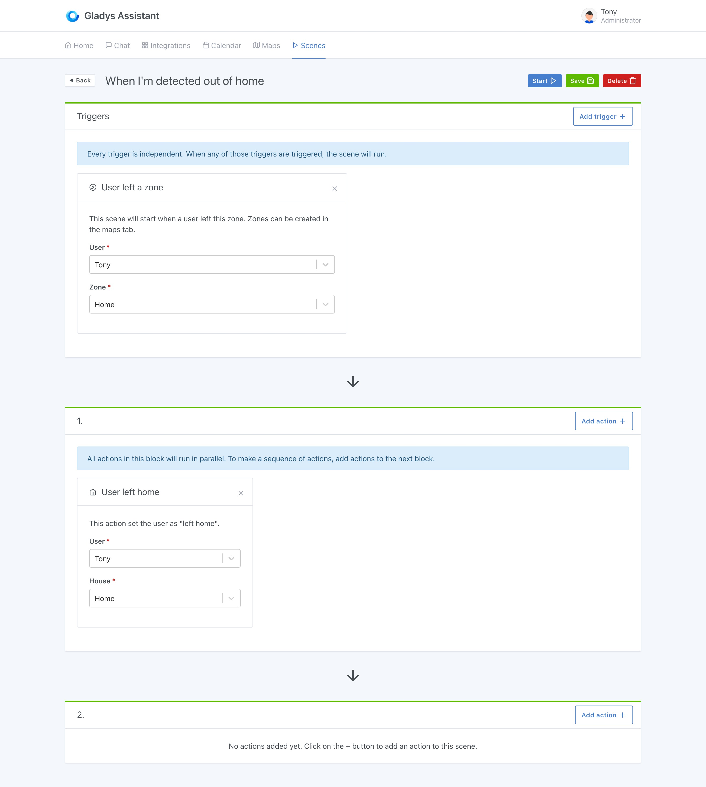
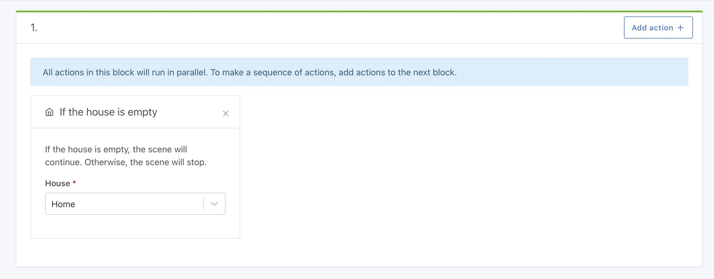
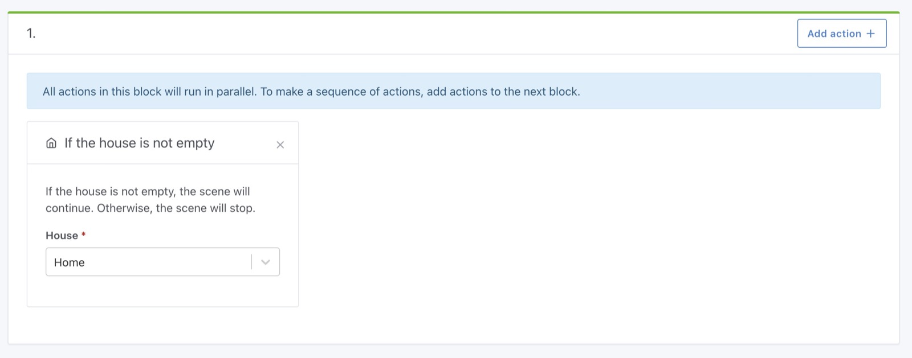
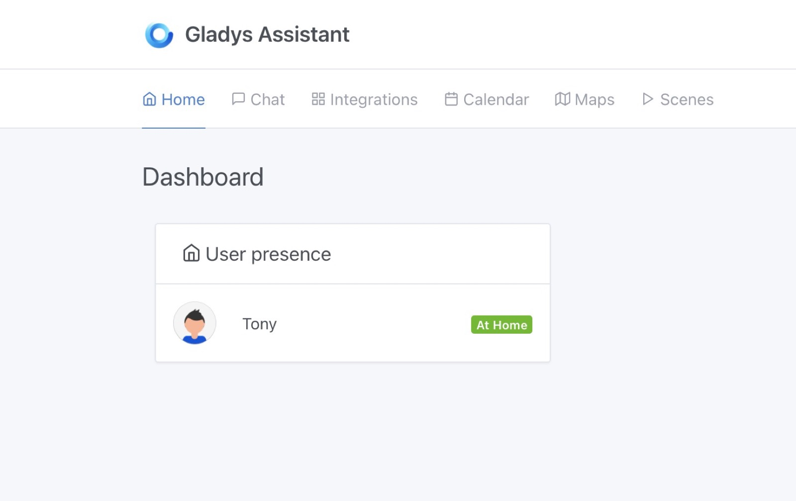

Hi all,

Today we are releasing Gladys Assistant v4.4, a brand new version that is finally making the map view useful in Gladys !

## What's new in Gladys Assistant 4.4?

### Create zones in the map view

On the map, you can now create zones:

- For your home
- Your work
- The school
- Literally anywhere on earth!

You should see your created zone on the map

You can of course edit those zones:

### Start a scene when a user enters/leaves a zone

Now, using the zones you previously created, you can now create a zone that will be trigger when a user enters the zone:

or when the user leaves the zone:

## An example: set your user as "at home" or "left home"

Imagine you want to set your user as "at home" when you enters a zone, and "left home" when you leaves a zone.

You can do that by creating two scenes, at home:

And left home:

### House empty/not empty condition in scene

It was already possible to create a scene that triggers when a house is empty/not empty, but it was not possible to add a condition in a scene to continue only if the house is empty/not empty.

It's now possible!

With this scene, you can add the presence card on the dashboard:

### Bugfixes

We fixed a few bugfixes in this release:

- Calling a scene from a scene should duplicate the scope object to avoid context pollution [`#1205`](https://github.com/GladysAssistant/Gladys/pull/1205)
- Fix log in scene continue-only-if action [`#1201`](https://github.com/GladysAssistant/Gladys/pull/1201)

## How to upgrade?

If you installed Gladys with the official Raspberry Pi OS image, your instance will update **automatically** in the coming hours. It can take up to 24 hours, don't panic.

If you installed Gladys with Docker, make sure you are using Watchtower. See the [documentation](/docs/installation/docker#auto-upgrade-gladys-with-watchtower).

With Watchtower, Gladys will update automatically.

## Thanks to contributors

Thanks to everyone who contributed to this release and gave their feedback on the forum!

If you want to talk about this release, you're all welcom on the [forum](https://community.gladysassistant.com/) !
