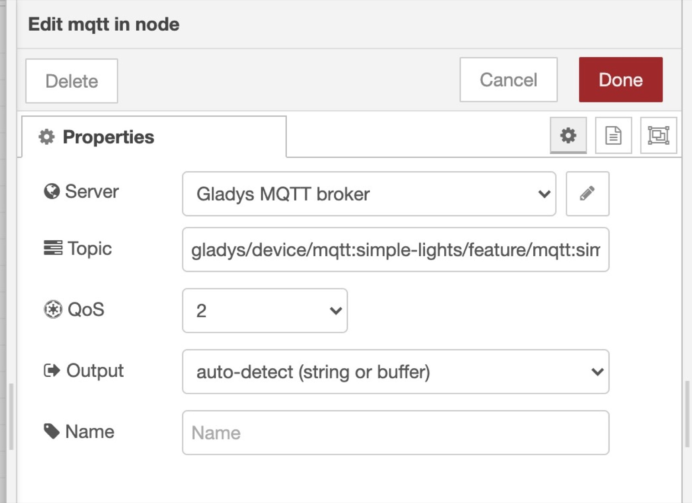

Hi !

In this tutorial I want to show you that it's possible to integrate Gladys Assistant with other cool open-source software like Node-RED.

## Start Gladys Assistant

You need to have a Gladys Assistant instance for this tutorial.

You can install Gladys Assistant on a Raspberry Pi with our pre-built Raspberry Pi OS image, or use Docker to spin up a Gladys container.

To get started, follow our [documentation](/docs/).

## Start Node-RED

We'll use Docker to install Node-RED.

### Start Node-RED docker image

Node-RED has a [Getting Started](https://nodered.org/docs/getting-started/) section on their website, but if you want to simply use Docker, you can run this command:

```
docker run -d \
--log-opt max-size=10m \
--restart=always \
--privileged \
-u root \
--network=host \
--name node_red \
-v /var/lib/node-red:/data \
nodered/node-red
```

**A few details:**

- We used the "privileged" mode in case you want to run some home automation modules on your machine, and sometimes it needs more permissions to access the system. If you don't need it, you can safely remove it.
- "-u root" is used to start the container as the "root" user. You can change "root" to the current user of your Linux machine. On a Raspberry Pi, it'll probably be "pi".
- "/var/lib/node-red": The folder where Node-RED data will be saved.

### Secure Node-RED

By default, Node-RED is open. We need to secure it so it's not open for everyone to use.

Node-RED admin needs to be configured in command-line.

You first need to hash your password by running the following command:

```
docker exec -it node_red node-red admin hash-pw
```

Enter your password.

It'll then display a string like:

```
$2b$08$6yOj6Z/ya7eDdn3eKwy4WukuyHUxiJOcZyHFiHPaCQBckKpLxUPly
```

This is a hashed version of the password "test"

Open the file `/var/lib/node-red/settings.js` by doing:

```
nano /var/lib/node-red/settings.js
```

If it doesn't work, maybe nano is not installed on your machine.

On Ubuntu/Debian, run:

```
sudo apt-get -y install nano
```

Go to the line with:

```
//adminAuth: {
//    type: "credentials",
//    users: [{
//        username: "admin",
//        password: "$2a$08$zZWtXTja0fB1pzD4sHCMyOCMYz2Z6dNbM6tl8sJogENOMcxWV9DN.",
//        permissions: "*"
//    }]
//},
```

Un-comment those line, and replace the password with the hashed password you generated earlier.

You should have something that looks like this:

```
adminAuth: {
    type: "credentials",
    users: [{
        username: "admin",
        password: "$2b$08$6yOj6Z/ya7eDdn3eKwy4WukuyHUxiJOcZyHFiHPaCQBckKpLxUPly",
        permissions: "*"
    }]
},
```

Now restart node-red with the command:

```
docker restart node_red
```

And you should be good, Node-RED should be secured!

### Accessing Node-RED

Congrats, Node-RED should be available at `IP_OF_YOUR_MACHINE:1880` !

You should see a login screen.

Here, use the the login you previously set in the settings.js file.

For me, it's:

```
Username: admin
Password: test
```


## Configure MQTT in Gladys Assistant

Now go to Gladys Assistant, and click on "Integrations" => "MQTT".

Go to the "Setup" tab, and click on the big blue button "Install broker in Docker" to setup a MQTT broker automatically.

You can also use a MQTT broker you already configured previously.

### Create a MQTT device in Gladys Assistant

Back to the "Devices" tab in the MQTT integration, you can create a new device:

- Name: "Lamp"
- External ID: "mqtt-lamp"
- Room: "Kitchen"
- Features: Add a "Light On/Off" feature to be able to control
  - Name: "Lamp"
  - Feature external ID: "mqtt-lamp"
  - Minimum Value: 0
  - Maximum Value: 1
  - Is it a sensor ? No

Copy paste the MQTT topic displayed, you'll need it for later!

## Control a device in Node-RED from Gladys Assistant

In Node-RED, you can create a "mqtt in" node to receive data from Gladys in MQTT.

You need to add the MQTT broker we just configured in Gladys by clicking on the little edit button (the pen icon next to Add new mqtt-broker):


- The server is `mqtt://localhost`
- Username: gladys
- Password: Copy paste the generated password from Gladys.


Finally, you need to paste the MQTT topic we copy pasted from Gladys when creating the device previously:



Now that this node is ready, you can connect pretty much anything to it, it'll be executed when a value is received on this MQTT topic.

You could connect a simple debug to see the data coming, or you can plug a switch case to do a different action if the data sent by Gladys is "0" (Turn Off) or "1" (Turn On).

Example:


## Send sensor value from Node-RED to Gladys Assistant

We'll do the opposite scenario in Node-RED: Sending some data from Node-RED to Gladys.

Let's imagine that I want to measure the CPU usage of my machine, and send this CPU usage every 10 seconds to Gladys.

### Create a Gladys MQTT device

I can create a Gladys a MQTT "CPU Usage" device:

- Name: "CPU"
- External ID: "mqtt-cpu"
- Room: "Kitchen"
- Features: Add a "Unknown" feature (you can choose anything here, it's just for the example)
  - Name: "CPU"
  - Feature external ID: "mqtt-cpu"
  - Minimum Value: 0
  - Maximum Value: 100
  - Is it a sensor ? yes

Copy paste the MQTT topic displayed, you'll need it for later!

### Send a value from Node-RED every 15 seconds

Add an "Inject" node in Node-RED.

Set `msg.payload` to a random value (Here I put 15)

Add a repeat interval at the end of the node, every 15 seconds.


Now add a "mqtt out" node, and paste the MQTT topic we saved earlier when creating the CPU device.


Connect the "Inject" node to the "mqtt out" node, and click "deploy".

Now you'll see that every 15 seconds, Node-RED will send the value "15" to Gladys in MQTT!

You can verify that by creating a dashboard and displaying the device we just created.

## Going further

The goal of using Node-RED here is to be able to control devices that are not compatible with Gladys yet, so you might want to check their Node-RED modules to add a new compatibility in Gladys.

You can search their [website](https://flows.nodered.org/search?type=node&sort=downloads)

And then, in Node-RED, click on the top-right menu, then "Manage palette" to install new modules.

You can then use the installed modules in Node-RED in the left-panel.
