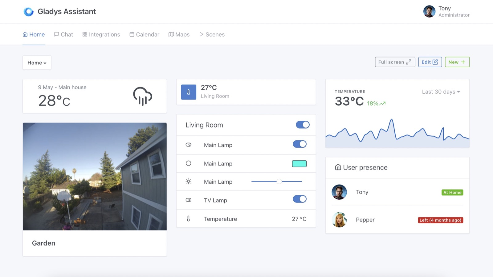

Hi everyone!

This week I'm releasing a set of big features that have been asked for quite some time 🚀

Everything is available in Gladys Assistant v4.7 🥳

## What's new in Gladys Assistant v4.7?

### Charts on dashboard

We now have a native way of displaying charts on the dashboard, entirely automatically and without having to setup a third-party database like InfluxDB.

To do this, Gladys is now aggregating all device data with 3 different levels of granulatity:

- hourly data: Gladys keeps max 100 values per device feature and per hour.
- daily data: Gladys keeps max 100 values per device feature and per day.
- monthly data: Gladys keeps max 100 values per device feature and per month.

When displaying a chart on the dashboard, Gladys will use one of the 3 sets of aggregated data to display the chart as fast as possible.

Our goal is to stay under 100ms request time no matter the amount of data your sensor is saving.

To read more about how to setup this feature, you can read [the documentation](/docs/dashboard/chart).

### Full Zigbee2mqtt compatibility

When releasing Zigbee2mqtt compatibility this year, we took a very prudent approach:

Each device needed to be classified manually by a developer before being able to be used in Gladys.

This approach was safer to start, because it allowed us to better integrate each device, understand a wide range of Zigbee peripherals and adapt Gladys for those devices.

But after some time, it became very repetitive to write one PR for each new Zigbee device, so we took another approach:

Auto-detecting each device!

Thanks to Alexandre Trovato [#1302 Pull Request](https://github.com/GladysAssistant/Gladys/pull/1302), we are now able to parse the data sent by Zigbee2mqtt to automatically map those devices to Gladys capabilities.

It means that all Zigbee2mqtt compatible devices are now compatible with Gladys, natively!

### In Tasmota integration, be able to change a switch to a light

It was a common feedback, some users plug a light on a switch, and therefore they want those switches to be considered as light in Gladys.

For example, if I say "Turn on the light in the living room", it should turn on those switches as well.

It's now possible to change a switch to a light in the Tasmota integration.

### Add a new "Device temperature" category to monitor CPU temperature

Some device send a value for the temperature of their CPU.

In Gladys, we had only one "temperature" category, and the problem is that when asking for "What's the temperature in the living room?" it would answer with the temperature of the CPU of your living room computer...

Now, there is a separate "Device temperature" category to let you classify those CPU temperature clearly, without affecting the "Room temperature" feature in Gladys.

Developed in [#1327](https://github.com/GladysAssistant/Gladys/commit/94acaac8fd32c3c0e0c82c581f10904d5ed36f0d).

### Lots of improvements/bugfixes

- In the MQTT integration, we now display if the broker is connected or not ([#1349](https://github.com/GladysAssistant/Gladys/commit/a5c95dcfbfc84b8ddde141a4e3680cae9fb659ce))
- In the Caldav integration, the date is now correct for recurring events ([#1367](https://github.com/GladysAssistant/Gladys/commit/b6ab1c06e94f804c6077da7b99e5e258ef0cf475))
- In the Telegram integration, temperature is now displayed in the correct user format ([#1363](https://github.com/GladysAssistant/Gladys/commit/bcbb1234b1590fb14a2af5eef87065c966297287))
- In the scene tab, fix a bug that was preventing the user to edit scene name ([#1318](https://github.com/GladysAssistant/Gladys/commit/7ed2d520b8b5b6c03b539311903425393797aaa1))
- Lots of bugfixes/improvements on the Ewelink integration ([#1044](https://github.com/GladysAssistant/Gladys/commit/a755d55f2ebb70983111343018b3fd9a1590933b))

## How to upgrade?

If you installed Gladys with the official Raspberry Pi OS image, your instance will update **automatically** in the coming hours. It can take up to 24 hours, don't panic.

If you installed Gladys with Docker, make sure you are using Watchtower. See the [documentation](/docs/installation/docker#auto-upgrade-gladys-with-watchtower).

With Watchtower, Gladys will update automatically.

## Thanks to contributors

Thanks to everyone who contributed to this release and gave their feedback on the forum!

If you want to talk about this release, you're all welcome on the [forum](https://community.gladysassistant.com/) !
