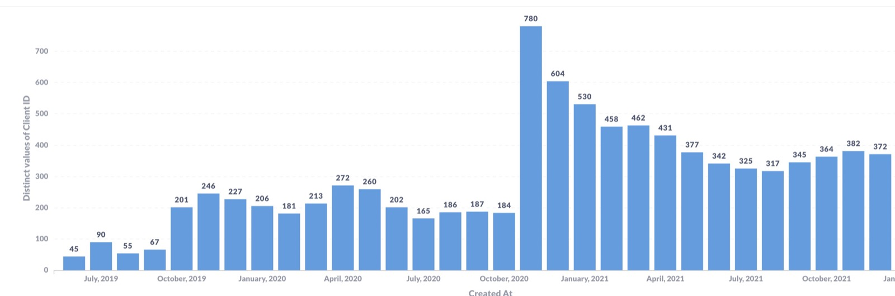
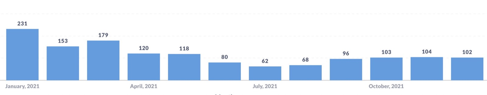
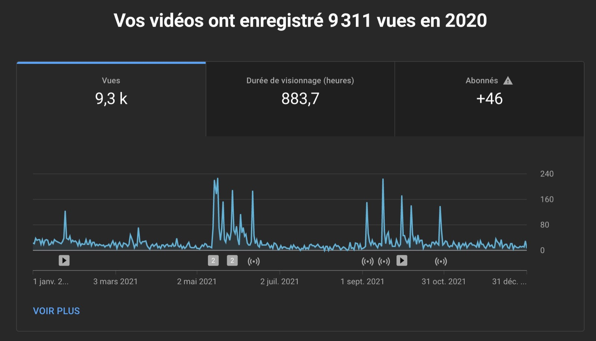
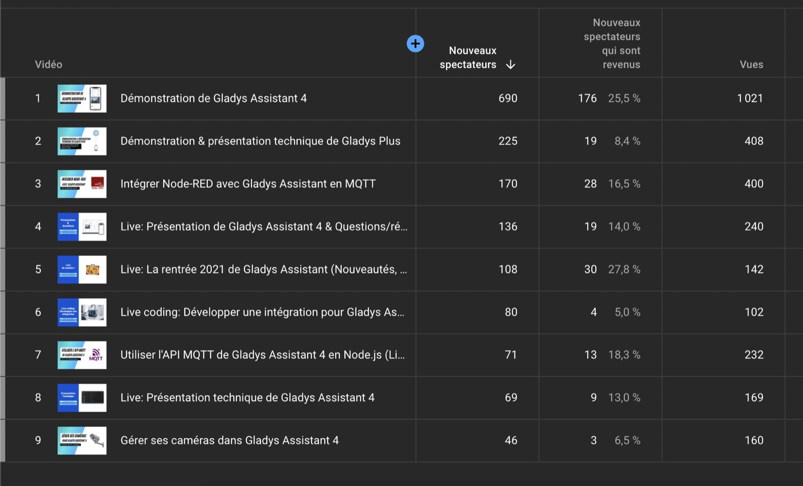

Hello everyone, and happy new year!

It's the tradition, every year I write an article to recap everything that has happened over the last year for Gladys Assistant.

Welcome to the 2021's version of this article 😄

<!--truncate-->

## What happened in 2021?

2021 was the most productive year on the project, as **we released 23 updates**, or one update every 2.2 weeks on average!

This productivity is the result of all the work done upstream in 2019 and 2020 to set up this new version of Gladys (Gladys 4) with a more recent tech stack, a stack that allows us to be more confident on the code that we release, to test more easily, and therefore to release features and fixes faster.

And it is above all **the involvement of the whole community** that has allowed the project to be so swift.

Without the PRs of all the contributors, it is impossible to have such rich compatibility, to have such a complete product, and to respond to bugfixes so quickly.

THANKS to all the contributors: Alexandre Trovato, Vincent Kulak, Bertrand D'Aure, Cyril Beslay, Corentin Allemand, NickDub, Sescandell, Terdious, Frédéric Le Barzic, Rob McCann, Thibaud Roudier and Nicolas Geissel! 🙏

To come back to the features that were developed this year, we can quote:

- Zigbee2mqtt integration, sunrise/sunset detection, dashboard brightness control in [Gladys Assistant 4.2](/blog/gladys-assistant-4-2-is-here)
- Presence managment in scenes, time-based condition in scenes, HTTP requests in scenes in [Gladys Assistant 4.3](/blog/gladys-assistant-4-3-is-here)
- Zone entry and exit detection, empty house condition / no longer empty in the scenes in [Gladys Assistant v4.4](/blog/gladys-assistant-4-4-is-here)
- Multiple dashboards, Google Home integration, possibility to deactivate a scene, control any device in a scene in [Gladys Assistant v4.5](/blog/gladys-assistant-4-5-is-here)
- Display of sensor graph on the dashboard, full compatibility with all Zigbee2mqtt devices in [Gladys Assistant v4.6 and v4.7](/blog/display-chart-and-major-zigbee2mqtt-upgrade)

As you can see, we were able to document and write blog posts for each new feature developed.

It is also the result of all the work done upstream on the site to make it easier to publish articles. I hope to continue this momentum in 2022 and write even more content.

## Some statistics

The [/open](/open/) page has returned to the site, and allows you to follow in real time the number of Gladys instances running, and the number of Gladys Plus users (and thus the income of the project).

### Usage

Since v4, we estimate the number of active instances by counting the number of update request requests made on our infrastructure.

Here is the number of active installations per month since the start of v4 (alpha included):

Here is the number of new instances per month:

In November 2020, Gladys v4 was released and there were a lot of articles on specialist sites, which boosted downloads in the months that followed.

The summer of 2021 was very low in terms of use and new users, which is not surprising because France has deconfined during this period and no one was simply in front of their computer.

Fortunately in September, growth resumed and we finally had ** 372 active instances ** at the end of December 2021.

It's a nice number, but it's below what I expected.

My goal was 1000 active instances, we are far from it for the moment 😄

### The YouTube channel

From May 2021, I got serious about the YouTube Game 😎

I released 5 videos and did 5 live YouTube.

It's a lot of work because each video / live takes me about 1 full day of work, between preparation, communication before the live, filming, editing, publication (thumbnail, description, timestamp, social media posts, newsletter)

10 videos therefore represent 10 days of work, knowing that I only work part-time on Gladys, this therefore represents approximately 1 month of work cumulatively over the year. It doesn't appear, but it's a huge job 😅

My video are all in french as I'm french, if you are intersted here are my top videos:

- [Demonstration of Gladys Assistant 4](https://www.youtube.com/watch?v=yP-umEMVcro)
- [Live: Technical presentation of Gladys 4](https://www.youtube.com/watch?v=t6mVCZ5Y9SU)
- [Integrate Node-RED with Gladys Assistant in MQTT](https://www.youtube.com/watch?v=bpmHzR8_S5g)
- [Demonstration & technical presentation of Gladys Plus](https://www.youtube.com/watch?v=TmjrBeufjyo)

In 2021, the channel had 9.3k views and 883 hours of viewing.

It's a good start, and I will continue in this direction in 2022 because for me the videos are a real plus for the project:

- Thanks to the YouTube algorithm, the videos are presented to YouTube visitors who do not know Gladys but are interested in home automation / the Raspberry Pi / all the tech topics that I discuss on video. These viewers discover the project via YouTube and potentially come to install Gladys afterwards.

YouTube even allows me to see statistics on these users:

- Videos are good complements to written tutorials, because it is often easier to reproduce what we see on video rather than what we see in a written article. Users project themselves better!

If you want me to tackle a specific topic in video, don't hesitate to tell me about it on the forum or on Twitter, I'm into any video topic.

### Social networks

On social networks:

- [@gladysassistant on Twitter](https://twitter.com/gladysassistant) has 2,744 followers
- [Gladys Assistant Facebook](https://www.facebook.com/gladysassistant) counts 756 likes
- [@gladysassistant on instagram](https://www.instagram.com/gladysassistant) brings together 573 subscribers

And finally 1,874 followers on [my personal Twitter](https://twitter.com/pierregillesl)!

### The newsletter

In terms of the newsletter, 3,508 of you follow the [Gladys Assistant newsletter](https://email-list.gladysassistant.com/subscription/haflMsWmU).

- 3016 subscribers in French
- 492 subscribers in English

It is a regression compared to last year, but it is normal! I implemented bounce detection rules, which purged the list of old emails that no longer existed.

A "bounce" email when the recipient is no longer reachable: the domain no longer exists or the email no longer exists. This often happens in the Gladys audience, because some of you use a personal domain as email (ex: firstname_at_last_name_of_family.com), and end up giving up this address / not renewing the domain.

### The GitHub Gladys Assistant

We are at 1,879 stars ⭐ on the [Gladys Assistant repo](https://github.com/GladysAssistant/Gladys)

It's + 21% compared to last year!

Another double-digit growth on the Github 😍

I am counting on you to support us on GitHub by putting a star ⭐ on the project.

## Projects and objectives for 2022

### A technically sound product

For me, the last 2 years have served to lay the foundations for a robust, stable and easy-to-use home automation software.

Now that the basics have been laid, we are moving at cruising speed: developments are frequent, the site evolves with each new feature, articles are published on the blog regularly, I make YouTube videos to explain each new feature in Gladys.

In other words: no more experimentation and proofs of concepts, v4 is indeed stable and the processes that we have set up with the community are working well.

### But usage does not follow yet

However, usage does not yet reflect all the work done. For me, we have not yet reached the critical point that we have reached on the tech side where the processes are well established and where we have a good pace.

This is not the case when it comes to acquiring new users.

There is unfortunately not yet a steady growth on the product. As we have seen on the annual usage curve, during the launch the number of installations was immediately very high (the result of the various articles published on home automation sites with a large audience), but once the launch effect passed, there was nothing more.

Growth came back very slowly in September, but it is clearly not enough.

There are several reasons for this in my opinion:

- During the launch, integrations and critical functionalities were missing (Zigbee2mqtt for example / Zone management / Multi-users / Multi-dashboard / Graphic view). I imagine some new users must have tested Gladys the month of launch, then put it aside. These features are now present but I'm not sure that outside of the community people are aware of all these developments.

- Our Z-Wave integration was not maintained for lack of maintainer and is clearly not up to date. Z-Wave remains a protocol that is still quite widely used, especially among the "pros" in home automation 😄. A specialized tester (YouTuber, blogger) who wants to write an article on Gladys will test with what he has at home: often Z-Wave.

In the long term, I am not sure that Z-Wave will keep those market shares when we see the new technologies: Zigbee devices at 8$ for a nice sensor and 8$ a USB stick vs Z-Wave device at 60$ for a single sensor and 25$ the USB stick. Matter future home automation standard that is coming, in full open-source. Bluetooth Low energy.

But in the short term home automation users for whom Z-Wave is the main technology have trouble with Gladys and that doesn't necessarily give the software a good publicity.

- Probably not enough communications outside the project. I'm trying via YouTube to reach a new population, but in my opinion I should rely more on existing media: participate as a guest on live (Twitch / YouTube)? Contact more home automation media? More presence on third-party forums?

If you have any ideas / have feedback / have a blog / know someone who could help us spread the word about Gladys, don't hesitate!

### A little optimism

Don't worry, I'm not complaining 😄

This is the reality of any product launch: nothing falls from the sky and it can sometimes take years before a product gets a steady growth. I have friends whose growth was flat for months, then vertical growth, even often without necessarily knowing why ... The main thing is to stay consistent in the work and not to let go 💪

In any case, thank you to the entire Gladys community which allows this product to exist.

Thank you to all the [Gladys Plus](/plus) contributors who provide financial support to the project while benefiting from great features: Google Home, backups, end-to-end encrypted remote access, open API.

Happy New Year 2022 to all, and we'll meet up on the forum to talk about all this 🙂

Pierre-Gilles Leymarie
