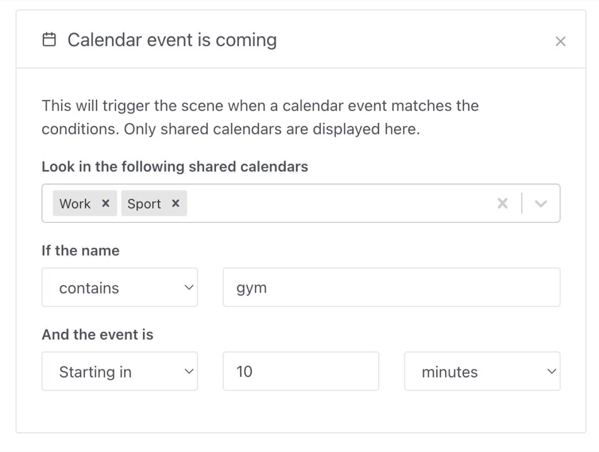
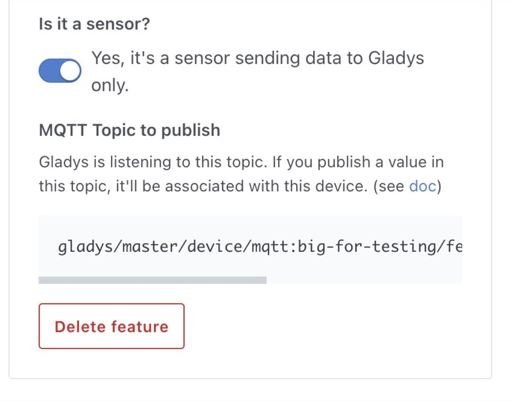

Hi everyone!

Today I'm happy to release a new version of Gladys, Gladys Assistant v4.8 🥳

This version is mainly focused on the calendar integration, but it also adds a lot of UX improvements in Gladys.

## What's new in Gladys Assistant 4.8?

### Scene trigger when a calendar event is coming up

This is a big feature that finally makes calendars really useful in Gladys.

It's now possible to trigger a scene when a specific event is coming up in the calendar.

Imagine you want to get a reminder when you need to go to work? Get a nice wake up at the right time?

You need to have at least one calendar connected to Gladys (We support iCloud calendars, Google Calendar, Synology calendars or any Caldav calendar with our [Caldav integration](/docs/integrations/caldav/)).

You can create a new scene, and create a "Calendar event is coming" trigger:

You can filter on the name of the event (contains "gym", starts with "Meeting", has any name, and more!)

Then, in the scene it's possible to use the information of the event that triggered the scene, for example in a "send message" action:

### Scene condition when a calendar event is running

Now, imagine you want to add a condition to a scene, to make it run only when you are at work, in a meeting, or in holidays.

You can use the "Condition on calendar events" condition in scenes.

You can filter on the name like for the trigger.

And of course you can use the event in following action in the same scene.

### Be able to rotate camera image by 180°

Thanks to [VonOx pull request on Github](https://github.com/GladysAssistant/Gladys/pull/1297), it's now possible to rotate a camera image in Gladys:

### MQTT UX improvements

One small improvement that will make a huge difference in understanding how the MQTT works, is the addition of the publish & subscribe MQTT topic directly in the UI for non-sensors devices.

For MQTT sensors, it looks like this:

For any device that is not a sensor:

### Zigbee2mqtt: CO sensors & Alarm feature

Thanks to Alexandre Trovato's work on Githu [here](https://github.com/GladysAssistant/Gladys/pull/1417) and [here](https://github.com/GladysAssistant/Gladys/pull/1420), you can now add a Zigbee2mqtt CO sensor & use the alarm feature in Gladys.

## How to upgrade?

If you installed Gladys with the official Raspberry Pi OS image, your instance will update **automatically** in the coming hours. It can take up to 24 hours, don't panic.

If you installed Gladys with Docker, make sure you are using Watchtower. See the [documentation](/docs/installation/docker#auto-upgrade-gladys-with-watchtower).

With Watchtower, Gladys will update automatically.

## Thanks to contributors

Thanks to everyone who contributed to this release and gave their feedback on the forum!

If you want to talk about this release, you're all welcome on the [forum](https://community.gladysassistant.com/) !

## Support us

If you want to support us, there are many ways:

- Answer posts on the forum, give your feedback.
- Help us improve the documentation.
- Develop new features/integrations on Gladys, we are 100% open-source.
- Make a [one time donation](https://www.buymeacoffee.com/gladysassistant).
- Subscribe to our [monthly subscription to Gladys Plus](/plus).
