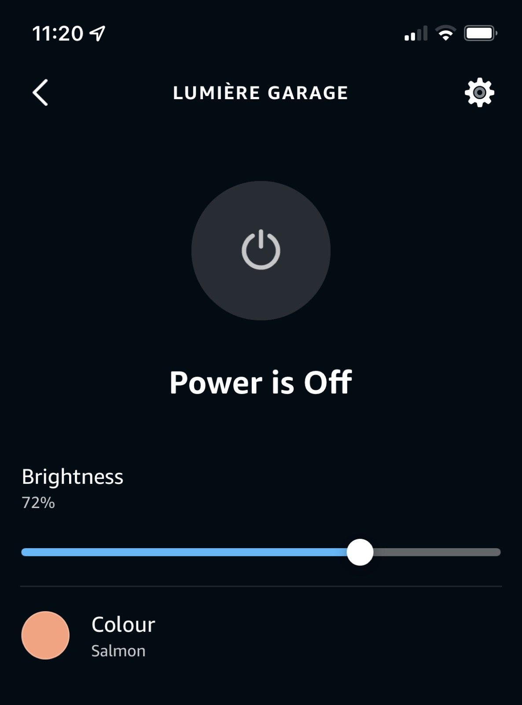
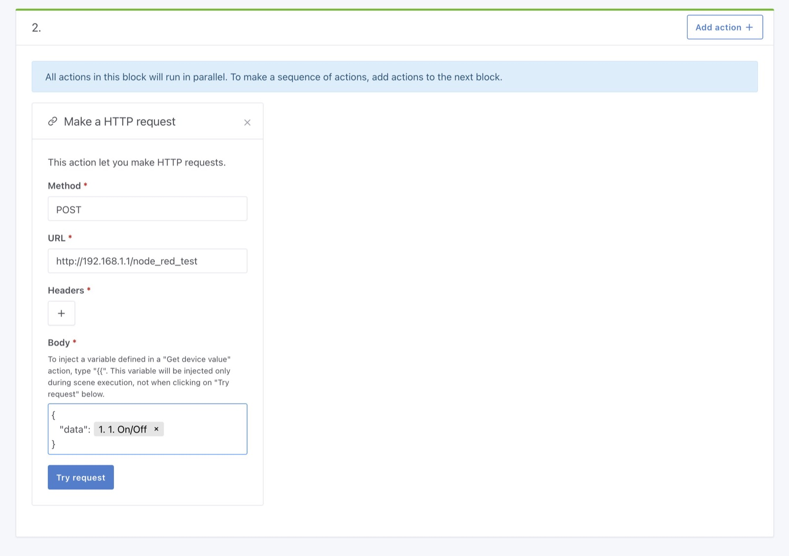

Hi everyone!

Today I'm launching a new release, Gladys Assistant v4.9.

In this version, I'm bringing a new major integration to Gladys: Amazon Alexa.

It means we are now compatible with all voice assistant: [Google Home](/docs/integrations/google-home) and [Amazon Alexa](/docs/integrations/alexa).

<!--truncate-->

## What's new in Gladys Assistant 4.9?

### Amazon Alexa integration

It's now possible to control your Gladys devices in Amazon Alexa.

We supports 3 types of control for now:

- On/Off (On lights, and switches)
- Light Brightness
- Light color

It means you can say:

- "Alexa, Turn on the light in the living room."
- "Alexa, dim the bathroom light."

To configure Amazon Alexa, it's just a few clicks.

You can follow our documentation on [how to configure Amazon Alexa](/docs/integrations/alexa).

### Inject variables in the HTTP Request action in scenes

You can now inject any variables from a scene in the HTTP Request action.

It's super simple and it can help you build powerful scene, like calling Node-RED with a custom parameter!

## Zigbee2Mqtt: Add support for Sonoff SNZB-01

We now support more clicks on the Sonoff SNZB-01 wireless switch.

## How to upgrade?

If you installed Gladys with the official Raspberry Pi OS image, your instance will update **automatically** in the coming hours. It can take up to 24 hours, don't panic.

If you installed Gladys with Docker, make sure you are using Watchtower. See the [documentation](/docs/installation/docker#auto-upgrade-gladys-with-watchtower).

With Watchtower, Gladys will update automatically.

## Thanks to contributors

Thanks to everyone who contributed to this release and gave their feedback on the forum!

If you want to talk about this release, you're all welcome on the [forum](https://community.gladysassistant.com/) !

## Support us

If you want to support us, there are many ways:

- Answer posts on the forum, give your feedback.
- Help us improve the documentation.
- Develop new features/integrations on Gladys, we are 100% open-source.
- Make a [one time donation](https://www.buymeacoffee.com/gladysassistant).
- Subscribe to our [monthly subscription to Gladys Plus](/plus).
