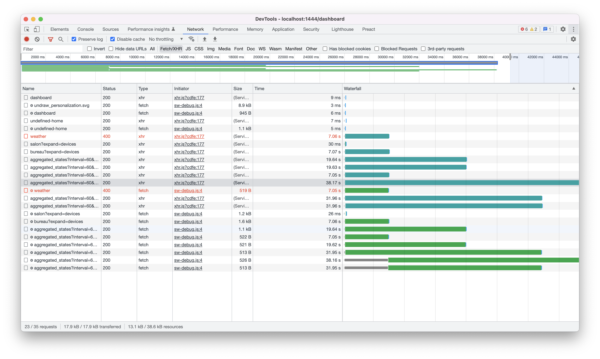
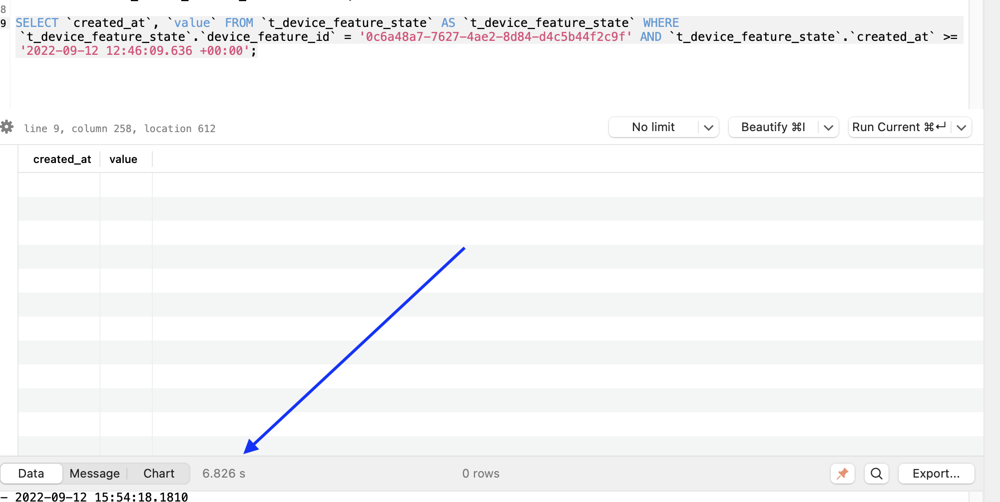
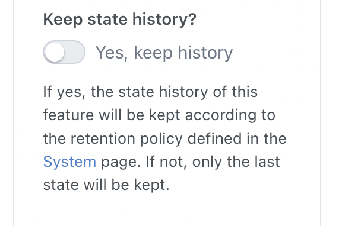

Hi everyone!

I hope everyone spent great summer holidays 🙂

Today I'm releasing Gladys Assistant v4.10, a big new release with amazing new features, both in integrations and in the core.

<!--truncate-->

## What's new in Gladys Assistant 4.10?

### Broadlink compatibility

We have a new integration 🎉

Broadlink devices are small IR emitter that acts as a remote control and can be controlled over Wi-Fi.


In Gladys v4.10, you can now connect your Broadlink devices to Gladys, and therefore control devices that your Broadlink can control (in infrared for now only, not radiofrequencies)

### Huge performance improvements on the dashboard

I've been having feedbacks that some user's dashboard were super slow to load when having multiple charts on the same dashboard.

So I asked one user to send me his database, so I could see what was wrong.

Here is what I saw:



His dashboard was taking up to 40 seconds to load: not normal at all !! 😅

So I tried running individually every single SQL query that are involved in displaying the dashboard.

I quickly found that some super simple queries were taking up to 6 seconds to run, just to finally return an empty result: not normal!



I used `EXPLAIN QUERY PLAN` to understand what SQLite was doing.

I realized that while I had the correct indexes on both attributes used in the query (`device_feature_id` and `created_at`), SQLite was using only one index to do the first filter, and then had to sequentially scan all rows to filter on `created_at`.

The solution was simple: I created an index that covered both attributes:

```sql
CREATE INDEX ix_device_feature_state_device_feature_id_created_at
ON t_device_feature_state (device_feature_id, created_at);
```

And instantly, the request taking 6 seconds went to... 5 ms! ⚡

His dashboard load time went from 40 seconds to load to 100 ms! ⚡

This performance improvement is available in Gladys Assistant v4.10.

Note that it can take some time to build the index, so Gladys might be taking longer to upgrade than usual.

### Select which device state history you want to keep

It's now possible to select which device state history you want to keep.

If you have a device that is very verbose and that store tons of data in your database, you can now exclude it from the history feature, and Gladys will only keep the last value.



### WebCal support

WebCal is a standard for accessing iCalendar files (`.ics` files).

Many organizations share WebCal calendars to share public dates: bank holidays, sporting events, TV shows, public meetings, and more.

The Caldav integration now supports syncing those WebCal calendars.

If you follow some WebCal calendars in your calendar (iCloud, Nextcloud, ...), Gladys will be able to sync them!

### Shutter/curtain support in the MQTT integration

We now support automatic shutters and curtains in the MQTT integration.


You can create a shutter in Gladys, and control 3 states:

```
STOP: 0
OPEN: 1
CLOSE: -1
```

You can also control the position of the shutter (if you shutter supports it).

### Zigbee2mqtt: Display signal quality (LQI) on the dashboard

With Zigbee2mqtt, we receive a "signal strength" attribute that tells if the device is far away from the network or not.

We now support this attribute (LQI), and you can now display it on your dashboard:


### Zigbee2mqtt: Add support for VOC sensors (air quality sensors)

VOC, or "Volatile Organic Compounds" are chemicals emitted by a variety of products at home (paintings, furnitures, cosmetics).

Some levels of pollutants can be 2 to 5 times higher inside than outside the home.

Some sensors exists to measure the VOC level at home, and we now support them in Gladys !

### Tasmota: Add support for devices that sends array of values

Some devices like the Sonoff Dual R3 flashed with Tasmota were not properly handled by Gladys.

We now support them entirely!

### Many bugfixes/UI improvements

I won't go into details of every single thing that changed, but we also fixed some little bugs, and improved the UI!

The full details can be read in the [CHANGELOG](https://github.com/GladysAssistant/Gladys/releases/tag/v4.10.0).

## How to upgrade?

If you installed Gladys with the official Raspberry Pi OS image, your instance will update **automatically** in the coming hours. It can take up to 24 hours, don't panic.

If you installed Gladys with Docker, make sure you are using Watchtower. See the [documentation](/docs/installation/docker#auto-upgrade-gladys-with-watchtower).

With Watchtower, Gladys will update automatically.

## Thanks to contributors

Thanks to everyone who contributed to this release and gave their feedback on the forum!

If you want to talk about this release, you're all welcome on the [forum](https://en-community.gladysassistant.com/) !

## Support us

If you want to support us, there are many ways:

- Answer posts on the forum, give your feedback.
- Help us improve the documentation.
- Develop new features/integrations on Gladys, we are 100% open-source.
- Make a [one time donation](https://www.buymeacoffee.com/gladysassistant).
- Subscribe to [Gladys Plus](/plus).
