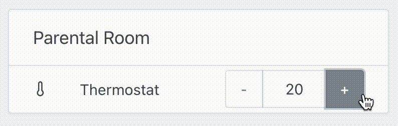

Hi everyone!

Today, I'm happy to release Gladys Assistant 4.12 with a lots of new features.

<!--truncate-->

## What's new in Gladys Assistant 4.12?

### HomeKit support

Gladys is now officialy compatible with HomeKit, meaning that you can control all your Gladys devices on your Apple devices, and use Siri.

For now we only supports 3 types of devices:

- Light bulb (On/Off, color, temperature et brightness)
- Switch (On/Off)
- Temperature sensor

Additionnal compatibilities will be added on request on the [forum](https://en-community.gladysassistant.com/).

To connect your Gladys devices to HomeKit, follow [our documentation](/docs/integrations/homekit)!

### Control your Thermostat

A new type of device is now available in the MQTT integration: Thermostat 🚀

You can now easily control the temperature in your house, and also automate this in scenes.

### French users: Watch your electricity consumption with Zigbee Lixee TIC

For users in France, we now supports the Lixee TIC sensor, a device that can be plugged into the Linky smart electric meter to watch in live how much power is your house using.

The device is simply plugged into your Linky electric meter:

It connects to Gladys using the Zigbee2mqtt integration, and allows you to see the real-time power consumption of your house.

## How to upgrade?

If you installed Gladys with the official Raspberry Pi OS image, your instance will update **automatically** in the coming hours. It can take up to 24 hours, don't panic.

If you installed Gladys with Docker, make sure you are using Watchtower. See the [documentation](/docs/installation/docker#auto-upgrade-gladys-with-watchtower).

With Watchtower, Gladys will update automatically.

## Thanks to contributors

Thanks to everyone who contributed to this release and gave their feedback.

If you want to talk about this release, you're all welcome on the [forum](https://en-community.gladysassistant.com/)!

## Support us

If you want to support us, there are many ways:

- Answer posts on the forum, give your feedback.
- Help us improve the documentation.
- Develop new features/integrations on Gladys, we are 100% open-source.
- Make a [one time donation](https://www.buymeacoffee.com/gladysassistant).
- Subscribe to [Gladys Plus](/plus).
