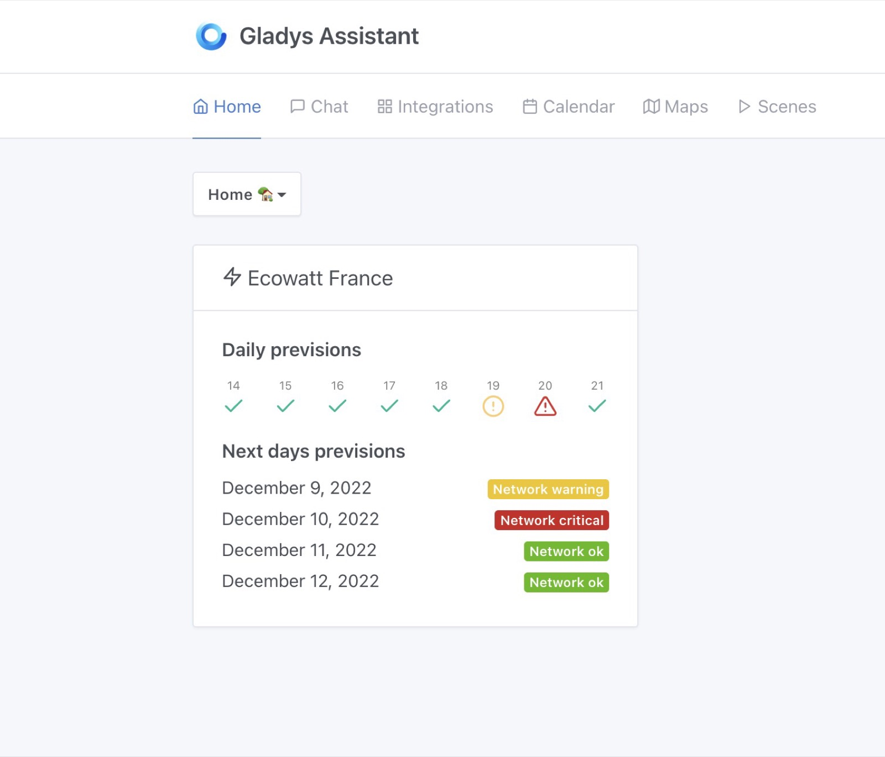
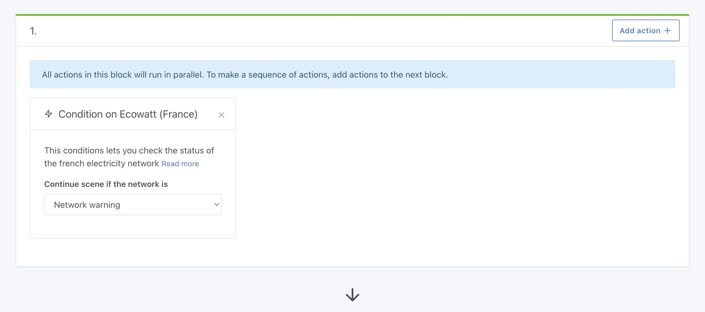

Gladys Assistant 4.13 is available, and it's a big release!

We've improved the developer experience by a lot, upgraded Gladys to Node.js 18 (from 14!) and are providing a new integration for French users.

<!--truncate-->

## What's new in Gladys Assistant 4.13?

### Ecowatt integration

In France, we are worried this winter that our electricity production won't be enough to cover consumption at peak.

Our electricity provider built an API that gives to citizen the hours of the day when the network is the most stressed.

We integrated this API in Gladys, so our users in France can automatically reduce their electricity consumption when the network needs it the most.

On your dashboard, you can see the electricity network status and previsions:

In scenes, you can automatically reduce your consumption when the network is the most stressed:

### Upgrade to Node.js 18 LTS

Gladys is now based on Node.js 18 LTS.

This had a huge impact on the speed of our CI, because we could remove lots of compiled polyfill when upgrading.

For example, we were using a Webcrypto polyfill for the end-to-end encryption feature in Gladys Plus, and starting from Node.js 16, the Webcrypto API is available in Node natively.

As a result, our tests went from 16 minutes to just 6 minutes!

### Ending Open-Zwave support

We no longer support open-zwave, because this integration wasn't building on Node.js > 14.

As Node 14 is end-of-life next year, it was mandatory for us to ugprade to keep Gladys secure.

We are working on a new integration on Zwave-JS-UI, but in the meantime we recommend you to use Node-RED + Gladys + Zwave-JS-UI.

## How to upgrade?

If you installed Gladys with the official Raspberry Pi OS image, your instance will update **automatically** in the coming hours. It can take up to 24 hours, don't panic.

If you installed Gladys with Docker, make sure you are using Watchtower. See the [documentation](/docs/installation/docker#auto-upgrade-gladys-with-watchtower).

With Watchtower, Gladys will update automatically.

## Thanks to contributors

Thanks to everyone who contributed to this release and gave their feedback.

If you want to talk about this release, you're all welcome on the [forum](https://en-community.gladysassistant.com/)!

## Support us

If you want to support us, there are many ways:

- Answer posts on the forum, give your feedback.
- Help us improve the documentation.
- Develop new features/integrations on Gladys, we are 100% open-source.
- Make a [one time donation](https://www.buymeacoffee.com/gladysassistant).
- Subscribe to [Gladys Plus](/plus).
