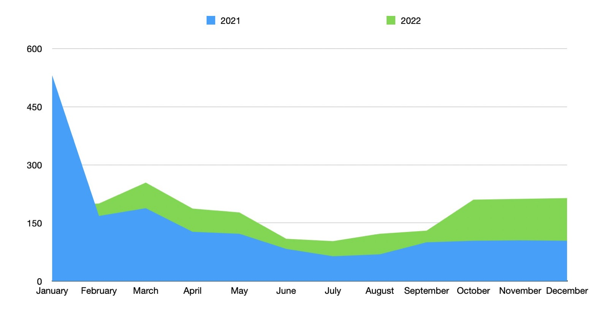

Hi everyone, and happy new year!

Every year I write an article to summarize what happened in the past year, and my projects for the next one.

This year is no exception, so here is my yearly review on Gladys.

<!--truncate-->

## What happened in 2022?

2022 was an amazing year for Gladys Assistant!

We were even more productive than last year with **28 releases**, which is one release every 2 weeks on average.

I think it's the maximum we should do, as pushing too much is a burden for users, and could reduce overall stability. One release every 2 weeks looks like a good rytmn that we will keep in 2023.

This year, we got 200 PRs merged on master from amazing contributors!

We can remember those features:

- [Calendar based triggers and conditions in scenes](/blog/gladys-assistant-4-8-with-calendar-in-scenes/)
- [Amazon Alexa support](/blog/gladys-assistant-4-9-with-alexa-integration/)
- [Broadlink integration](/blog/gladys-assistant-4-10-broadlink-and-performances/)
- [Apple Homekit support](/blog/gladys-assistant-4-12-homekit/)
- [Node 18 compatibility and Ecowatt integration](/blog/gladys-assistant-4-13-ecowatt/)

Thanks to all contributors who contributed to this release, it's thanks to you that we can have such a great product today!

I'm thinking about: Alexandre Trovato, Vincent Kulak, Bertrand D'Aure, Cyril Beslay, Corentin Allemand, NickDub, Terdious, Romuald Pochet and Nicolas Geissel! 🙏

### Usage

We saw this year quite some growth in usage on the product.

This year, every month had more users than the same month of the previous year (expect January but that's because in January 2021 it was the launch of the v4, with media coverage).

On the revenue side, we saw a +33,8% increase in revenue from 2021.

Most of the revenue came in March when I launched the yearly plan for 59,99€:

I'm very happy with those numbers and I hope this trend will continue in 2023.

### The YouTube channel

This year I released 8 videos and recorded 3 YouTube lives.

It's a bit more than last year (5 videos & 5 lives), and it's definitely worth it.

Those videos brings visibility on Youtube about what we're doing on Gladys/

In terms of views, I did twice the numbers of views of 2021, from 9k to 20k views in a year:

For now the channel is all in French, if you are interested here are my most popular videos this year:

- [Gérez vos appareils Zigbee dans votre domotique avec Zigbee2mqtt et Gladys Assistant](https://youtu.be/ALW3uDB9P0s)
- [Installer un Raspberry Pi sur un disque externe SSD sans ligne de commandes (pour débutant)](https://youtu.be/Zn7imzI0oYU)
- [Live : Lancement de Gladys Assistant 4.9 avec le support d'Amazon Alexa](https://youtu.be/Da_AQSQedFg)
- [Louis et sa boîte aux lettres connectée - Gladys Assistant chez vous #1](https://youtu.be/XXanY-SP_5w)

### Social networks

On social networks:

- [@gladysassistant on Twitter](https://twitter.com/gladysassistant) has 2,775 followers
- [Gladys Assistant Facebook](https://www.facebook.com/gladysassistant) counts 763 likes
- [@gladysassistant on instagram](https://www.instagram.com/gladysassistant) brings together 575 subscribers

And finally 2,266 followers on [my personal Twitter](https://twitter.com/pierregillesl)!

### The newsletter

In terms of the newsletter, 3,388 of you follow the [Gladys Assistant newsletter](https://email-list.gladysassistant.com/subscription/haflMsWmU).

- 2874 subscribers in French
- 514 subscribers in English

It's less than last year, but as I said last year I implemented a bounce detection feature that purges subscribers that no longer receive my emails.

Let's see what happens in 2023, but this time I hope to grow this mailing list!

### The GitHub Gladys Assistant

We are at 2,233 stars ⭐ on the [Gladys Assistant repo](https://github.com/GladysAssistant/Gladys)

It's +19% compared to last year!

Still a yearly double-digit growth on the Github 😍

I am counting on you to support us on GitHub by putting a star ⭐ on the project.

## Projects and goals for 2023

As I was telling you, the growth in use, as well as Gladys Plus turnover, all of this makes me much more confident for the future.

Unlike the end of 2021 when my opinion was mixed, I am convinced that Gladys is a project with infinite potential if we continue on this trajectory.

For my part, I want to go further in 2023, and for that I created a new company for Gladys Assistant : **Gladys Assistant SAS**.

Until then, I collected the Gladys Plus income on my personal french "micro-enterprise", alongside my freelance income. The concern of this status is that this status did not push me to re-invest the Gladys Plus income in growth, because this status does not allow to deduct its expenses: the income of a micro is considered as personal income, it is not a business separate from the individual.

This change in status will therefore allow me to reinvest the income from Gladys Plus in various projects: contests? Offer hardware + Gladys Plus bundles? Financing home automation equipment? Marketing? Pay a freelance? Everything becomes possible!

It may seem like a simple change, but for me it's a complete paradigm shift that will have a huge impact on the project in 2023.

If you want to contribute to this growth in 2023, join us on [Gladys Plus](/plus)!

### Product side

On the product side, I have lots of ideas for 2023, but the main idea is very simple: to satisfy Gladys users.

Many of you make feature requests on the forum, and the goal is still to bring down these requests one by one from the most voted to the least voted.

Some progress that I would like to see in 2023 on Gladys:

- Duplication of scenes + "Clock" box on the dashboard
- Enedis-Linky integration
- New integrations (Zwave-js-ui, Withings, Yeelight)
- Highly requested UX improvement: Re-order scenes, dashboard, etc...
- More content: Mini-PC tutorial? Better developer documentation? More Youtube videos!
- Matter support?

## Thank you all!

Thank you to all those who support Gladys, whether by developing new features, by contributing via [Gladys Plus](/plus/), via [one-time donations](https://www.buymeacoffee.com/gladysassistant), or by helping on the [forum](https://en-community.gladysassistant.com/).

Another happy new year to all!

Pierre-Gilles Leymarie
