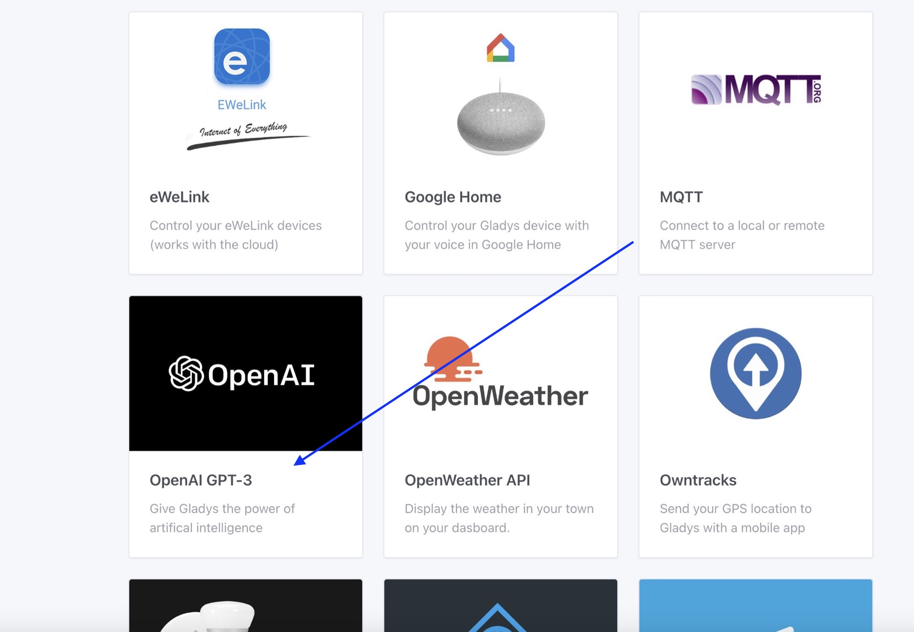

Hi everyone!

Unless you live in a cave, you've probably heard about ChatGPT/GPT-3, an artificial intelligence developed by OpenAI.

On the internet, everyone has tried to chat with this AI, whether it was to see if it would replace us at work, do better than us in university exams, or just to see how it reacts when asked convoluted questions.

On my side, I think this AI is a great tool, a kind of overpowered search engine, accessible to language, which has access to an impressive dataset!

## What does this have to do with Gladys?

In Gladys, we have always had a "Discussion" tab, which allows you to send requests to Gladys: "Turn on the light in the living room", "Show me the camera in the garden", "What is the temperature in the bathroom?

On the principle, this tab works in the same way as GPT-3: we trained a neural network on a set of data, to "teach" it to respond to user commands.

The difference between the current implementation in Gladys, and GPT-3, is the size of the input data.

Where Gladys was trained on a few commands, GPT-3 was trained on 175 billion parameters, including:

- Petabytes of web pages crawled over 8 years
- All Reddit content with more than 3 upvotes
- A lot of books
- All of Wikipedia

To train this model, OpenAI used a cluster of 10,000 Nvidia V100 graphics cards. Monstrous!

Once trained, this model is so big that you need a server with at least 175 GB of RAM to run it 🤯

In short, you get it, GPT-3 is at an impressive level that is hard to reach on our small scale.

## OpenAI GPT-3 integration in Gladys

This model, OpenAI did not create it for them, it is available via an API ( and it's not free, because they obviously have to pay for the 10k Nvidia V100 ^^).

It is this API that I integrated in Gladys!

I did some tests to see if GPT-3 could have an interest in home automation, and frankly it's amazing.

I worked on the "prompt" that I send to GPT-3 to delimit the framework of possible interactions, and it works great!

GPT-3 manages to classify each request, and can answer a lot of questions because I remind you that GPT-3 has access to content coming from everywhere on the internet.

But enough talking...

## Show time!

Let's start easy, I forgot how to boil eggs?

Here, I have a question about home automation, what do you think Gladys?

I don't remember how to display the logs of a Docker container...

What's the height of the Eiffel Tower?

AI seems super smart, is it the future?

But isn't this dangerous? I've seen i-Robot, and humans were getting locked up in their homes!

Phew, we were not far from a catastrophe there!

## How to test?

As the GPT-3 API is not free, I offer this integration to all [Gladys Plus](/plus) users.

If you want to test, you have to switch to Gladys Plus, and as a bonus you will support the growth of an amazing open-source project 😊

On the occasion of this launch, I launched the promo code **SMART2023** which gives -40% discount on your first Gladys Plus payment, for 59,99€ per year ( 4,99€/month ).

No excuses!

➡️ [Learn more about Gladys Plus](/plus) ⬅️

You must be in Gladys Assistant v4.15 to take advantage of this integration, and you will find the integration in the "Integrations" tab:

## Next

For now, this integration is an alpha, the goal is to collect your feedback and allow you to test.

This integration has for now no impact on your home automation system, if you ask it to turn on the light, it will answer you but will not do the action.

Depending on your feedback, we will be able to integrate GTP-3 fully with Gladys.

So, what do you think? Excited? 😄

I'm waiting for your feedback on [the forum](https://en-community.gladysassistant.com/)!

## How to upgrade?

If you installed Gladys with the official Raspberry Pi OS image, your instance will update **automatically** in the coming hours. It can take up to 24 hours, don't panic.

If you installed Gladys with Docker, make sure you are using Watchtower. See the [documentation](/docs/installation/docker#auto-upgrade-gladys-with-watchtower).

With Watchtower, Gladys will update automatically.
