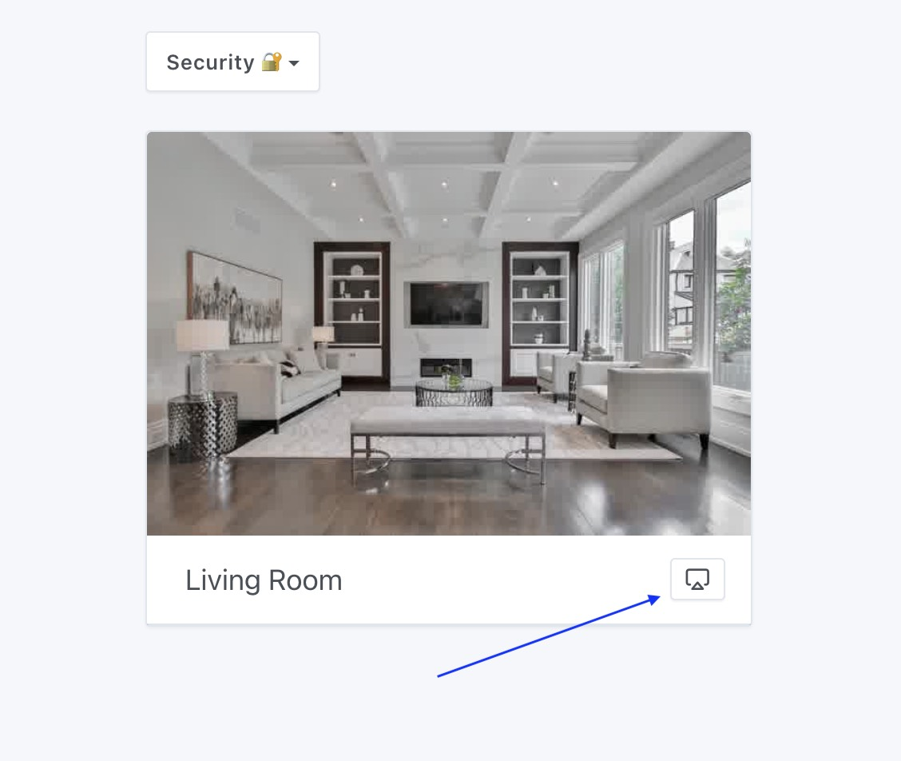
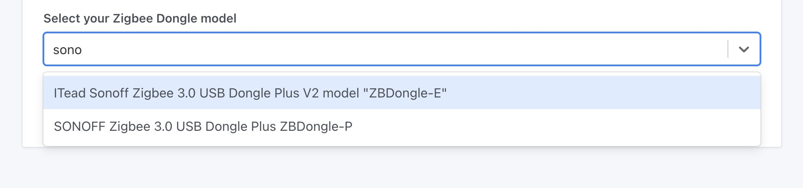
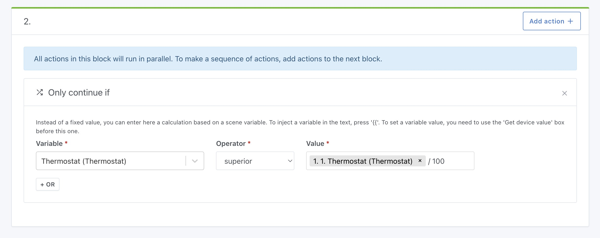
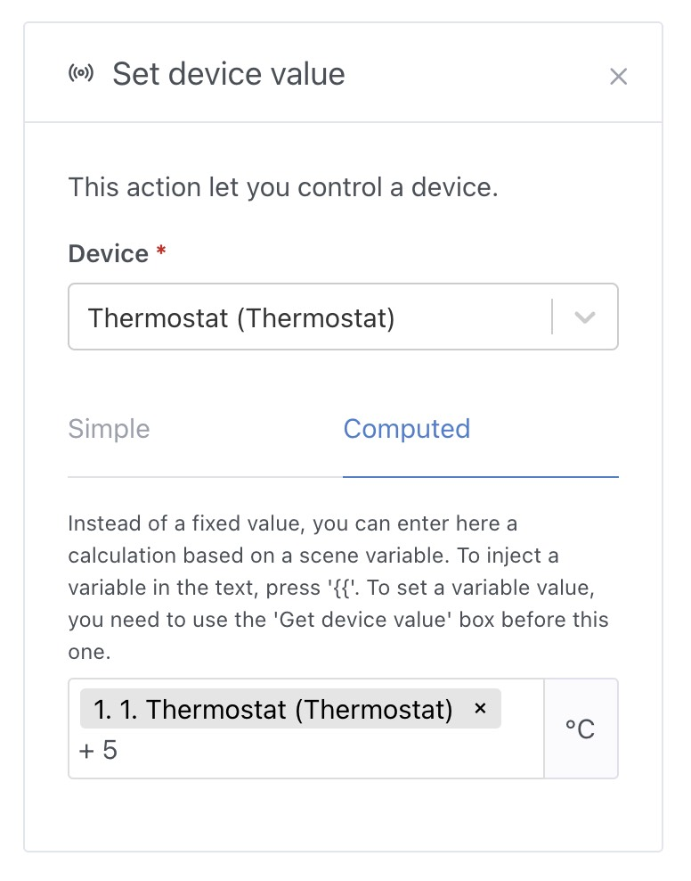
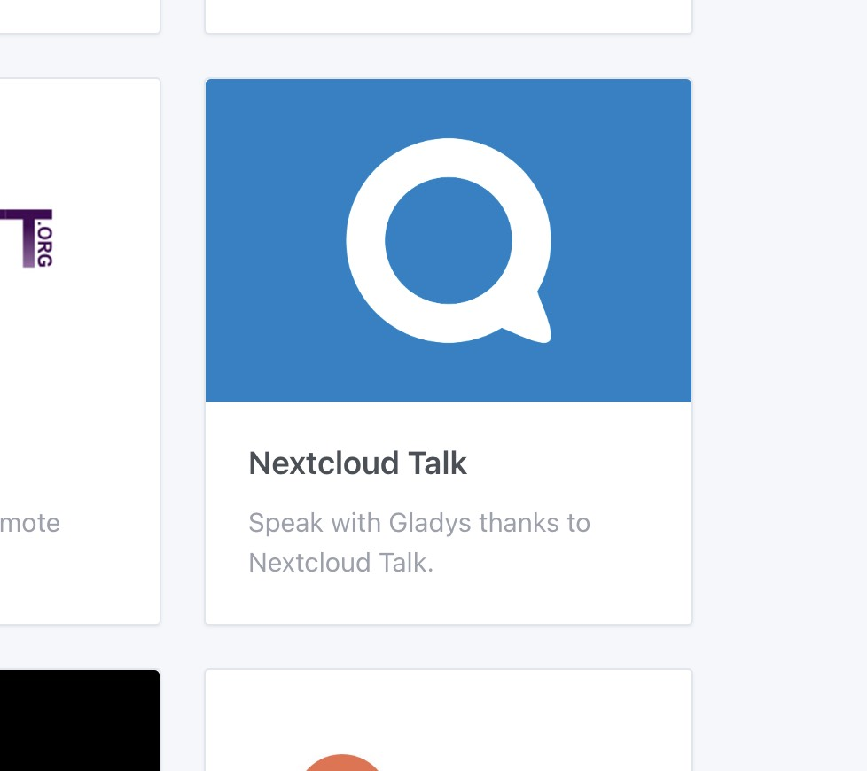

Hi everyone!

I'm happy to present you today Gladys Assistant 4.23, a new release with lots of new features!

## Live streaming camera

The major feature of this version is the ability to watch your cameras live on the dashboard, either locally or remotely via Gladys Plus.

The video stream is encrypted from end to end before guaranteeing your privacy, as always 😉

<!--truncate-->

**Note:** This feature requires quite a lot of resources (playing a video stream, compressing it, encrypting it, live, it requires resources!), if the live doesn't start or takes really too long to start, it might be that your machine is not powerful enough for it. 32-bit Raspberry Pi's are not powerful enough for this, for example.

## Selecting the Zigbee dongle model

In the Zigbee integration, it is now possible to select which Zigbee dongle model you are using, which will update the Zigbee2mqtt configuration file automatically!

Thanks to AlexTrovato for the development 👏

## Calculations in scenes

In scenes, it is now possible to do mathematical calculations in 2 places:

In the "continue only if" condition, it is possible to compare several variables with each other, while doing a mathematical calculation:

In the action "control a device" it is possible to use a variable and a mathematical calculation to deduce the value that will be sent to the device.

Very useful to make dynamic scenes that adapts to the execution of the scene!

Thanks @bertrandda for the development 👏

## NextCloud Talk integrations

New integration! This integration allows you to use NextCloud Talk to chat with Gladys, the same way the Telegram integration works.

Thanks @bertrandda for the development 👏

## Various improvements and fixes

- Improved account creation process: more responsive, simpler, with less information to fill in.
- Homekit integration now supports door/window opening sensors
- The dashboard displays the sensor names in a clearer way ([#1749](https://github.com/GladysAssistant/Gladys/pull/1749))
- Fixed a bug on the "HTTP Request" action that did not allow to have an empty POST request body ([#1772](https://github.com/GladysAssistant/Gladys/pull/1772))

## How to upgrade?

If you installed Gladys with the official Raspberry Pi OS image, your instance will update **automatically** in the coming hours. It can take up to 24 hours, don't panic.

If you installed Gladys with Docker, make sure you are using Watchtower. See the [documentation](/docs/installation/docker#auto-upgrade-gladys-with-watchtower).

With Watchtower, Gladys will update automatically.

## Thanks to contributors

Thanks to everyone who contributed to this release and gave their feedback.

If you want to talk about this release, you're all welcome on the [forum](https://en-community.gladysassistant.com/)!

## Support us

If you want to support us, there are many ways:

- Answer posts on the forum, give your feedback.
- Help us improve the documentation.
- Develop new features/integrations on Gladys, we are 100% open-source.
- Subscribe to [Gladys Plus](/plus).
