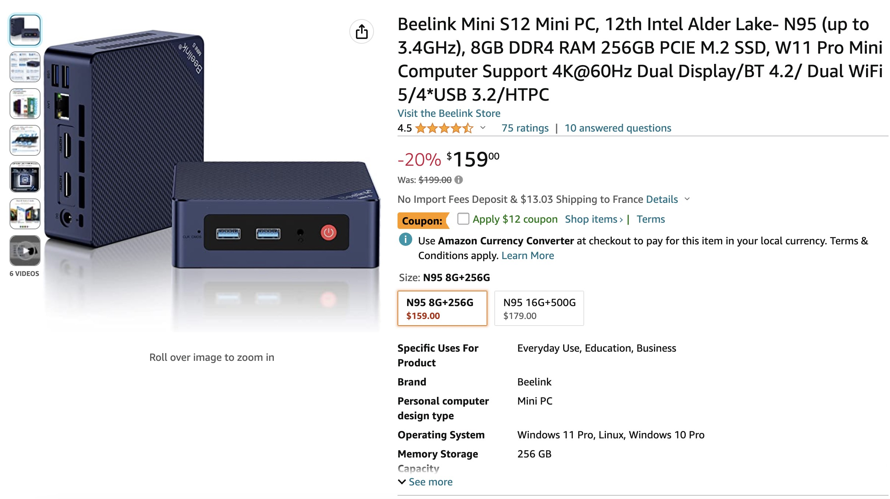
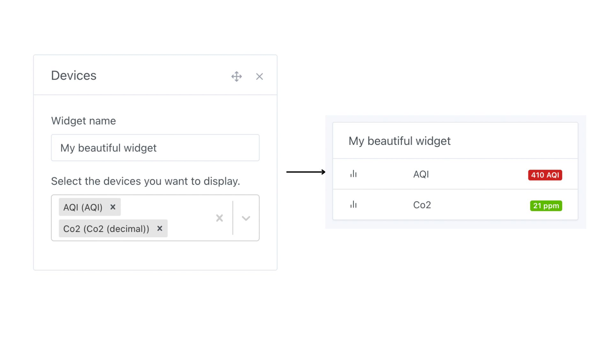
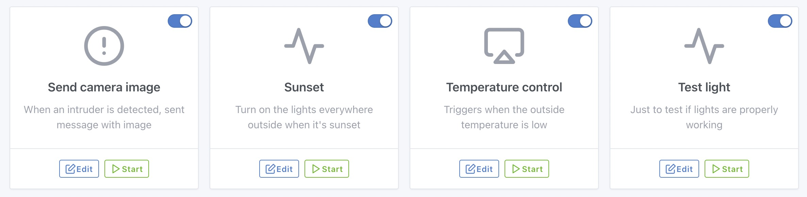
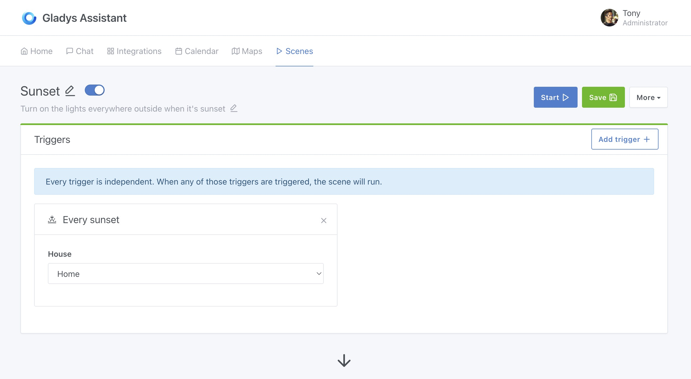
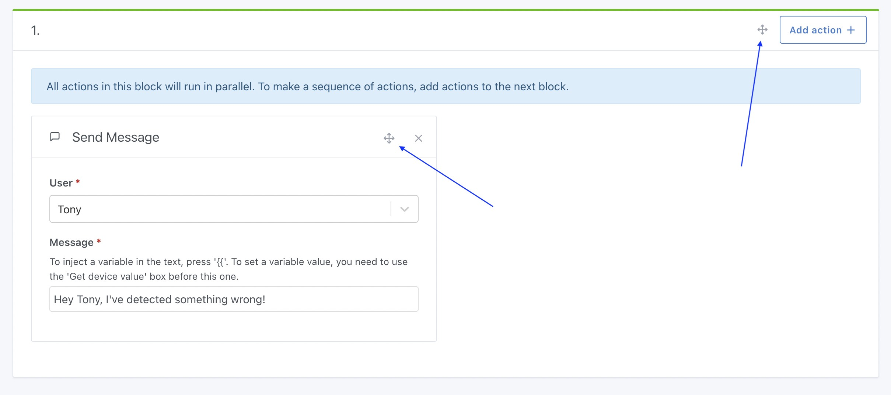
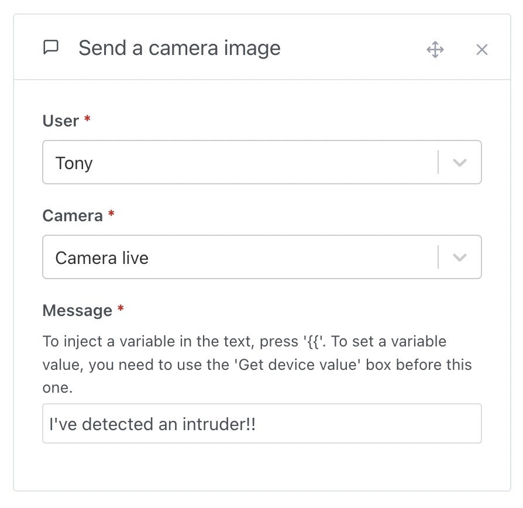
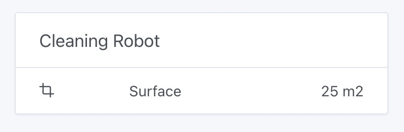
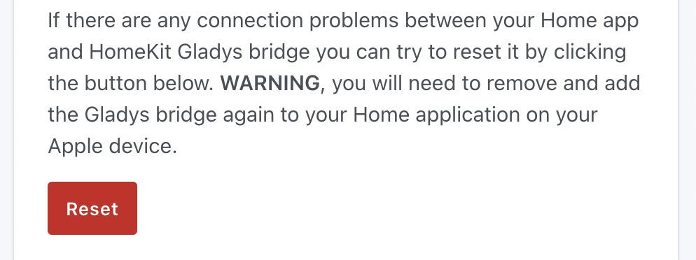

Hi everyone!

New version of Gladys today with some really nice changes that improve the way Gladys is used on a daily basis.

Just before I get started, I wanted to tell you about a great deal I found on Amazon the other day, which I think is really worth it to get started in home automation with reliable, high-performance equipment:

Beelink mini-PCs are in [flash promotion, at 159$ (-20%)](https://amzn.to/3p9apPx) for an 8GB RAM mini-PC, 128GB SSD, Intel Quad-Core processor, Gigabit Ethernet, USB 3.0, Wi-Fi and Bluetooth.

The 16GB RAM version is priced at [179$](https://amzn.to/3JjuV6T).

Some people in the community have even ordered several, so to speak 😂

The community is pretty unanimous in saying that today, mini-PCs are a more than serious alternative to the Raspberry Pi, hard to find, and ultimately at a similar price when you take everything into account ( Board + SSD + power supply + case ).

## New "Devices" widget

<!--truncate-->

It was a point of frustration for many, until now it wasn't possible to create a "Devices" widget mixing devices from different rooms.

That's now fixed with this new widget developed by Lokkye, which is fully customizable: you can drag any device into it, and put any title you like :

## Improved scene UX

The overall experience of creating and editing scenes has been greatly enhanced in this version.

First of all, a scene now has an editable description, allowing you to better discern your scenes:

This description can be edited super-simply by clicking on the description in the scene:

You'll notice that the header at the top of the scene editing screen has been improved to be more functional and easier to read. Secondary functions (duplication and deletion) have been relegated to a "More" button, so as not to constantly overload the screen with buttons.

On mobile, responsive has been improved to keep the screen clear and legible even on small screens:

Finally, Gladys now offers the most frequently requested feature: moving actions/blocks of actions within scenes.

This selectable cross makes it possible to grab actions and drag & drop them to another point in the scene.

## Send camera image in scenes

Super PR from Lokkye, which now lets you send a camera image by message in scenes.

The idea behind this feature is to be able to make "If motion is detected THEN send me an image of the outside camera by message" scenes:

## Google Home: Fix brightness management bug

I got feedback from a Swedish Gladys user who explained that his IKEA Tradfi bulbs weren't working very well with Google Home integration.

When he set the brightness to 100% in Google Home, his bulbs were only at half their brightness in Gladys.

The reason for this bug was quite simple: IKEA Tradfi bulbs have a brightness range of 0-254 and not 0-100%, so a small conversion step is needed to go from the Google Home scale (0-100%) to the Tradfi scale (0-254), and back again.

The bug has been corrected [in this PR](https://github.com/GladysAssistant/Gladys/pull/1813).

## Surface units added

This was a request from Hizo on the forum, so it's now possible to add surface MQTT devices.

Useful, for example, for a robot vacuum cleaner that returns the cleaned/cleaning surface.

## HomeKit: Link reset button added

Thanks to a PR from bertrandda, it is now possible to reset the link with Homekit in Gladys :

## How to upgrade?

If you installed Gladys with the official Raspberry Pi OS image, your instance will update **automatically** in the coming hours. It can take up to 24 hours, don't panic.

If you installed Gladys with Docker, make sure you are using Watchtower. See the [documentation](/docs/installation/docker#auto-upgrade-gladys-with-watchtower).

With Watchtower, Gladys will update automatically.

## Thanks to contributors

Thanks to everyone who contributed to this release and gave their feedback.

If you want to talk about this release, you're all welcome on the [forum](https://en-community.gladysassistant.com/)!

## Support us

If you want to support us, there are many ways:

- Answer posts on the forum, give your feedback.
- Help us improve the documentation.
- Develop new features/integrations on Gladys, we are 100% open-source.
- Subscribe to [Gladys Plus](/plus), at -40% right now!!
