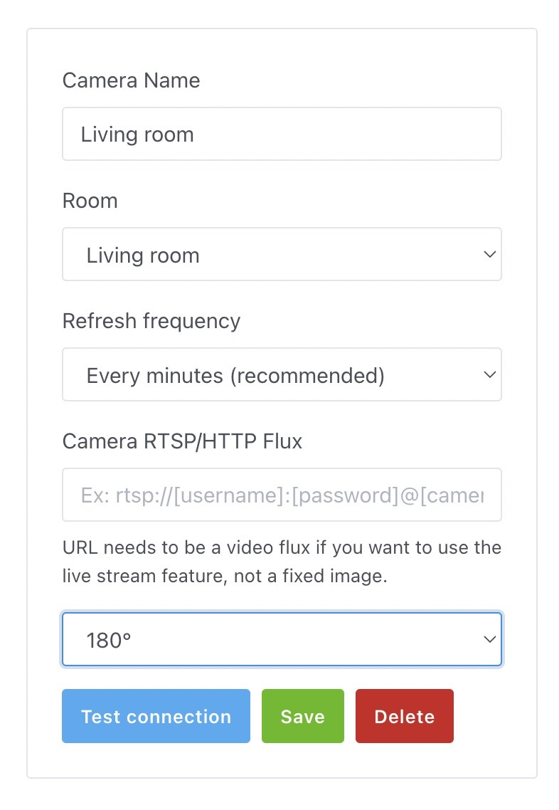

Hi everyone!

Today I'm pleased to announce Gladys Assistant 4.26, a release that brings compatibility with Tuya-compatible devices.

It was already possible to use certain Tuya Zigbee devices with Gladys via our Zigbee2mqtt integration, but now Wi-Fi connected sockets and light bulbs are also compatible via an official Tuya integration 🎉🎉

## -40% on Gladys Plus with this launch

To mark this launch, I'm offering 40% off your first Gladys Plus payment with the code **TUYA2023** !

Hurry up, it's happening [on Gladys Plus here](/plus/)!!!

## Compatible devices

For now we only support 2 types of devices: sockets & lights.

For example:

Tuya sockets like this [$12 energy monitoring socket](https://amzn.to/44EvMHp) are compatible.

Tuya compatible lights like [Dalattin pack of 4 light bulbs for $20,99](https://amzn.to/3JSinnc) are compatible!

To configure these devices, you can follow the tutorial [in Gladys documentation](/docs/integrations/tuya/).

If you have other Tuya devices that are not yet managed, please come to [the forum](https://en-community.gladysassistant.com/) to talk about them.

Many thanks to Lokkye on the forum for this development 🙌

## Rotating camera images

It's now possible to rotate a camera image 90°, 180°, and 270°, on the dashboard and in video lives.

Thanks to Lokkye for this development 🙌

## How to upgrade?

If you installed Gladys with the official Raspberry Pi OS image, your instance will update **automatically** in the coming hours. It can take up to 24 hours, don't panic.

If you installed Gladys with Docker, make sure you are using Watchtower. See the [documentation](/docs/installation/docker#auto-upgrade-gladys-with-watchtower).

With Watchtower, Gladys will update automatically.

## Support us

If you want to support us, there are many ways:

- Answer posts on the forum, give your feedback.
- Help us improve the documentation.
- Develop new features/integrations on Gladys, we are 100% open-source.
- Subscribe to [Gladys Plus](/plus), at -40% right now!!
