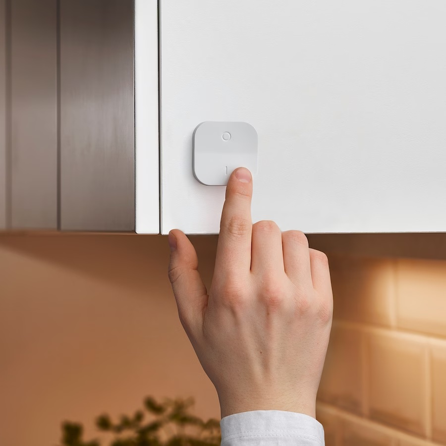
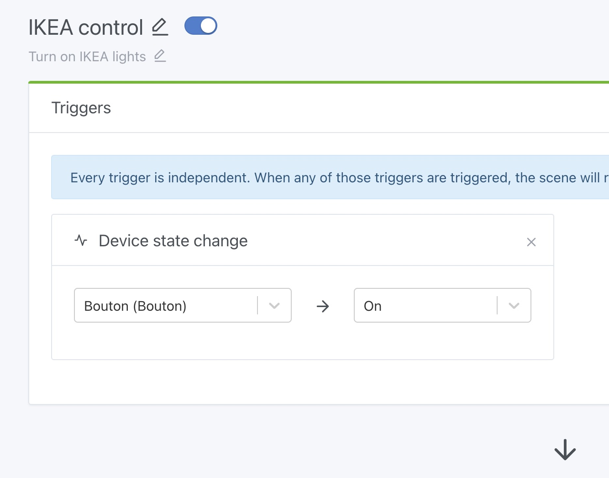
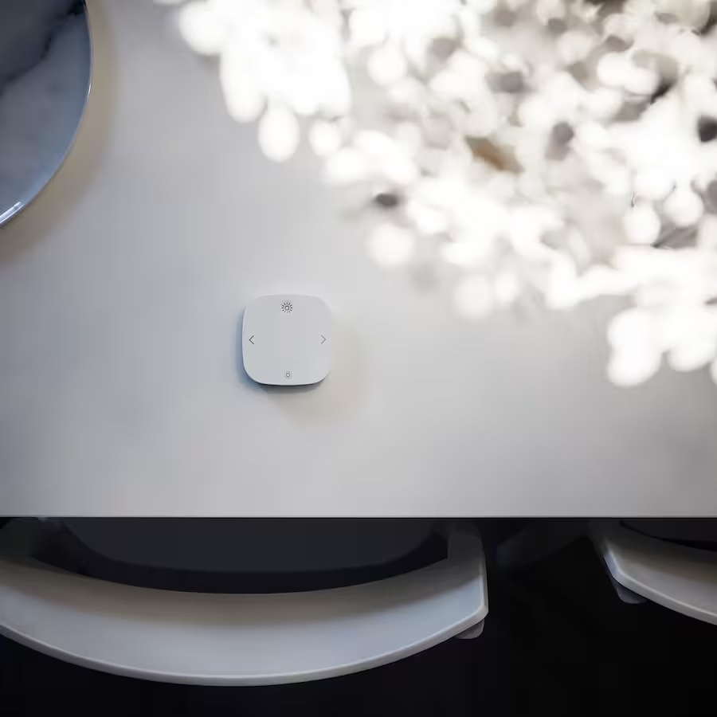

Hello everyone!

Hope you spent good holidays ☀️

On the Gladys Assistant front, I returned last week with an update to v4.26.1, which introduced a [set of fixes](https://en-community.gladysassistant.com/t/gladys-assistant-v4-26-1-mosquitto-fixed-at-v2-0-15-google-home-graph-improved/118) in response to your feedback over the summer.

Today I'm following up with a more important update in terms of features: Gladys Assistant 4.27.

## Rename your devices on the dashboard

<!--truncate-->

This was a feature that had long been the talk of the town: what should be displayed on the dashboard to properly "define" a feature: the device name? Device name and room? The feature name? Or both?

After some thought, I realized that we'd never be able to please everyone, so I decided to let the user modify the name when displaying it on the dashboard.

In concrete terms, on the dashboard, in the "Devices" widget you can rename and move each device according to your preference:

<video width="100%" controls autoplay loop muted>
<source src="https://gladysassistant-assets.b-cdn.net/gladys-4-27/gladys-rename-devices-en.mp4" type="video/mp4" />
  Your browser does not support the video tag.
</video>

## New Zigbee devices

Gladys is now fully compatible with 3 new Zigbee devices, including two from the IKEA connected range.

For those unfamiliar with the [IKEA Zigbee connected lighting offering](https://www.ikea.com/us/en/cat/eclairage-connecte-36812/), it's very affordable (from €9.99 for a bulb, €6.99 for a switch), and of good quality. If you're new to home automation, this is a good way to start. What's more, it's available in all IKEA stores or by delivery on their website!

### IKEA TRÅDFRI button with dimmer switch

This button is a very inexpensive On/Off switch ([6,99€ at IKEA](https://www.ikea.com/us/en/p/tradfri-variateur-dintensite-sans-fil-connecte-blanc-70408595/)), which also acts as a dimmer when pressed on or off.

I've added support for 5 actions:

- On
- Off
- Increase brightness
- Reduce brightness
- Stop brightness

These actions are available in scenes for your automations:

### IKEA STYRBAR button with intensity and color control

This connected remote control allows you to control the On/Off, dimming and color of one or more bulbs. It's available for [9,99€ at IKEA](https://www.ikea.com/us/en/p/styrbar-remote-control-smart-white-80488370/).

I've added support for 11 actions:

- On
- Off
- Increase brightness
- Reduce brightness
- Stop brightness
- Left arrow click
- Right arrow click
- Left arrow hold
- Right arrow held
- Left arrow released
- Right arrow released

These actions are also available in scenes to automate whatever you wish.

Of course, when used in Gladys, these two buttons can control anything and everything.

For those who want more "direct" control, it's possible to use the [Bindings Zigbee2mqtt](https://www.zigbee2mqtt.io/guide/usage/binding.html) to enable a direct association between the switch and the bulb, in direct Zigbee.

This allows you to have live control that works even if your home automation is inactive.

### Xiaomi WXKG01LM button

I've added a few actions that were missing for this button:

- Triple click
- Quadruple click
- Release click
- Lots of clicks

## Missing Zigbee compatibility?

If you have a Zigbee device that is not fully supported by Gladys, don't hesitate to post a message [on the forum](https://en-community.gladysassistant.com/).

## How to upgrade?

If you installed Gladys with the official Raspberry Pi OS image, your instance will update **automatically** in the coming hours. It can take up to 24 hours, don't panic.

If you installed Gladys with Docker, make sure you are using Watchtower. See the [documentation](/docs/installation/docker#auto-upgrade-gladys-with-watchtower).

With Watchtower, Gladys will update automatically.

## Support us

If you want to support us, there are many ways:

- Answer posts on the forum, give your feedback.
- Help us improve the documentation.
- Develop new features/integrations on Gladys, we are 100% open-source.
- Subscribe to [Gladys Plus](/plus), at -40% right now!!
