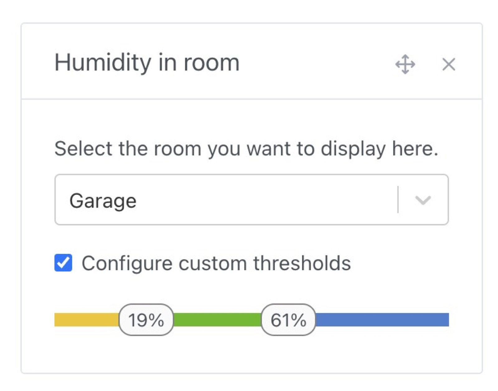

Hi everyone!

Another Gladys update with lots of new features 🥳

### Integrations with Mitsubishi air conditioners

It's now possible to connect your Mitsubishi air conditioners (connected via MELCloud) to Gladys!


Thanks to @Lokkye for the development 🙌

### Full screen mode for Gladys tablets

If you're using Gladys on a touchscreen tablet somewhere in your home, it's likely that you'll want to display the Gladys dashboard full-screen, without the option of navigating away from that screen.

This is now possible, thanks to a parameter to be added to the URL:

```
?fullscreen=force
```

To enable better use of "tablet on the wall" type devices, the duration of connection sessions has been increased to 1 year.

(Sessions can still be revoked in Gladys settings at any time).

### Set room temperature/humidity widget limits

It's now possible to define at what limit the colors of the "Temperature/Humidity" widgets change.

A bedroom doesn't necessarily have the same limits as a bathroom, or a terrarium!

When editing a dashboard, you can now define customized thresholds:




Thanks @Lokkye for this development 🙌

### Camera images expire

From now on, expired camera images will no longer be displayed on the dashboard:


### Tuya roller shutter management

The Tuya integration was released this summer, and a new type of device has just been added: roller shutters.

Thanks @Lokkye for this development 🙌

### Lots of fixes

- In MQTT, NextCloud Talk and Tasmota integration, password fields will no longer be automatically filled in by browsers (to avoid auto-fill bugs) ([#1881](https://github.com/GladysAssistant/Gladys/pull/1881))
- On the dashboard, some devices no longer have value expiration dates (smoke detector, water leak detector, button, and text)
- Improved translations in OpenWeather integration ([#1897](https://github.com/GladysAssistant/Gladys/pull/1897))
- In scenes, in the "Control a device" action, binary devices are initialized to 0 by default instead of "empty value" ([#1901](https://github.com/GladysAssistant/Gladys/pull/1901))
- In MQTT integration, an error message is added when a device is created with the same external ID as an existing device ([#1902](https://github.com/GladysAssistant/Gladys/pull/1902))
- Better validation of "string" states ([#1894](https://github.com/GladysAssistant/Gladys/pull/1894))

Full CHANGELOG available [here](https://github.com/GladysAssistant/Gladys/releases/tag/v4.29.0).

## How to upgrade?

If you installed Gladys with the official Raspberry Pi OS image, your instance will update **automatically** in the coming hours. It can take up to 24 hours, don't panic.

If you installed Gladys with Docker, make sure you are using Watchtower. See the [documentation](/docs/installation/docker#auto-upgrade-gladys-with-watchtower).

With Watchtower, Gladys will update automatically.

## Support us

If you want to support us, there are many ways:

- Answer posts on the forum, give your feedback.
- Help us improve the documentation.
- Develop new features/integrations on Gladys, we are 100% open-source.
- Subscribe to [Gladys Plus](/plus), at -40% right now!!
