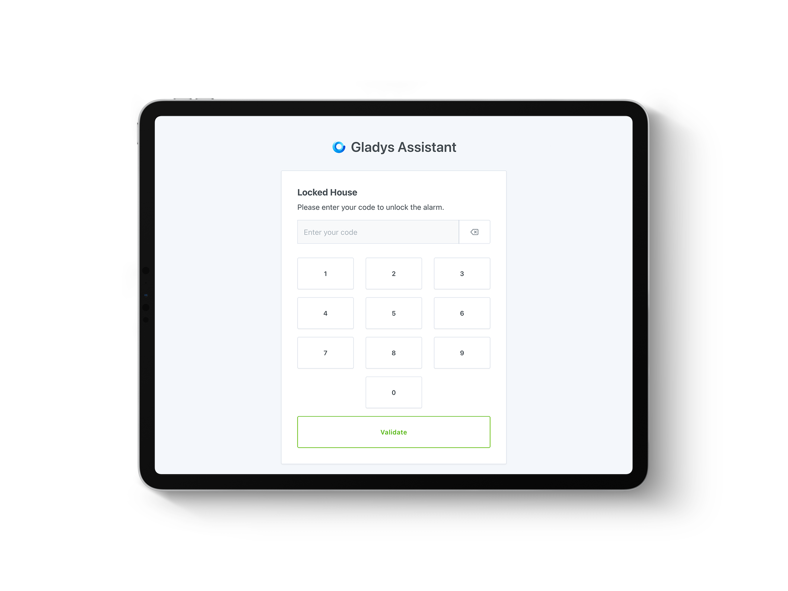

Hi everyone!

Gladys Assistant 4.30 has just been released, and it's a hell of a version!!! 🥳

The main feature is the complete management of an Alarm mode that allows you to set up a complete home security system.



You've got to admit, it does make you want to 😎

## An alarm in Gladys

Gladys can now replace a complete alarm system by managing the various states of any good alarm system:

<!--truncate-->


If you'd like to set up an alarm with Gladys, I've written [a complete tutorial](/docs/dashboard/alarm/) on the subject!

## Node-RED integration

It was already possible to interface Node-RED with Gladys (with the [MQTT integration](/docs/integrations/mqtt)), but this required some knowledge as you had to launch Node-RED yourself.

Lokkye has worked on a native integration so that anyone can launch a Node-RED instance alongside Gladys with a single click!

From now on, just go to the "Node-RED" integration and click on "Activate" to launch a Node-RED container:


## Tuya: Power consumption management

Tuya integration now supports connected sockets that report electricity consumption data.

Thanks to Lokkye for the development 🙏

## Launch a scene from chat

This was already possible with the ChatGPT integration, but this command has just been added to the Gladys "local" chat model. You can now ask Gladys to launch a scene in the chat:


Thanks to Lokkye for the development 🙏

## Launch a scene with MQTT

You can now launch a scene using MQTT by posting a message on the topic:

```
gladys/master/scene/SCENE_SELECTOR/start
```

By replacing `SCENE_SELECTOR` with the scene selector, which can be found in the scene edition URL.

For example, for the scene `http://192.168.1.10/dashboard/scene/cinema`, you'll need to send a message to the topic:

```
gladys/master/scene/cinema/start
```

Thanks Lokkye for the development 🙏

## Launch a scene when Gladys starts up

Want to receive a message when Gladys restarts? Perform an operation every time Gladys starts up?

You can now launch a scene when Gladys starts up:


Thanks Lokkye for the development 🙏

## Zigbee2mqtt: Interface enhancement

Devices already added will no longer be displayed by default in the "Zigbee network discovery" page:


And the Zigbee2mqtt URL is now displayed on the configuration page!

**Bug correction**: When changing the USB key port, Gladys restarts the Zigbee2mqtt container with the correct volume.

Thanks to AlexTrovato and Cicoub13 for these improvements 🙏

## Homekit: Humidity and leak sensors management

From now on, your leak and humidity sensors will be put back into Homekit!

Thanks bertrandda for the development 🙏

The complete CHANGELOG is available [here](https://github.com/GladysAssistant/Gladys/releases/tag/v4.30.0).

## How to upgrade?

If you installed Gladys with the official Raspberry Pi OS image, your instance will update **automatically** in the coming hours. It can take up to 24 hours, don't panic.

If you installed Gladys with Docker, make sure you are using Watchtower. See the [documentation](/docs/installation/docker#auto-upgrade-gladys-with-watchtower).

With Watchtower, Gladys will update automatically.

## Support us

If you want to support us, there are many ways:

- Answer posts on the forum, give your feedback.
- Help us improve the documentation.
- Develop new features/integrations on Gladys, we are 100% open-source.
- Subscribe to [Gladys Plus](/plus), at -40% right now!!
