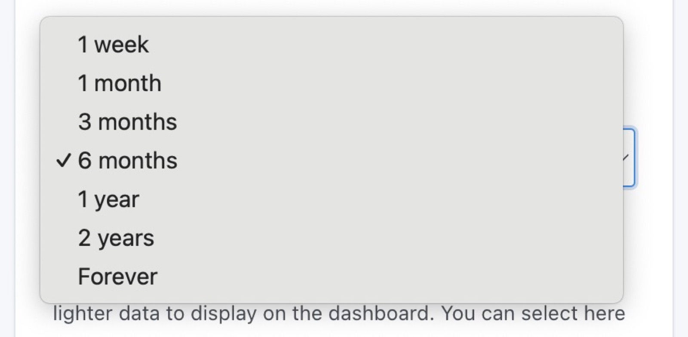

Hello everyone,

At the end of October I presented [Gladys Assistant 4.30](/blog/gladys-4-30-alarm-mode/), a version that brought a complete alarm to Gladys!

Today I'm releasing Gladys Assistant 4.31, a version that brings a lot of new features and fixes following your feedback on the alarm mode 🎉🎉

## Tag filtering in scenes

Many of you have been asking for a mechanism to filter the increasing number of scenes in your instances, and @Lokkye has done just that!

You can now add one or more tags to your scenes:

And then you can filter your scenes by tag:

This allows you to organize your scenes more easily (by room, by function).

## New trigger: Receiving an MQTT message

It's now possible to trigger a scene on receipt of a customized MQTT message!

The aim of this trigger is to enable simplified external integrations for advanced users, without necessarily going through Node-RED.

For example, if you're a [Frigate](https://docs.frigate.video/integrations/mqtt/) user and want to receive an MQTT message in Gladys when motion is detected on a camera, you can!

This is just an example, but you'll want to go a lot further, and make scripts that call Gladys via this trigger, for example!

## Cleaning up sensor states in the database

When you installed Gladys, you normally chose the retention time for sensor states.

Today, I'm adding new durations to Gladys for this parameter:

And I've added a new parameter "Keep aggregate states" which lets you tell Gladys how long to keep the pre-calculated states for display on the dashboard:

The idea of this parameter is to be able to keep, for example, "6 months of raw data" + "1 year of aggregated data", so as not to keep the raw data for too long, while still having the last year displayed on the dashboard.

**Note:** If you have a large Gladys database, consider changing this setting. The next cleaning will take place at 4 a.m. the following day!

## New docker-compose.yml file

Cyril has been working on the [docker-compose.yml](https://github.com/GladysAssistant/Gladys/blob/master/docker/docker-compose.yml) file we offer on the site for installing Gladys.

It's now fully up to date!

## Philips Hue: Adding a hybrid scan + manually adding a bridge

Some of you were having trouble using Philips Hue integration because your Philips Hue bridge wasn't being detected locally by Gladys.

Cyril has been working on a new "hybrid" scan that does an "N-UpNp" scan in addition to the "UpNp" scan we were doing.

If Gladys still doesn't detect your Philips Hue bridge, you can add it manually via its IP address.

## Chat: Display a camera by name

It is now possible to display a camera in chat by calling it by its name (and not necessarily by the name of the room).

For example, if your camera is called "Fridge camera", you can ask Gladys to display it:

If you ask "Show me the camera in the living room" and there are several cameras in the living room, Gladys will now send you all the images.

## Fixes

- Inversion of door opening sensor labels in scenes. Open becomes closed and closed becomes open (this was an error!). There's nothing to change on your side on your existing scenes if these scenes were working, only the label has changed, not the value.
- The name of the "Alarm" widget is now optional. If left blank, the title bar will be hidden.
- In the alarm, when the `?fullscreen=force` parameter is supplied, it must be retained despite redirections on the locked screen, as well as after an alarm unlock.

The complete CHANGELOG is available [here](https://github.com/GladysAssistant/Gladys/releases/tag/v4.31.0).

## How to upgrade?

If you installed Gladys with the official Raspberry Pi OS image, your instance will update **automatically** in the coming hours. It can take up to 24 hours, don't panic.

If you installed Gladys with Docker, make sure you are using Watchtower. See the [documentation](/docs/installation/docker#auto-upgrade-gladys-with-watchtower).

With Watchtower, Gladys will update automatically.

## Support us

If you want to support us, there are many ways:

- Answer posts on the forum, give your feedback.
- Help us improve the documentation.
- Develop new features/integrations on Gladys, we are 100% open-source.
- Subscribe to [Gladys Plus](/plus), at -40% right now!!
