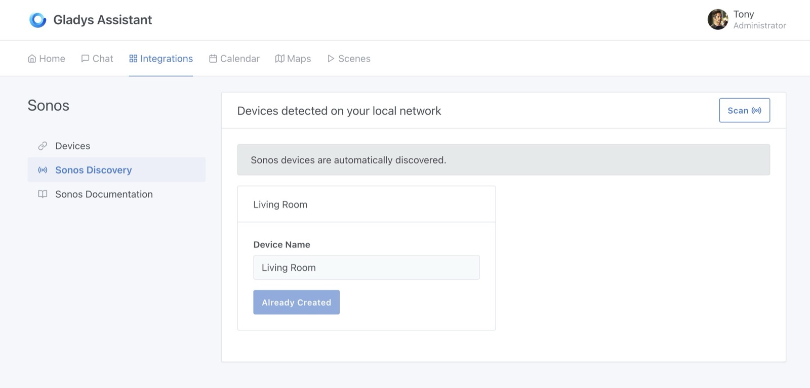
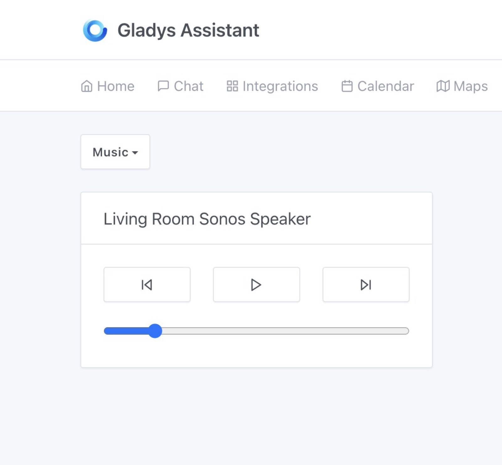
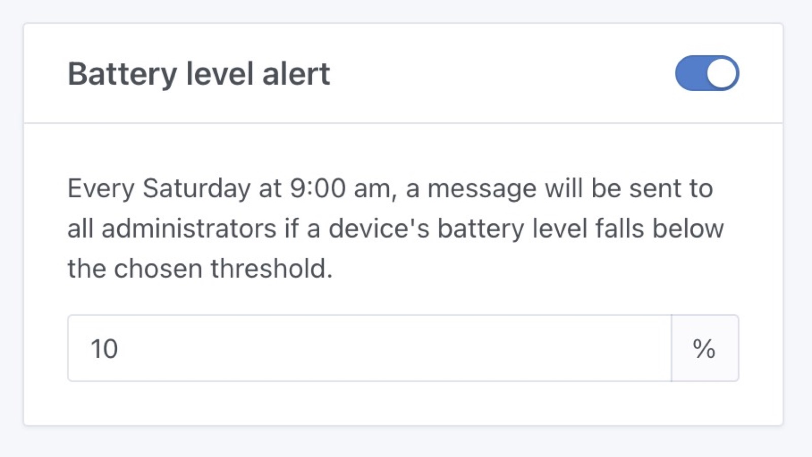
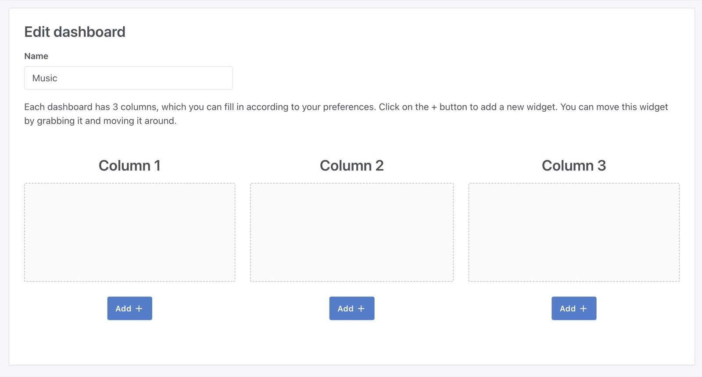
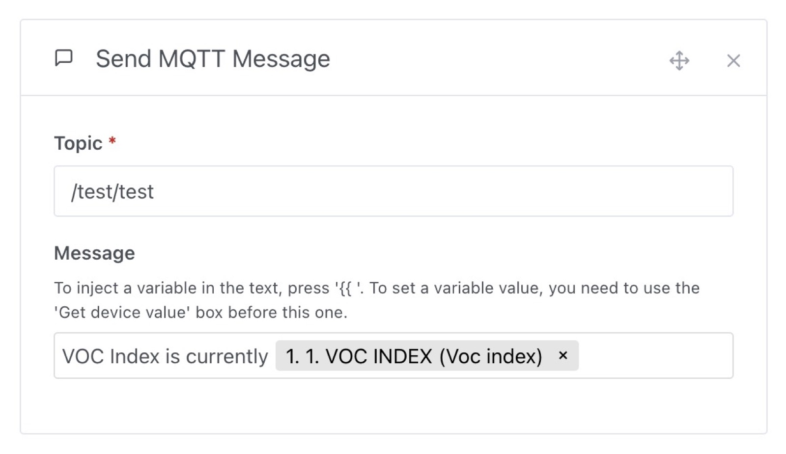

Hi everyone!

2 weeks ago, I was live on Youtube for a live coding session that lasted over 7 hours!!!

In this live, I developed from start to finish a Sonos integration for Gladys.

The live coding was in French, if you are interested, the live replay is available [here on YouTube](https://www.youtube.com/watch?v=M4vOjQXMiZI).

Today, I'm happy to release Gladys Assistant 4.32, which includes this Sonos integration 😁

## Sonos integration in Gladys

Now you can connect your Sonos speakers to Gladys.

<!--truncate-->

On the dashboard, you'll find a "Music" widget that lets you control a speaker:

And that's all for now!

And yes, the goal of this development was to have a working MVP of a Sonos integration in Gladys, and I think the contract is fulfilled 😊

Now I'm looking for a maintainer who'd like to help move this integration forward.

If you want to lend a hand tomorrow, join us [on the forum](https://en-community.gladysassistant.com/)!

## Sending a message when the battery is low

You've dreamed of it? Lokkye has done it for you!

From now on, every Saturday morning at 9am, if one or more devices in your connected home have a battery level below a certain threshold, Gladys will send you a message (on Telegram if you've set it up):

Thanks Lokkye for the development 🙌

## Zigbee2mqtt: Managing the IKEA Vindstyrka sensor

The [IKEA Vindstyrka Zigbee](https://www.ikea.com/fr/fr/p/vindstyrka-capteur-qualite-de-lair-connecte-00498231/) sensor returned a `voc_index` value that we didn't manage in Gladys for the moment. Unlike a "raw" VOC value, this one represents a variation:

> The index has a scale from 0 to 500, with a reference value of 100 representing average air quality over the last 24 hours.
> A reading below 100 indicates an improvement in air quality, and above 100 a deterioration.

Will_71 on the forum has looked into the subject and brought us the accounting! Thanks 🙌

## Zigbee2mqtt: Complete management of the OWON PIR313-E sensor

This sensor exposes 2 features we didn't manage yet: "low battery" (we already manage the battery level), and "tamper detection" (if a thief tries to remove the motion sensor).

Will_71 has worked on this again, many thanks 🙌

## Dashboard: Add one "Add" button per column

A small UX fix that may seem simple but will greatly simplify our lives: there's now an "Add +" button per column on the dashboard!

Thank you Brisou for your first PR on Gladys, which I hope will be the first of many 🙌

## Sending an MQTT message in scenes

It's now possible to send an MQTT message in scenes, to a custom topic and with a custom message.

Thanks Lokkye for the great PR 🙌

## Fixes

A few fixes have crept into this release!

- Some fixes on the new scene tag filtering feature by Lokkye 🙌
- In scenes, some selectors were overlapping each other, this is no longer the case. Thanks Will_71 🙌
- The Gladys container launches the Node process directly, which allows the database to be closed correctly when Gladys stops. Thanks cicoub13 for the fix 🙌

The complete CHANGELOG is available [here](https://github.com/GladysAssistant/Gladys/releases/tag/v4.32.0).

## How to upgrade?

If you installed Gladys with the official Raspberry Pi OS image, your instance will update **automatically** in the coming hours. It can take up to 24 hours, don't panic.

If you installed Gladys with Docker, make sure you are using Watchtower. See the [documentation](/docs/installation/docker#auto-upgrade-gladys-with-watchtower).

With Watchtower, Gladys will update automatically.

## Support us

If you want to support us, there are many ways:

- Answer posts on the forum, give your feedback.
- Help us improve the documentation.
- Develop new features/integrations on Gladys, we are 100% open-source.
- Subscribe to [Gladys Plus](/plus)
