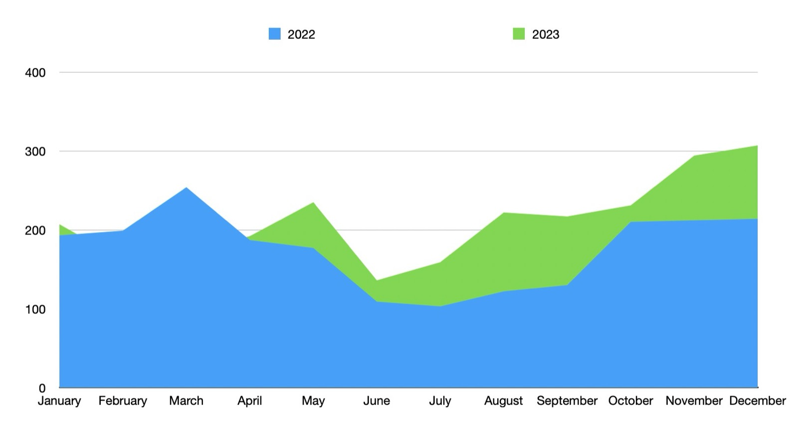
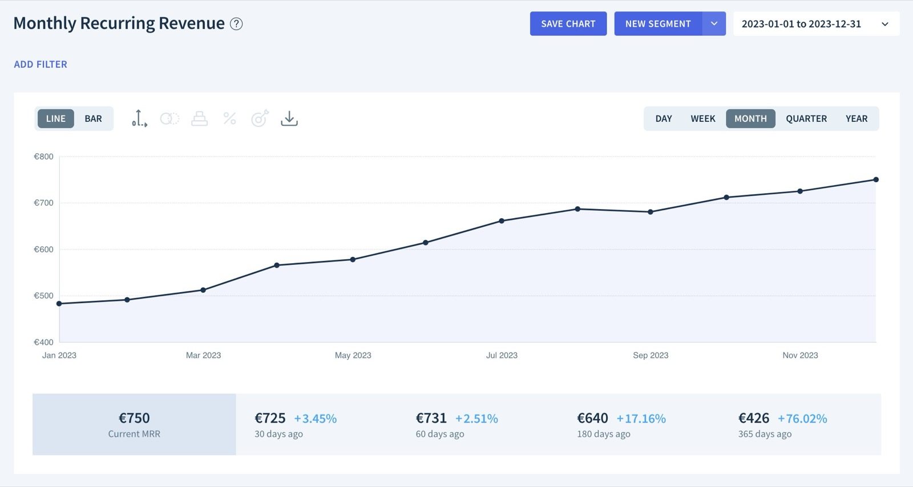
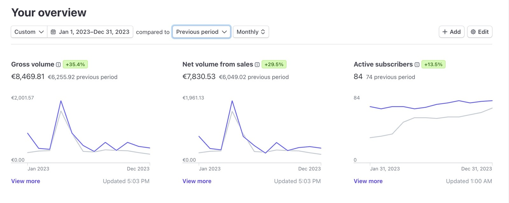
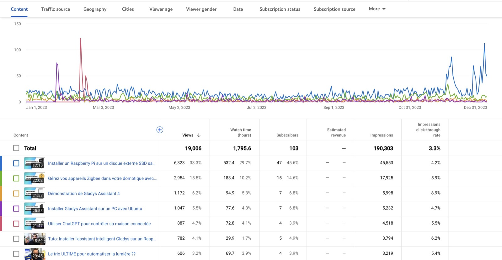

Happy New Year to all 🙌

I hope 2024 will be a year full of good things for you: health, family, projects!

Like every year, I take stock of the previous year and present my plans for the new year.

If you prefer this review on video, I've made a YouTube live which is available for replay [here (in french only)](https://www.youtube.com/watch?v=9aHgmzqObxQ).

## What happened in 2023?

<!--truncate-->

2023 was a year rich in new features:

- [An integration with OpenAI ChatGPT](/blog/open-ai-gpt-3-in-gladys-assistant/)
- [In-dash camera live-streaming](/blog/camera-live-streaming-gladys-assistant-4-23/)
- [Compatibility with the Tuya protocol](/blog/gladys-assistant-tuya/)
- [Full alarm mode in Gladys](/blog/gladys-4-30-alarm-mode/)
- [Sonos integration in Gladys](/blog/gladys-4-32-sonos-integration/)

THANK YOU again to all the developers who have contributed to these releases, 2023 has been an exceptional year and it's all thanks to you 🎉

Thanks to Alexandre Trovato, Vincent Kulak, Bertrand D'Aure, Cyril Beslay, Corentin Allemand, NickDub, Terdious, Romuald Pochet, Quentin Legay, Jonathan Brisavoine, William Deren, Nicolas Geissel, euguuu, Patrick Scheips and
Brad Sanders! 🙏

### Usage

In 2O23, the number of new installations was up on 2022, except in February-March, which can be explained by the fact that I was on summer vacation in February-March this year and was therefore not active during this period!

On the contrary, in July-August 2023, I didn't take any vacations, and this is reflected in the number of new installations:

In terms of MRR (Monthly Recurring Revenue), Gladys Plus now stands at €750 MRR, an increase of +76% since last year.

Gladys Plus made €8,469 in sales in 2023, an increase of +35%.

I had announced at the end of 2022 that I wanted to make €18k in sales by 2023.

It's a missed target, the main reason being that I wasn't able to release the new product I wanted to launch in 2023, but which therefore arrives at the beginning of 2024... 😎

### The YouTube channel

The [YouTube channel](https://www.youtube.com/@GladysAssistant) continued its 2022 momentum!

19,000 views on the channel, 1800 hours of watch time, it's a great year, but we're doing a little less than in 2022 because I've released fewer videos.

For me, YouTube remains an excellent channel for acquiring new users, which I intend to continue using in 2024.

The live coding at the end of the year was a great success, and something I'll be continuing to do!

Some videos that worked well in 2023 (in french only for now):

- [Le trio ULTIME pour automatiser la lumière ??](https://www.youtube.com/watch?v=gNlZ2bId8Z0)
- [Live coding : Une intégration Sonos en une journée ?](https://www.youtube.com/watch?v=M4vOjQXMiZI)
- [Live coding : Une intégration Z-Wave en une journée ?](https://www.youtube.com/live/f6mWvy2kWSs?si=tSEA8-RtAdbY2C5d&t=454)
- [Live : Le mode "Alarme" débarque dans Gladys Assistant 🎉](https://www.youtube.com/watch?v=qEcVqvkg-Yc)
- [Gérez vos appareils Zigbee dans votre domotique avec Zigbee2mqtt et Gladys Assistant](https://youtu.be/ALW3uDB9P0s)

### Social networks

On social networks:

- [@gladysassistant on Twitter](https://twitter.com/gladysassistant) gathers 2,721 followers
- [Gladys Assistant Facebook](https://www.facebook.com/gladysassistant) has 760 likes
- [@gladysassistant on instagram](https://www.instagram.com/gladysassistant) has 579 followers

And 2,335 followers on [my personal Twitter](https://twitter.com/pierregillesl)!

### Newsletter

On the newsletter front, 3,277 of you follow the [Gladys Assistant newsletter](https://email-list.gladysassistant.com/subscription/haflMsWmU).

- 2775 subscribers in French
- 502 English subscribers

It's a down year overall. I still use the newsletter as much as ever, but I don't put much emphasis on it. Maybe I'll have to work on this part in 2024!

### The Gladys Assistant GitHub

We're at 2,430 stars ⭐ on the [repo Gladys Assistant](https://github.com/GladysAssistant/Gladys).

That's +9% compared to last year!

I'm counting on you to support us on GitHub by putting a star ⭐ to the project.

## Projects and goals for 2024

Well, most importantly: what does 2024 have in store for us on Gladys?

### Time to scale

As far as I'm concerned, Gladys Assistant v4 has reached a stage where the product has proved its worth: both in terms of core, and integrations, we have a base that's running with great satisfaction among hundreds of users.

Now we need to get the word out about the product, so that other users can join us.

We need to show the world that yes, Gladys Assistant is a serious connected home solution in 2024.

To do this, I have a very specific plan in mind, which I'll be unveiling as early as February 2024, and **it's going to change everything** (#teasing!!)

Over the course of 2024, I'll need you, the Gladys community, to talk positively about the project, take initiatives to promote Gladys (presence on social networks, telling friends/family, contacting bloggers/YouTubers) and above all support newcomers to the forum.

I think it's time for a French solution to titillate our great American competitor 😁

### On the product side

On the product side, I've got lots of ideas for 2024, and as always we're going to continue culling feature requests on the forum to **satisfy users**.

A lot of you are making [feature requests on the forum](https://en-community.gladysassistant.com/c/feature-requests/7), and the objective remains to cull these requests one by one.

2 short-term goals I have in mind:

- Release Z-Wave JS UI integration and add compatibilities one by one.
- Continue the groundwork on Zigbee2mqtt & Tuya to get as many compatible devices as possible.

The rest will be decided by the community as the year progresses: as always, there's no roadmap, it's up to you to choose what will arrive in Gladys in 2024 🙌

## Thank you all!

Thanks to everyone who supports Gladys, whether by developing new features, contributing via [Gladys Plus](/plus/), via [one-off donations](https://www.buymeacoffee.com/gladysassistant), or helping out on the [forum](https://en-community.gladysassistant.com/).

Happy new year to all!

Pierre-Gilles Leymarie
