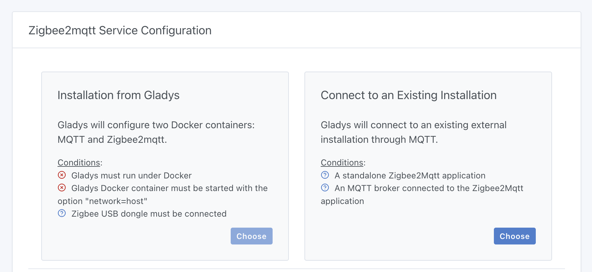
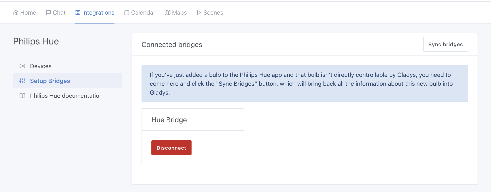
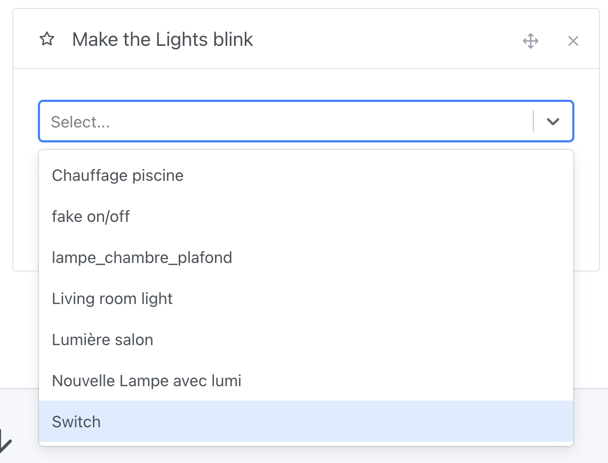

Hi everyone!

Today I'm releasing Gladys Assistant 4.40, an update to Gladys that brings a much-requested feature: the ability to use Gladys with an existing Zigbee2mqtt instance.

## Using Gladys with an existing Zigbee2mqtt instance

From now on, when you configure Zigbee2mqtt in Gladys, Gladys will offer you 2 choices:

Either you're a beginner starting from scratch, and Gladys can take care of all the Zigbee2mqtt configuration (that's what Gladys was doing until now).

Or you're an experienced user who already has an existing Zigbee2mqtt installation (for example, if you're using Home Assistant or any other home automation platform), in which case you can connect Gladys to an existing installation.

This second option lets you test Gladys without touching your installation, and you can even use 2 home automation systems at the same time!

That's the power of open-source systems 😊

If you're a user of another home automation solution, I'd love to hear from you: come and test our Zigbee2mqtt integration, and tell us on [our forum](https://en-community.gladysassistant.com/) if there are any devices that aren't yet managed: it's a great help and helps us improve!

Thanks to AlexTrovato for his work on this development 🙌

## Philips Hue: “Synchronize bridges” button added

In Philips Hue integration, in the past if you added a Philips Hue bulb to your bridge while Gladys was already running, Gladys was unaware of this new bulb.

The explanation comes from the library we use, which keeps a cache of available lights because synchronization with the bridge is a costly operation.

From now on, I've added a “Synchronize bridges” button that allows you to retrieve the latest version of the light bulb list in Gladys:

## Blink sockets in scenes

The “Blink lights” scene action now lets you select connected sockets, or any switch, allowing you to blink a light that's connected to a socket.

Be careful, however, not to flicker a traditional light bulb, as it may snap. Only use LEDs!

For example, my bathroom mirror bulb is controlled by a [Zigbee switch ZBMINIL2](https://www.domadoo.fr/fr/peripheriques/6619-sonoff-commutateur-intelligent-sans-neutre-zigbee-30-zbminil2.html?domid=17), and therefore appears in this scene action:

Thanks to Cicoub13 for this development 🙌

## LAN Manager: timeout increased to 60 seconds

I've had some feedback that the LAN Manager integration's network scan timeout wasn't sufficient: I've now increased it from 30 seconds to 60 seconds.

## How to upgrade?

If you installed Gladys with the official Raspberry Pi OS image, your instance will update **automatically** in the coming hours. It can take up to 24 hours, don't panic.

If you installed Gladys with Docker, make sure you are using Watchtower. See the [documentation](/docs/installation/docker#auto-upgrade-gladys-with-watchtower).

With Watchtower, Gladys will update automatically.

## Support us

If you want to support us, there are many ways:

- Answer posts on the forum, give your feedback.
- Help us improve the documentation.
- Develop new features/integrations on Gladys, we are 100% open-source.
- Subscribe to [Gladys Plus](/plus)
