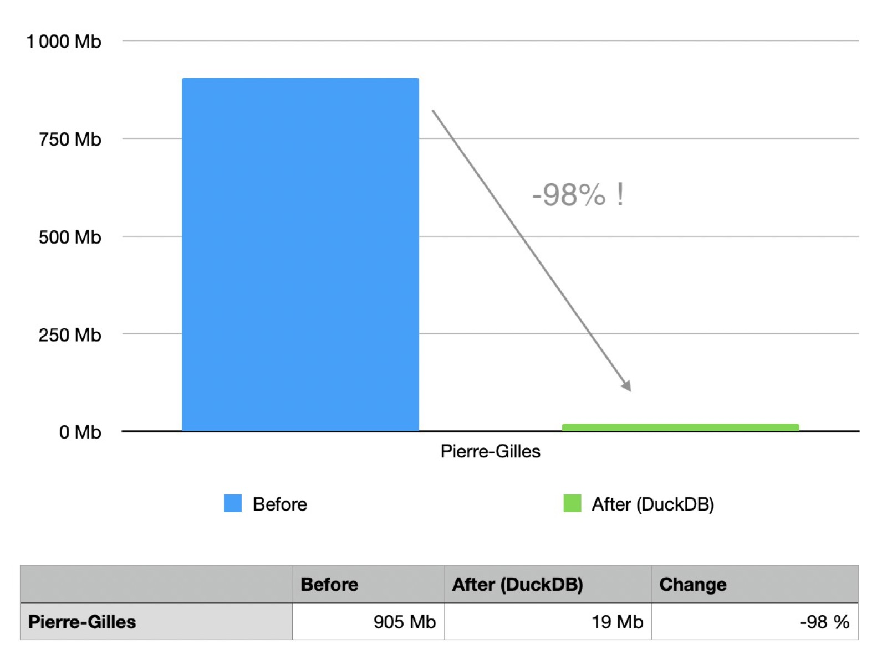
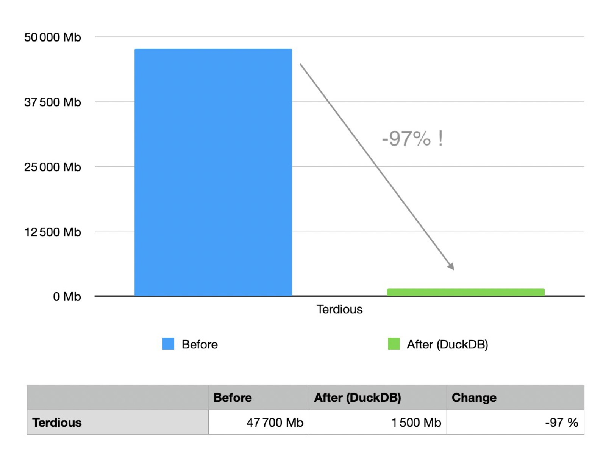
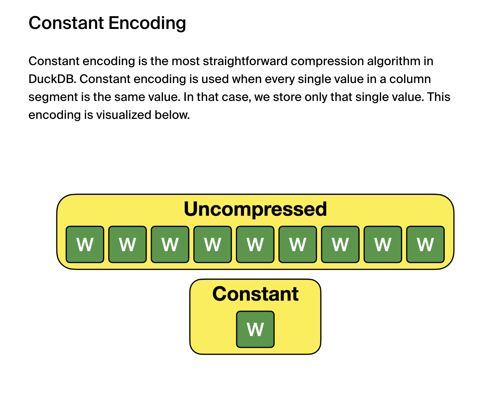
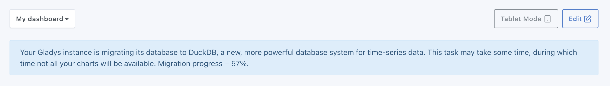
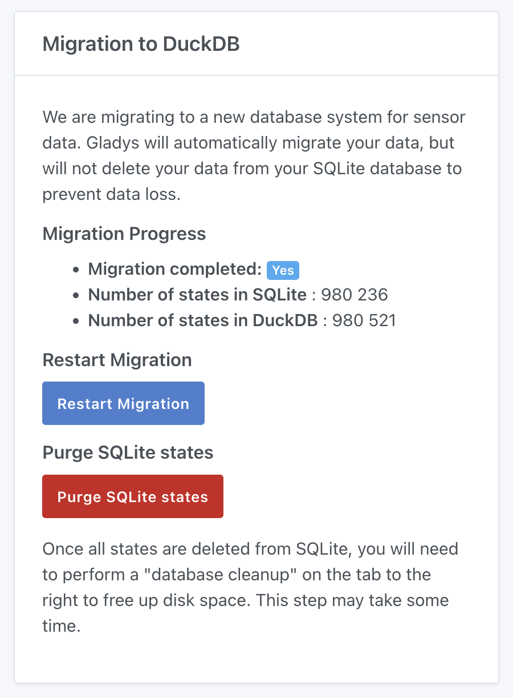
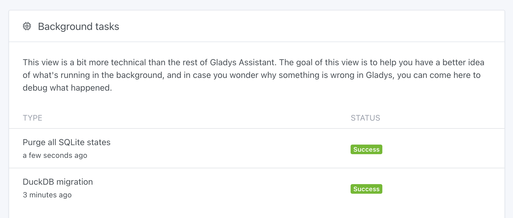
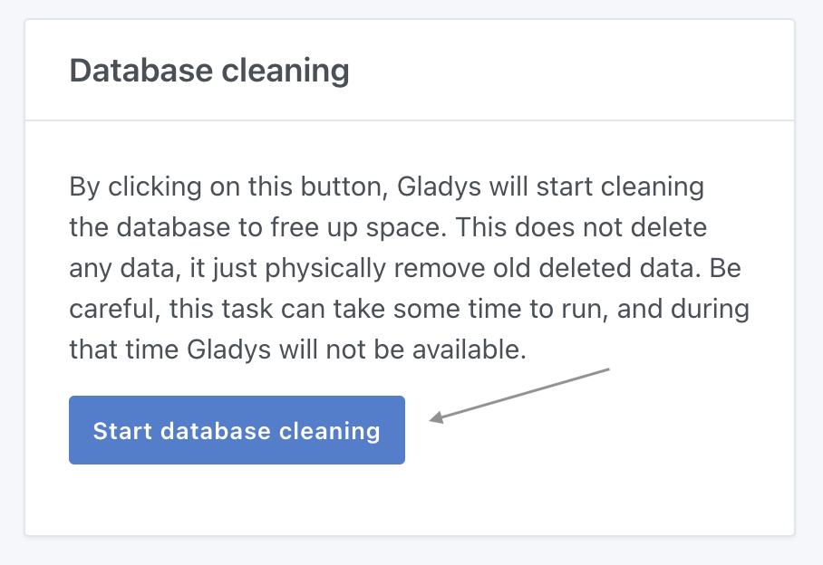

Hi everyone,

Today is a big day: I’m releasing a major version of Gladys that will drastically improve the Gladys experience and keep us at the cutting edge of data storage technology.

Imagine...

➡️ Your Gladys database shrinking from 47 GB to 1.5 GB...\
➡️ Your charts displaying instantly, even over long periods of data...\
➡️ Your Gladys Plus backups becoming lighter and faster...

Well, we did it!

## The Technology: DuckDB

[DuckDB](https://duckdb.org/) is an OLAP database system that, like SQLite, stores data in a single file.

<!--truncate-->

If we had to define DuckDB:

> DuckDB is an analytical database engine designed to offer optimal performance on large volumes of data while remaining lightweight and easy to integrate. It is particularly suited for embedded data analysis, with native support for complex SQL queries and efficient in-memory processing.

DuckDB, with its OLAP + file approach, is unique in its kind, and I had been monitoring this technology for several years.

Until recently, DuckDB was in alpha and therefore not ready to be used in production on a critical product like Gladys.

But in June, DuckDB finally reached version 1.0, with a clear announcement that the API and file format would no longer undergo major changes, making DuckDB suitable for production use.

## Integration into Gladys

Following the launch of version 1.0, I immediately started development in Gladys and did a YouTube live stream to test the technology with you.

We quickly saw together that the technology was very promising, so I continued development.

In a nutshell, the tasks included:

- Migrating the sensor history currently in SQLite to DuckDB (and if possible, without downtime)
- Setting up an interface to monitor the migration and a way to "clean" the SQLite DB afterward
- Modifying all the code that writes historical sensor values
- Rewriting the dashboard chart display queries
- Reviewing the entire Gladys Plus backup process
- Finally, testing the migration in real-world scenarios to see if DuckDB works well in daily use on real instances.

In short, there was a lot of work to do!

## The Result

On August 6th, I started the "real" tests on my personal Gladys setup.

My instance has about forty devices and has been live since February 2024.

I had a 905 MB database, with 996,000 sensor states, which after migration was reduced to:



Yes, you read that right, my database was reduced to 19 MB! It's almost ridiculous!

For the largest Gladys user, Terdious, with 80 million states for a 47.7 GB database, it was reduced to:



In short, it's quite revolutionary!

For the past 20 days, this new version has been running smoothly on my setup and other Gladys users' setups.

The charts are much faster; Terdious noticed load times twice as fast on his mini-PC.

On his Pi 4, it's even more impressive, with dashboards containing charts now displaying in 150 ms compared to 1 to 5 seconds before.

## How Does It Work Under the Hood?

At this point, you might be thinking: is this magic?

Actually, not really:

- First of all, SQLite is not suited for this use case, so we were forced to store information 4 times in the database: once for the "raw" data, once for monthly aggregated data, once for daily aggregated data, and once for hourly aggregated data. This allowed us to fetch data more quickly from pre-reduced datasets.
- Then, on the SQLite side, I had added very specific indexes to respond to queries like "Show me the values of temperature sensor XX between this morning and now." These multi-column indexes provided good performance but were storage-intensive (again, this is redundancy).
- Finally, DuckDB does an outstanding job. The data is aggressively compressed (If you're interested, there's [an article on their blog](https://duckdb.org/2022/10/28/lightweight-compression.html)).

For example, in the case of Gladys, if you have a binary sensor (door open sensor, motion sensor, leak sensor, etc.), the data is just 0s and 1s: there are only 2 possible values.

This kind of dataset is very easy to compress:



## How to Update?

Gladys should normally update automatically if you use Watchtower.

If you installed Gladys with Docker, make sure you're using Watchtower. See the [documentation](/fr/docs/installation/docker#mise-à-jour-automatique-avec-watchtower).

If you're impatient and know what you're doing, you can also manually run Watchtower in "one-shot" mode:

```sh
docker run --rm \
    -v /var/run/docker.sock:/var/run/docker.sock \
    containrrr/watchtower \
    --run-once
```

(Don't forget to use sudo if you're running Gladys as an administrator)

Once Gladys is updated to `v4.45.0`, there are several steps to take before seeing your DB shrink.

## The Migration

As soon as your instance updates, the migration to DuckDB will begin.

At the top of your dashboard, you will see a message:



During this migration, your instance may be slowed down, and your charts will not be available.

You can find the migration status in "Settings → System":



Once the migration is complete, the "Migration completed" line will change from "No" to "Yes."

Take a moment to browse Gladys and check that all your charts look correct.

If everything looks good, you can then purge the SQLite states by clicking the red "Purge SQLite states" button, which will start a task:



During this task, your Gladys instance will be a bit slower, which is normal.

Depending on the number of states in your database and the speed of your disk, this task can take a few hours or even days if you have a large DB.

Gladys remains usable, but slower!

Finally, once this purge is complete, you'll need to clean the SQLite DB so that the file on your disk is finally reduced.

To do this, click on the "Clean database" button:



This task is **blocking**, and Gladys will not be available during the cleanup.

Finally, once the task is done, restart Gladys.

You're done! You should now have a much smaller database and a much faster Gladys instance!

## Conclusion

I hope this update will bring you the same results as it has for all the testers!

In any case, I'm convinced that this update will revolutionize the use of Gladys, and I welcome your feedback.

Thanks again to all the testers who helped in the development 🙏

## Getting Started with Gladys?

If you want to get started with Gladys and don't have the hardware, I'm launching a unique starter kit! (France only for now)

I'm offering:

- A powerful mini-PC (the same one I have at home)
- Access to the Gladys training (plenty of video and written content)
- One year of Gladys Plus

All at an unbeatable price.

If you are in France and want to know more, [click here](/fr/starter-kit/)!

## Supporting the Project

There are many ways to support the project:

- Participate in discussions on the forum, help newcomers.
- Contribute to the project by proposing new integrations/features.
- Improve the documentation, which is open source.

Thanks to everyone who supports Gladys 🙏
