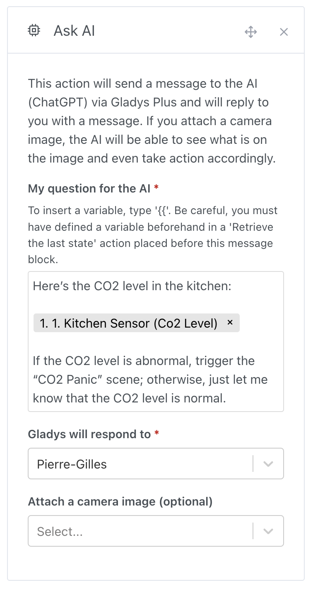

Hello everyone!

Today, I’m excited to introduce Gladys Assistant 4.48, a version where artificial intelligence is even more deeply integrated into Gladys to make your home smarter and more responsive.

Since January 2023, you could already ask ChatGPT questions through Gladys.

That was a good start, but I want to take it further! What if AI could be proactive and make decisions for you?

## Imagine the possibilities

Imagine a car pulls up in front of your house. A dedicated security guard would watch, recognize your car—its shape, color, license plate—and know immediately that it’s you. But hiring a 24/7 guard isn’t within reach for everyone!

What if AI could play that role?

In Gladys, you can now write a simple instruction, for example:

> “If a car is in front of the house, and it’s a red Tesla Model 3 with the license plate XXX, turn on the garage; otherwise, alert me that there’s an intruder.”

With Gladys 4.48, this scenario becomes a reality! You have a generalist AI ready to monitor and make decisions, just like a dedicated agent, but without the cost.

## A concrete example

This new feature is based on the OpenAI ChatGPT 4o-mini API, with its latest vision feature available to Gladys Plus subscribers.

In a scene, you can create an “Ask AI” action and, if desired, send it an image from a camera.

Take the car example:

If movement is detected outside your house, Gladys will send the garage camera image to analyze the situation. Then, based on detection:

- If the correct car is recognized, the garage light turns on.
- If another car is detected, you receive an intruder alert on your phone.

## Analyzing sensor values

The camera is just one example! You can also send sensor data to the AI and ask it to act based on the results.

For instance, you could send a CO2 sensor value and request an action if the level is abnormal:

No need to look up recommended CO2 levels in a room—the AI draws on its extensive knowledge (essentially all of the internet!) to assess the situation and act intelligently.

It’s even possible to inject values retrieved from other APIs to:

- Get a weather report first thing in the morning
- Track financial markets with a stock summary
- Check the news with an RSS feed
- Verify home security each day during your vacation (normal temperature, etc.)

The possibilities are endless! I can’t wait to see what you’ll create with this update. Share your trials on the forum to inspire others!

## Other updates

- In scenes, filters by tag or title are now saved in the URL, so you can easily return to a filter after navigating.
- Added support for pilot wire heaters in scenes.
- Camera images are now retrieved via TCP (instead of UDP), avoiding display errors (like the green band bug).
- Fixed binary charts: the first value now displays correctly.
- DuckDB: connections are now properly closed when Gladys shuts down.

Thanks to everyone who contributed to this update! 🙌

## How to update?

Make sure to use Watchtower for automatic updates. Check the [documentation](/docs/installation/docker#auto-upgrade-gladys-with-watchtower).

With Watchtower, Gladys will update automatically.
