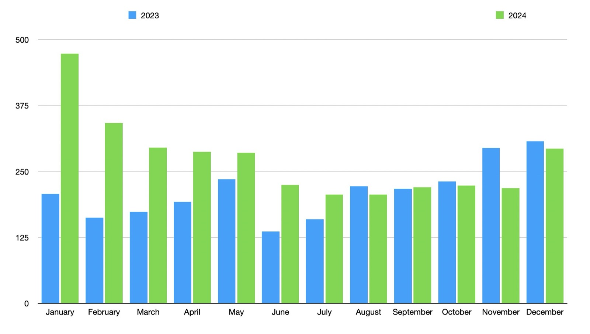
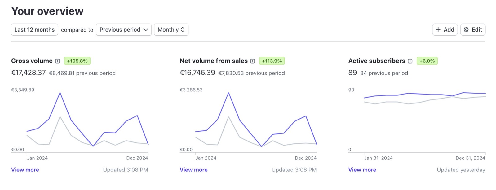
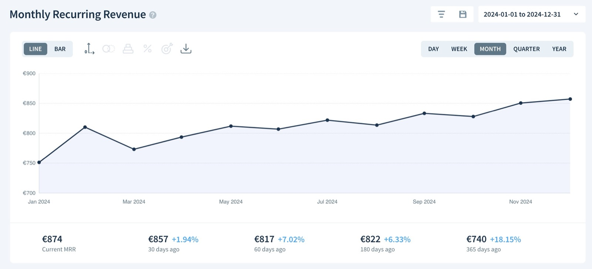
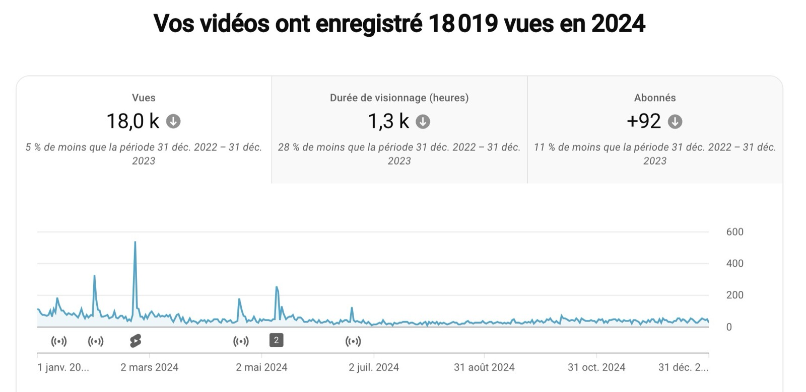

Hello everyone, and Happy New Year 2025!

I hope you had an excellent 2024.

For Gladys, 2024 was a pivotal year, marked by personal changes that allowed Gladys to develop to its full potential!

Indeed, I moved into an apartment fully automated with Gladys. It has become a real showcase of the work we've done and allowed me to record dozens of tutorials on smart home technology.

## What happened in 2024?

<!--truncate-->

2024 was an incredibly active year:

- **27 Gladys releases** (about one every two weeks)
- Filming and launching a [complete smart home training course](https://formation.gladysassistant.com/) (41 videos/articles currently available)
- Launching a starter kit including hardware

### Development

Several major features were delivered this year:

- Migration to **DuckDB**, reducing storage usage by up to 97%
- Integration of **Z-Wave JS**, **Netatmo**, **Sonos**, **Free Mobile**, **Airplay**, and more
- Support for **EDF Tempo**
- External support for **Zigbee2mqtt**
- **AI**: Voice integration with speakers (Sonos, Google Home, HomePod)
- **AI**: ChatGPT 4.0 and proactive AI in scenes

## Usage

The start of 2024 saw a significant increase in new installations compared to 2023:

The end of the year was quieter, and it’s hard to say whether this decrease in activity is due to my own slower pace — I was traveling in September/October and then on Christmas holidays at the end of the year — or if it was simply a period when everyone was generally less available. In any case, these variations are normal: there are always ups and downs 😄

### Revenue

In total, Gladys Plus generated **€17,428** in revenue in 2024, a **+105.8%** growth compared to 2023. This growth was mainly driven by the launch of the starter kit.

Gladys Plus now has an **MRR of €874**, a **+18.15%** increase from last year.

These results validate our strategic choices for Gladys, and I plan to continue on this path in 2025.

## The YouTube Channel

This year, the [YouTube channel](https://www.youtube.com/@GladysAssistant) experienced a slight drop in views, as I didn’t publish any videos in the second half of the year.

Working part-time on Gladys, I had to prioritize between development, support, documentation, filming the training course, and the starter kit. Pausing YouTube was a strategic decision, and the results confirm it. 😄

In 2025, I plan to revive the channel to attract new users. Perhaps we could organize more **live coding** sessions?

Here are a few videos published in 2024:

## Social Media

On social media:

- [Gladys Assistant Twitter](https://twitter.com/gladysassistant): **2,680 followers**
- [Gladys Assistant Facebook](https://www.facebook.com/gladysassistant): **759 likes**
- [Gladys Assistant Instagram](https://www.instagram.com/gladysassistant): **580 followers**

On my personal account: **2,354 followers** on [Twitter](https://twitter.com/pierregilles).

## The Newsletter

There are **3,187** subscribers to the [Gladys Assistant newsletter](https://email-list.gladysassistant.com/subscription/1mXJoEWEl), broken down as follows:

- **2,647** French subscribers
- **540** English subscribers

Although the French subscriber base slightly decreased, the English newsletter is growing. I also enhanced the use of this communication tool in 2024.

## Gladys Assistant GitHub

The [Gladys Assistant GitHub repository](https://github.com/GladysAssistant/Gladys) now has **2,743 stars ⭐**, a **+12.88%** increase.

Don’t forget to support the project by giving it a ⭐ if you haven’t already!

# Projects and Goals for 2025

## Matter Integration

The Matter ecosystem is becoming increasingly mature: high-quality devices are entering the market, and libraries are being developed.

On the Node.js side, the official Matter library is now available, which will allow us to build Matter compatibility.

I have a very positive view of Matter: it could finally be the unified smart home protocol I’ve been dreaming of since the project began.

I believe that in the long term, Matter might become the only protocol, creating a larger gap between different smart home software.

Currently, platforms like Home Assistant have a significant advantage due to the number of integrations, but this would diminish if Matter became the sole protocol.

If the "communication" layer were standardized with Matter, the user experience would be the main differentiator between platforms...

Which brings me to the second point:

## UX Improvements

I regularly perform "UX reviews" on Gladys, asking you: are there small issues in Gladys that bother you daily and would change your life if fixed?

Each small change incrementally improves the product, and all these changes combined make Gladys increasingly user-friendly.

In 2025, I aim to do significant work on UX to take Gladys to the next level of simplicity.

## Even More AI

If 2024 was undoubtedly the year of AI, I believe this trend will continue in 2025.

I will keep following the latest advancements in AI to bring the best to Gladys.

The goal remains the same: to make Gladys the intelligent assistant for your home.

## North American Expansion

The [international Gladys forum](https://community.gladysassistant.com/) grew significantly in 2024.

In terms of installations, 12% of new installations now come from the US, and 7% from Canada.

I believe the North American market should be my next focus. It’s a massive market (491 million people) with a strong tech-savvy audience. There are also many developers who could become contributors and help us move forward.

To target this market, here are some steps:

- Develop compatibility with the devices they use (hence the Matter development!).
- Communicate on platforms they frequent (Reddit, X?).
- Connect with local influencers.

If you have ideas, I’d love to hear them! 😄  
We even have a passionate user living in Canada who can help us better understand this market. (Hi @lmilcent 👋)

## A More Affordable Starter Kit?

The 2024 starter kit was a hit, but I’d love to offer an even cheaper kit.

The challenge is that at €259, it’s already hard to lower the price unless suppliers reduce their costs occasionally.

One idea could be to offer a kit based on a less powerful mini-PC, reducing the cost. I’m considering the non-pro version of the Beelink S12, featuring 8 GB of RAM, 256 GB of SSD, and an Intel N95 CPU.

Would a less powerful but more affordable kit interest you? 😄

## Feature Suggestions?

If you have ideas or requests for new features, feel free to propose them on the [forum](https://community.gladysassistant.com/c/feature-requests/7/l/latest?order=votes)!

# Happy New Year, and Thanks to All!

Thank you to everyone supporting Gladys, whether through help on the forum, subscribing to Gladys Plus, or purchasing the starter kit.

I hope 2025 will be as fantastic as 2024! 🚀

Pierre-Gilles Leymarie
