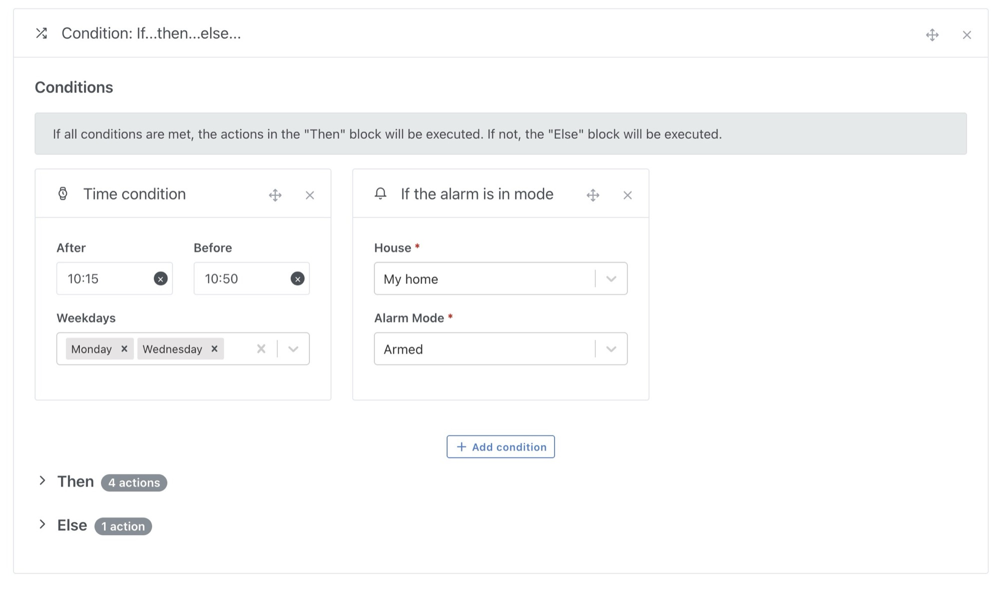
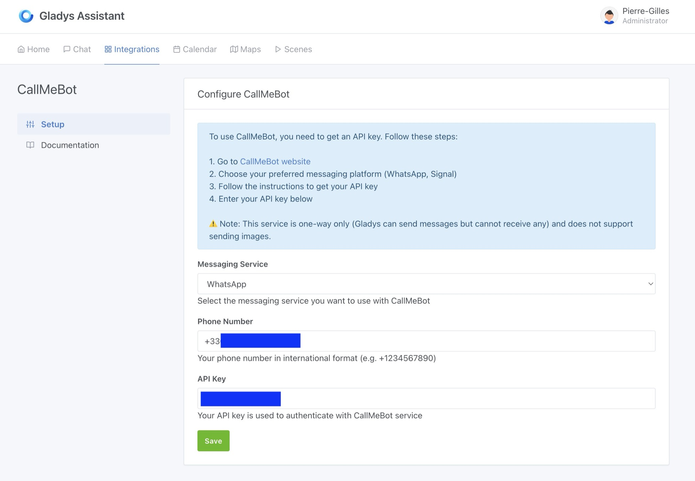

I'm excited to announce the release of Gladys Assistant v4.55.0, an update packed with significant improvements to make your smart home even more intelligent and flexible.

## "If... Then... Else" Condition in Scenes

One of the most anticipated features is finally here!

You can now add "If... Then... Else" conditions to your scenes, allowing you to create advanced scenarios with multiple execution paths. This enhancement gives you finer control over your automations without needing to create multiple scenes.

### Example Use Cases:

- **If** the temperature exceeds 25°C, **then** turn on the fan, **else** close the blinds.
- **If** someone is home, **then** turn on the lights, **else** activate away mode.

I'm looking forward to seeing how you use this feature!

## Send Messages to WhatsApp and Signal with CallMeBot

Want to receive alerts directly on WhatsApp or Signal?

Now you can, thanks to the CallMeBot integration!

You can send instant notifications to these platforms to stay informed in real-time about events in your home.

Perfect for receiving an alert in case of an intrusion or a water leak!

## Other Improvements

- **Improved camera image quality**: Resolution increased to 1280px for sharper display on the dashboard and in Telegram messages.
- **Fixed missing units on dashboard charts**: When editing a chart, device feature units are now correctly displayed. If your charts are missing units, try deselecting and reselecting the features. Apologies for the inconvenience 🙏
- **German users are now redirected to the English documentation** for better accessibility.

## Update Now!

This version brings even more flexibility and power to Gladys Assistant.

If you're using WatchTower, Gladys will update automatically within the next 24 hours.
