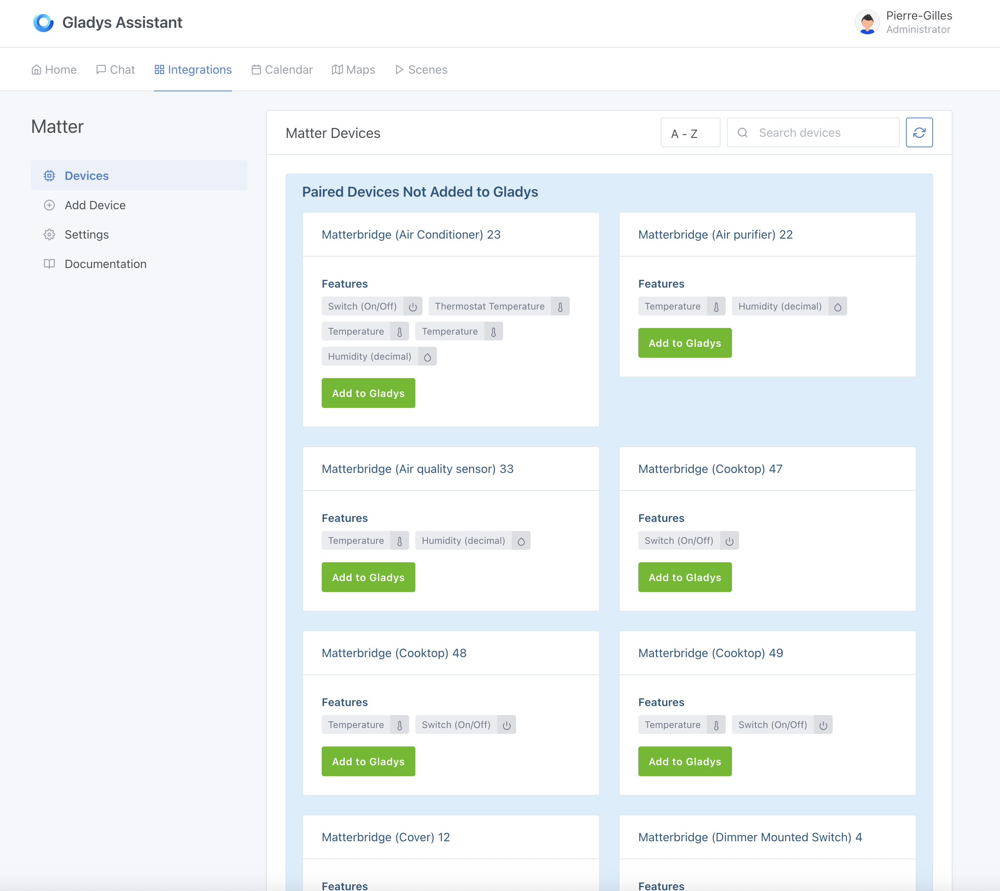
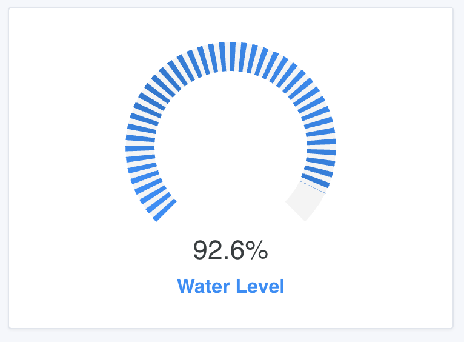
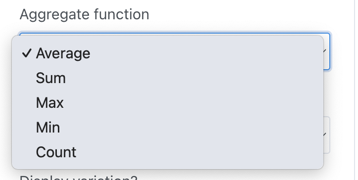
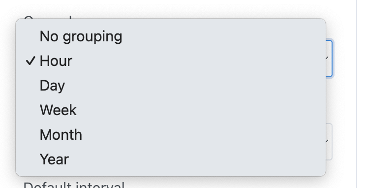
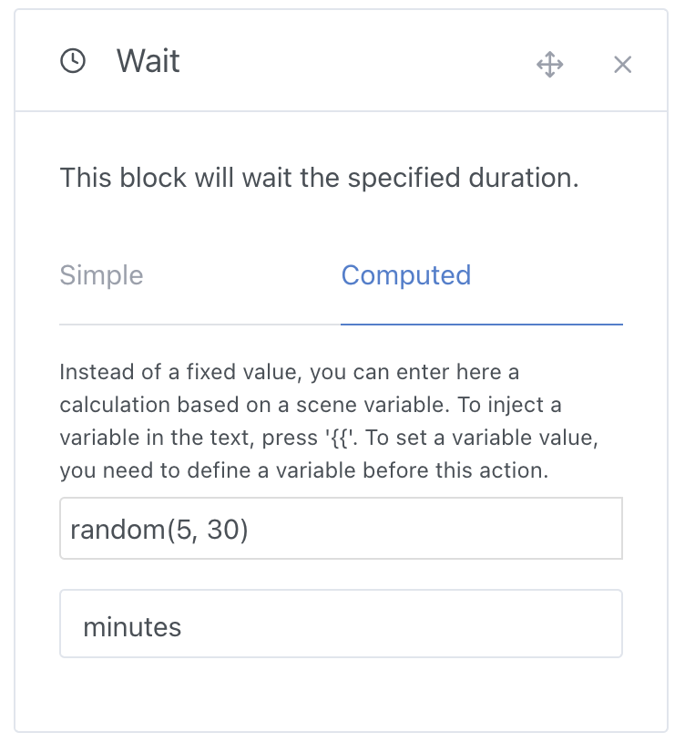
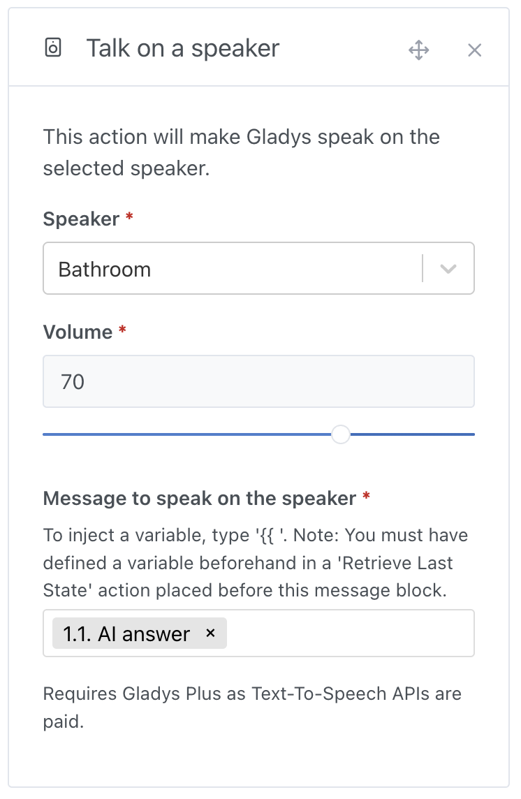
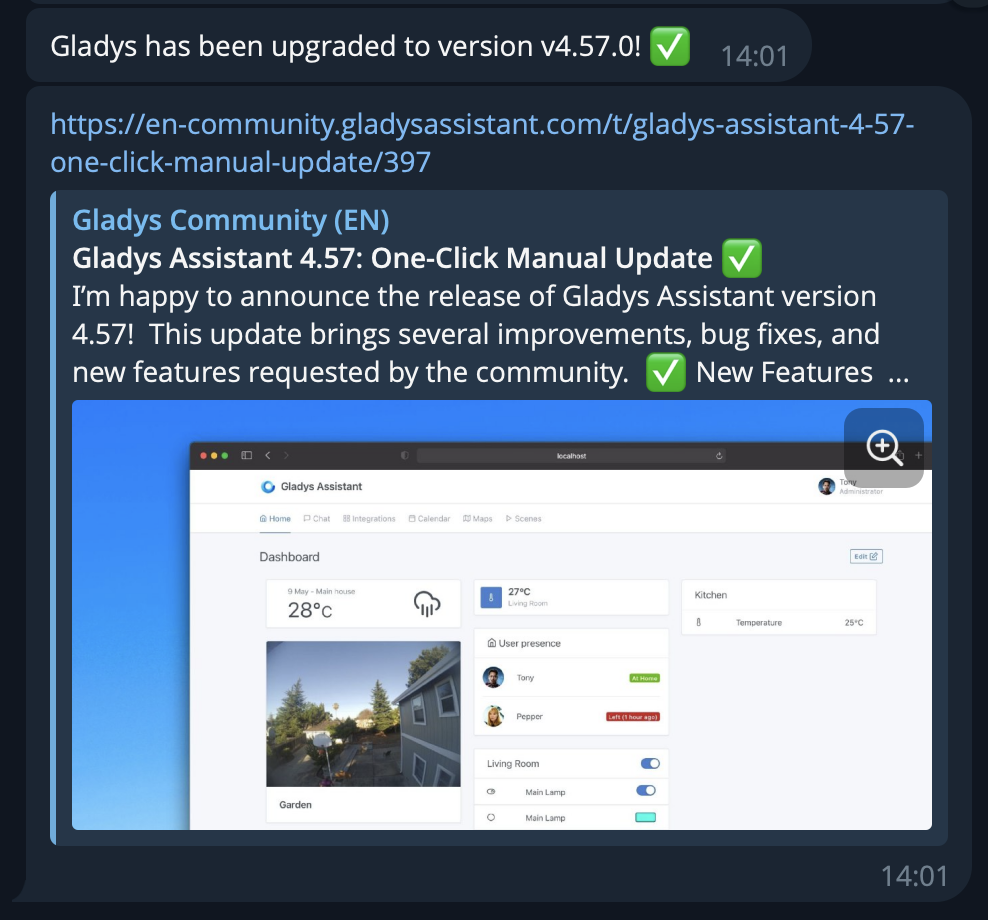
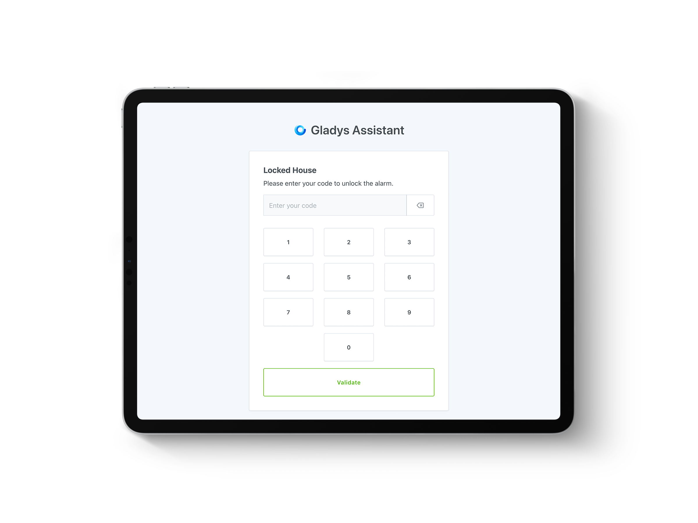
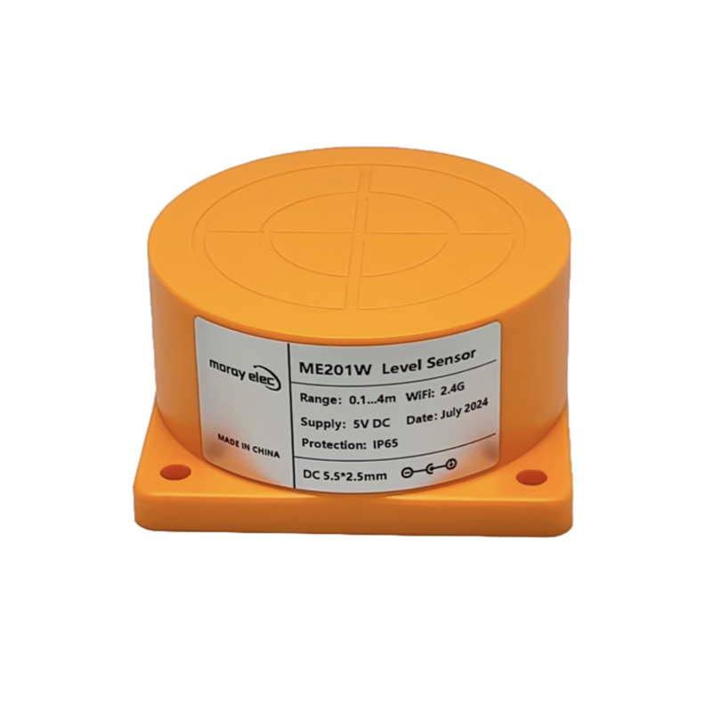
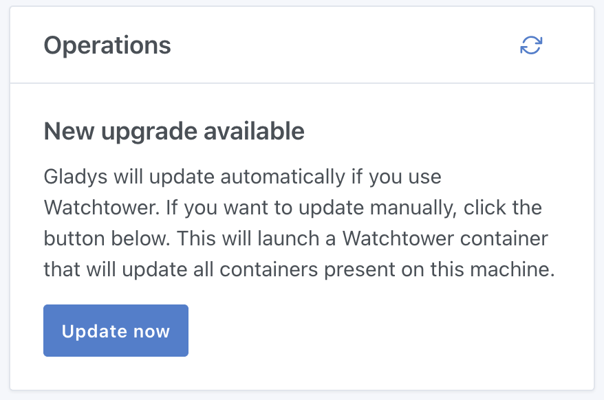

If you've been on the Gladys forum, you've probably noticed: the last few weeks have been particularly active!

Today, I'm very happy to release **Gladys Assistant 4.58**, which brings Matter support, but that's far from being the only interesting thing in this version 😄

## Matter Integration

As I mentioned in my [2024 year in review](/blog/2024-year-in-review/), I'm convinced that Matter is a small revolution in the world of smart homes, and a revolution that will have an **extremely positive impact for Gladys**.

This protocol is open, works entirely locally, and finally allows us to have a common language between devices from various brands.

No more proprietary protocols, no more third-party applications, no more cloud APIs, no more data going to third-party servers 😎

I say this protocol is open because anyone can create a Matter device, even DIY.

There is, for example, an excellent open source project, [Matterbridge](https://github.com/Luligu/matterbridge), which aims to connect non-Matter compatible devices to a Matter network. This project allows, for example, **Shelly**, **Somfy Tahoma**, **Zigbee2MQTT**, **Home Assistant** devices, and more to be compatible with Matter.

Thanks to this project, all these devices become de facto compatible with Gladys Assistant!

For those of you who have unusual devices, it's even possible to code a small Matterbridge plugin to add Matter support to your device, and thus easily integrate it into Gladys Assistant.

Anyway, this integration is now available:

My goal is to cover 100% of Matter devices, and I welcome your feedback so we can achieve this.

To get started with the Matter integration, you can follow this tutorial:

👉 [Integrate Matter devices in Gladys Assistant](/docs/integrations/matter/)

## Gauge Widget on the Dashboard

You can now add a "Gauge" widget to your dashboard, useful for visualizing the fill rate of a tank, the battery level of a device, and much more!

## Improved "Charts" Widget

The "Charts" widget now supports custom aggregation functions:

As well as grouping by interval: hour, day, week, month, year:

These improvements will allow you to better visualize your data, for example:

- Display the **cumulative** precipitation **per day**
- Display the monthly **sum** of electricity consumption
- Display the **number** of sensor values received **per week**
- Display the **minimum value** of battery **per day** of your battery storage

The possibilities are endless!

## The "Wait" Scene Action Supports Dynamic Values

It is now possible to inject variables and perform calculations in the "Wait" block.

For example, if you want to wait between 5 and 30 minutes randomly, you can use this function:

Super useful for simulating presence!

It's also possible to inject a variable from a sensor, or even from Gladys AI...

## Get the Result of an AI Query

In scenes, you can use our "Ask AI" block to ask a question to the artificial intelligence and get an opinion on a situation.

This is the true "proactive AI" we've all dreamed of!

For example, this action allows you to identify a car in a camera image, or analyze a sensor value, without you needing to intervene.

The AI's response is now injected into a scene variable, usable in all other blocks, for example, to speak on a speaker:

## Gladys Update Notification

From now on, Gladys will send you a notification when it has just updated.

The notification is sent to Gladys administrators, in their language, through their configured communication methods: Telegram, WhatsApp, Signal, or NextCloud Talk.

## Alarm: Partial Arming Now Locks Your Tablets

If you use the alarm in Gladys, and you activate partial arming at night or during a daytime nap, know that it now locks all tablets in the house, to prevent a potential intruder from accessing your home automation during your sleep!

Specifically, as soon as the "Partial Arming" mode is activated, all tablets in the house will have this display to protect your installation:

## Zigbee2MQTT: Support for the Tuya ME201WZ Level Sensor

If you want to measure the level of a tank in real-time, and receive alerts when the level is too low or too high, you can now use the [Tuya ME201WZ Zigbee sensor](https://www.domadoo.fr/fr/produits-compatibles-jeedom/7616-moray-capteur-de-niveau-d-eau-liquide-carburant-zigbee-tuya-me201wz.html?domid=17), which is fully supported by Gladys 🙂

## ZWaveJS: Energy Measurement Support

Devices that support energy measurements, such as the ZW075 AEON Labs Smart Switch Gen5, are now supported by our ZWave integration, based on ZWaveJS.

Thanks to @Sescandell for the development!

## And That's Not All!

This version brings many other improvements, including:

- **HomeKit**: limiting accessory names to a maximum of 64 characters (compliance with specifications). Thanks to @bertrandda for the development 🙏
- **MQTT** & **Zigbee2MQTT**: improved search performance on the devices page.
- **Scenes**:
  - Ability to delete the first condition in a group of multiple conditions.
  - New bottom bar to save and test a scene + confirmation before deletion. Thanks to @cicoub13 🙏
  - Added a button to insert an action group.
  - Filters are now preserved after deleting a scene.
- **Dashboard**:
  - Added a button to insert a widget at a specific position.
  - Display of "non-sensor" but non-controllable MQTT devices as sensors.
  - Fixed display of MQTT placeholders in scenes.
  - The lighting control widget only appears if there are more than two lights.
- **Local Websockets**: fixed a bug causing visual flickering on the dashboard.

The complete CHANGELOG is available [on GitHub](https://github.com/GladysAssistant/Gladys/releases/tag/v4.58.0).

Thanks to all the contributors, and to all the testers who helped me a lot for this release, especially @mutmut, who helped me enormously with Matter support.

## How to Update?

Gladys will automatically update if you use Watchtower.

Otherwise, you can use our new button to update Gladys in one click:

This button has been available since Gladys Assistant v4.57 in the `Settings` → `System` tab.

## Want to Get Started with Gladys?

If you're a beginner and looking for a simple and complete solution, I've designed an ideal kit to get started smoothly:

- A **powerful mini-PC**: 4 cores, 8/16 GB RAM, 256/500 GB SSD
- Access to a **complete training** where I show you my setup step by step
- One year subscription to **Gladys Plus**, with automatic backups, encrypted remote access, and more

All starting at 165.98€, for now only shipping [in France](https://gladysassistant.com/fr/starter-kit/).
(Ping me if you want shipping to another country!)

By choosing this kit, you save time, support an open-source project, and enjoy a solution designed to last 😎

See you soon on Gladys! 👋

Pierre-Gilles
