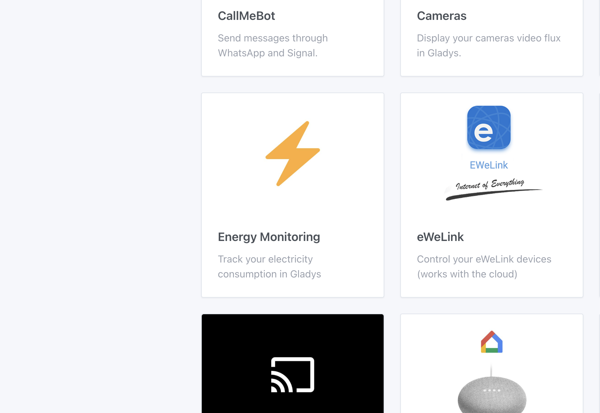
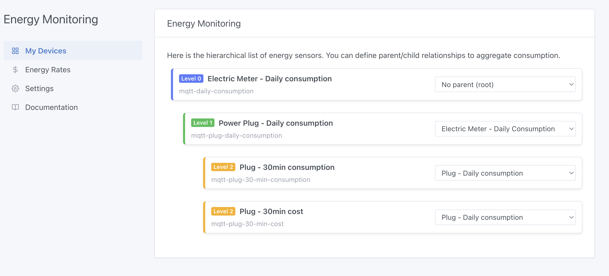
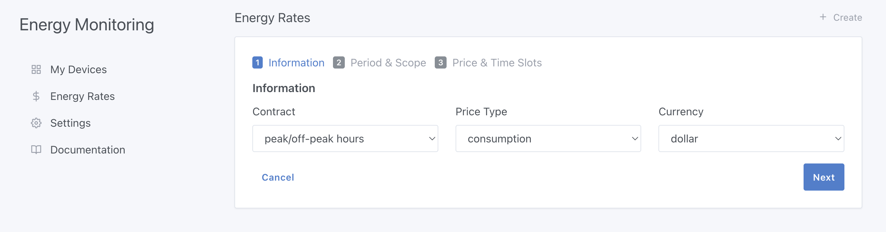
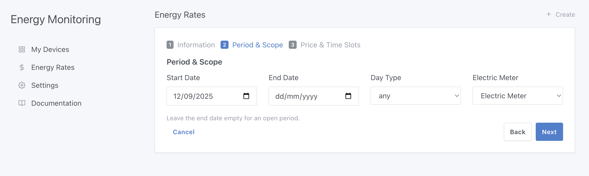
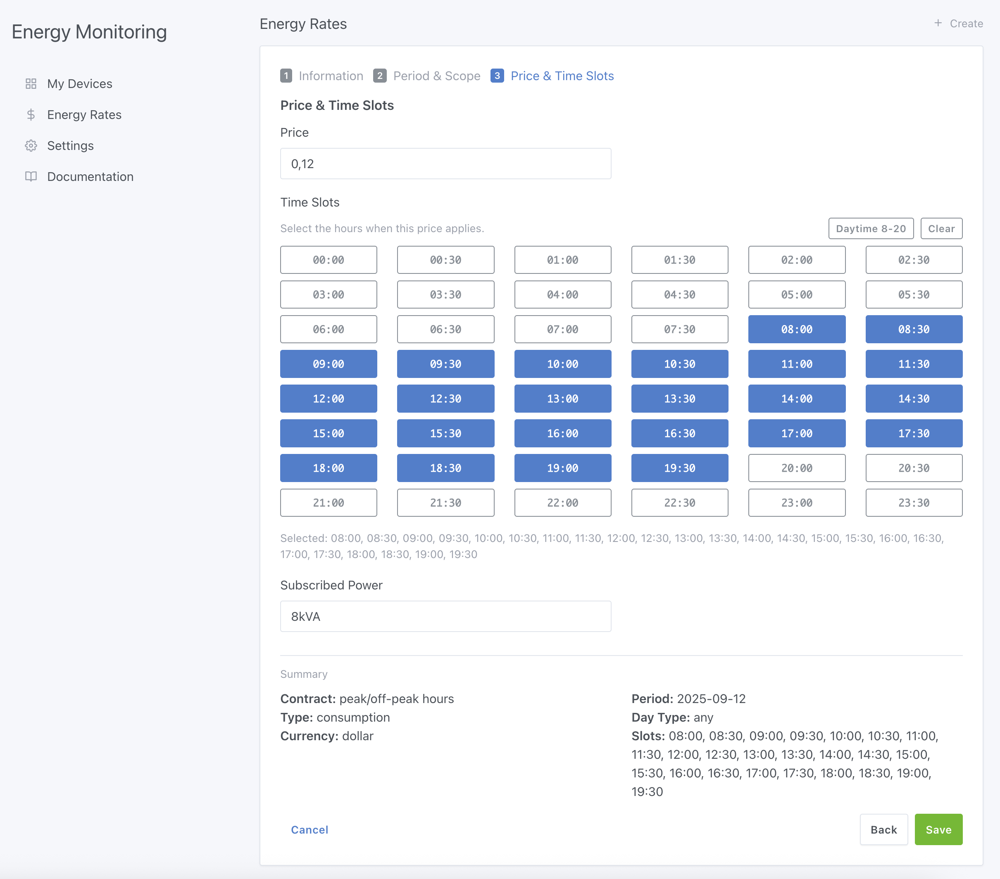
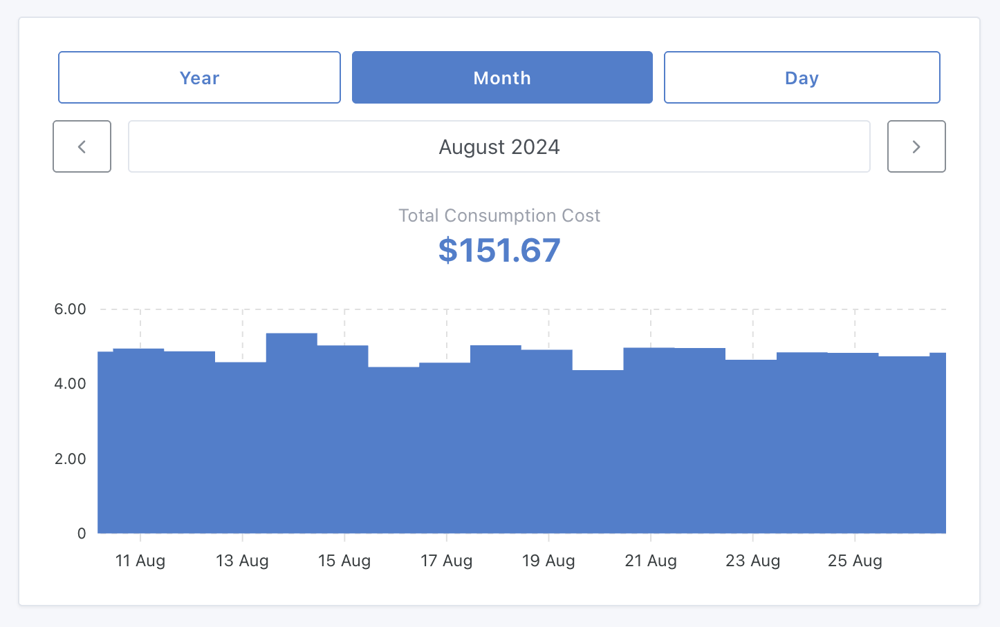

Hey everyone,

At the end of May, I was chatting with Thomas Lemaistre ([**@Terdious**](https://community.gladysassistant.com/u/terdious/summary) on the forum), and he was explaining his electrical setup: multiple meters, solar panels, an electric car... and soon batteries to store his energy.

**His goal in Gladys:**

👉 Track his consumption directly in **euros**  
👉 Visualize the different energy flows in his home  
👉 Measure the performance of his solar panels  
👉 And most importantly, know how close he is to **energy self-sufficiency** 🌞🔋

I've been dreaming about these kinds of features for Gladys for a long time 😍 But it's a big project, difficult to start without funding.

In June, **@Terdious offered to finance the development himself**. Just like that! 🎉

He prepared a detailed specification, I proposed a quote, he accepted... and I was able to start this project this summer.

Today, I'm super happy to reveal the **first part** of this development!

<!--truncate-->

## What has been developed so far

### Configuration

A brand new integration has appeared in Gladys: **"Energy Monitoring"** 🎉

This is where you'll find all options related to energy monitoring in Gladys.

In the first tab, you can define the layout of your electrical installation by organizing your devices hierarchically. This allows Gladys to understand how electricity flows in your home.

👉 Next, you can enter your electricity rates. And a major new feature: Gladys also manages rate history! Because unlike other home automation software, we all know that prices change over the years... and your calculations need to reflect reality, year after year.

For now, entry is manual, but automatic import is already planned.

**3 types of contracts are already supported:**

- Basic rate
- Peak/Off-peak hours
- EDF Tempo

The first two are completely generic, so they can be used anywhere in the world. An American user with a peak/off-peak contract, for example, can use it without any problem.

My ambition is clear: I want Gladys calculations to be as precise as those of your energy provider. Down to the cent.

**No approximations**: reliability is key.

That's actually where most of the work was: implementing an ultra-precise calculation engine. I've done tests with my own EDF Tempo contract, and the results match exactly with the values on the EDF portal ✅

And good news: this integration is compatible both with data from the Enedis integration (via Gladys Plus) and with any custom consumption source:

- a Zigbee plug,
- an MQTT sensor,
- or any other measurement you send to Gladys.

### 📊 **Dashboard**

I've added an "Energy Monitoring" widget.

It allows you to visualize your consumption by year, month, or day at a glance.

And this is just the beginning: more widgets will enhance the monitoring.

## **What's next**

This is where I need your help:

I'm looking for users willing to help me test the algorithm.

Specifically: if you agree to share with me in a private message [on the forum](https://community.gladysassistant.com/) your consumption data, I can compare it with Gladys calculations and ensure the results match perfectly.

The goal: quickly release a first beta of energy monitoring in Gladys, before moving on to the other features requested by @Terdious.

## **Thank you Thomas**

I want to thank @Terdious enormously, without whom this development simply wouldn't have happened. It's thanks to his funding that I was able to start this project, and I think the entire community can say a big THANK YOU to him 🙌

And for those who sometimes wonder why certain requests aren't implemented quickly: it's never a question of unwillingness, but of resources. I work on Gladys according to the available funding, and contributions like this are a **huge accelerator** for the project 🚀
