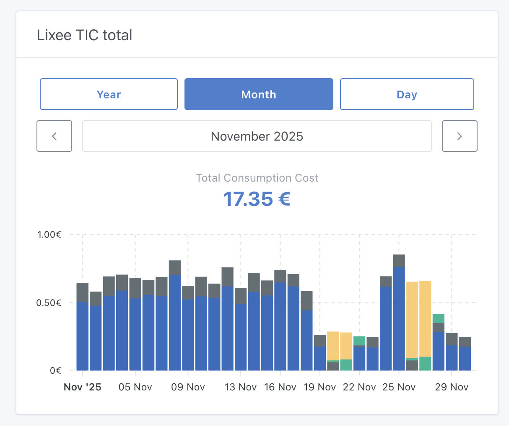

Hey everyone,

Back in September, I announced that [energy monitoring was coming to Gladys](/blog/energy-monitoring-coming-soon/). Today, I'm thrilled to announce that **it's officially live in Gladys Assistant 4.66!** 🎉

## Energy Monitoring

- **Track your consumption in kWh and euros** with precision matching your energy provider
- **Support for multiple rate types**: basic, peak/off-peak hours, and EDF Tempo
- **Historical rate management**: because prices change over time
- **Beautiful dashboard widget** to visualize your consumption by day, month, or year
- **Compatible with Zigbee devices, MQTT sensors, and the Enedis integration**

<!--truncate-->

To use this feature, update to Gladys 4.66 and check out the full documentation:

👉 [Energy Monitoring Documentation](/docs/integrations/energy-monitoring/)

## MCP Server: History Support

The [MCP server](/docs/integrations/mcp/) now supports querying device history! Your AI assistant can now answer questions like "What was the temperature in the living room yesterday?" or "Show me my energy consumption for the past week."

## Zigbee2mqtt 2.7.0

We've upgraded Zigbee2mqtt from 2.6.1 to 2.7.0, featuring the brand new **Windfront** frontend for a more modern and responsive interface. Check out the [full changelog](https://github.com/Koenkk/zigbee2mqtt/releases) for all improvements.

## Thank you

A huge thank you to **Thomas Lemaistre** ([@Terdious](https://community.gladysassistant.com/u/terdious/summary)) who funded this development and made it possible!

If you have questions or feedback, feel free to post on [the forum](https://community.gladysassistant.com/).
