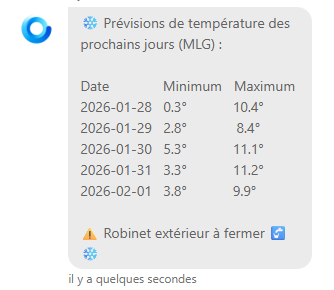

Hey everyone,

A new version of Gladys is out, with several improvements and fixes, including a one-click way to run **Matterbridge** and open the door to many more compatible devices.

{/* truncate */}

## 🆕 What's new

### Matterbridge integration

Gladys now lets you launch a **Matterbridge container in a single click**, opening the door to many more compatible devices.

Want to see how I built this integration with AI? I explain everything on YouTube:

📖 [Matterbridge documentation](/docs/integrations/matterbridge/)

⚠️ Note: if you already run Matterbridge on your instance, launching it through Gladys could cause a port conflict. There's no real benefit to running Matterbridge via Gladys if you've already set it up yourself outside of Gladys.

### Favorite integrations

You can now mark your favorite integrations to find them more quickly.

### Tasmota improvements

Automatic IP discovery over MQTT, a direct link to the device's web interface, and better sorting during discovery.

## 🐛 Fixes & improvements

- **Room temperature widget:** outlier temperature values are now excluded, and the Fahrenheit conversion for the maximum value is fixed.
- **Chat:** spaces in messages are now preserved correctly thanks to `pre-wrap`:

- **DuckDB** updated to 1.4.4.
- Fixed typos in translations.
- Improved the robustness of the MCP service.

---

Thanks to all the contributors: @bertrandda, @mutmut, @Will_71, @qleg and @Terdious for this great collaborative work! 🙌

Happy updating! 🚀
