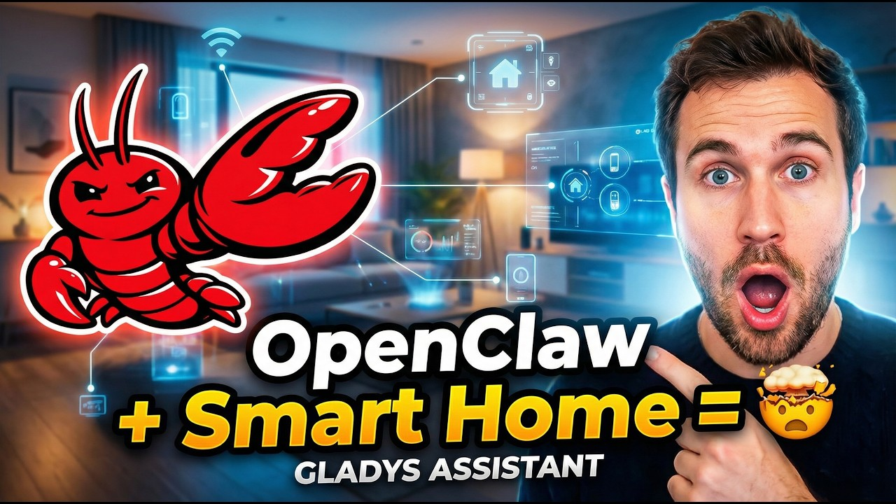

Hey everyone!

You've probably heard of **OpenClaw**, the AI framework that blew up on GitHub a few weeks ago and was just acquired by OpenAI. I decided to connect it to Gladys to see what it could do, and honestly, the result is impressive.

{/* truncate */}

I plugged OpenClaw into Gladys to test the possibilities of letting an autonomous AI agent control a real smart home. I walk through the whole experiment in this video:

**A word of caution:** I don't recommend installing OpenClaw on your Gladys server. It's still very early software, it touches a bit of everything, and it has been criticized for security issues. For this test, I deployed OpenClaw on an isolated cloud VM to keep everything sandboxed 🔐

It's a fascinating glimpse of where AI-driven home automation is heading, but safety and privacy come first.
