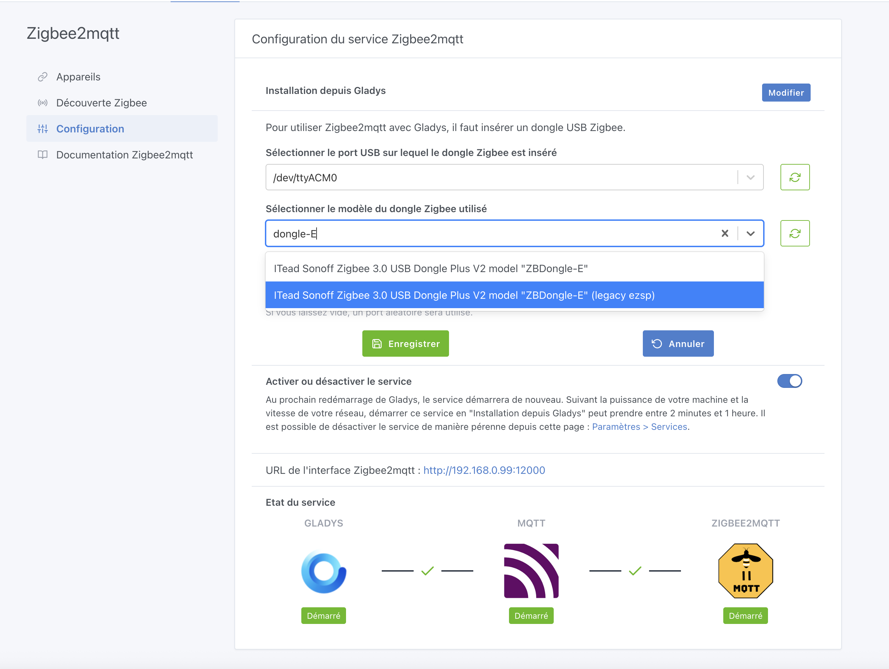
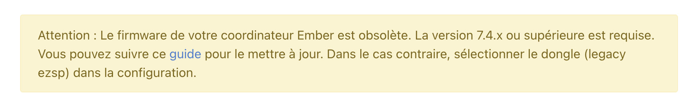

Hey everyone,

A new version of Gladys Assistant is available 🥳, featuring the new Zigbee2mqtt Ember driver and Tasmota energy tracking.

{/* truncate */}

## Zigbee2mqtt: the new Ember driver

Zigbee2mqtt now offers a new driver, **Ember**, for certain dongles such as the Sonoff ZBDongle-E. The Zigbee2mqtt integration in Gladys now lets you select this Ember driver for compatible dongles.

If you use EZSP, Zigbee2mqtt won't touch your installation without your action, to avoid breaking your setup. **Stability is a core value of the project**, and this update was designed not to impact your daily use.

If you want to switch to Ember, you can, but you'll probably need to update your Zigbee dongle's firmware first. For example, for the Sonoff Dongle-E, the integration lets you choose between "Ember" (the new default) and the old EZSP driver:

If you test the new driver and your firmware isn't compatible, don't panic, you'll see a clear message:

You can then either update the firmware or go back to EZSP for now. A big thank you to [@cicoub13](https://community.gladysassistant.com/) for this contribution!

## Dashboard: improved door/window sensor display

The display of door/window sensors on the dashboard has been improved for better readability. We now show "Open/Closed" instead of the small padlock icon, which wasn't very legible.

## Tasmota: energy tracking added

Tasmota devices are now integrated into energy monitoring. Thanks [@Terdious](https://community.gladysassistant.com/) for this development 🙌

---

The update is automatic, or you can force it in the settings. Have a great end of the week!
