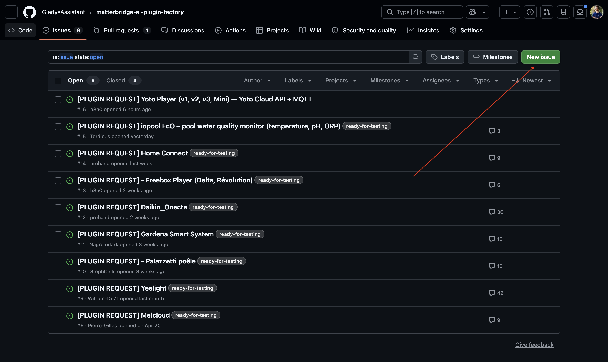
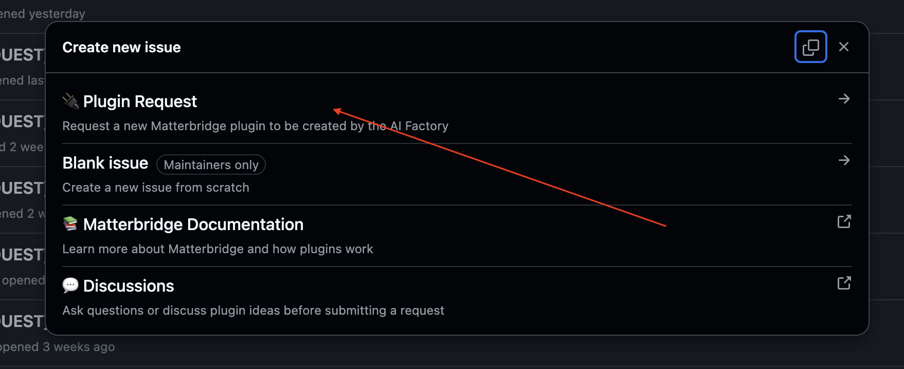
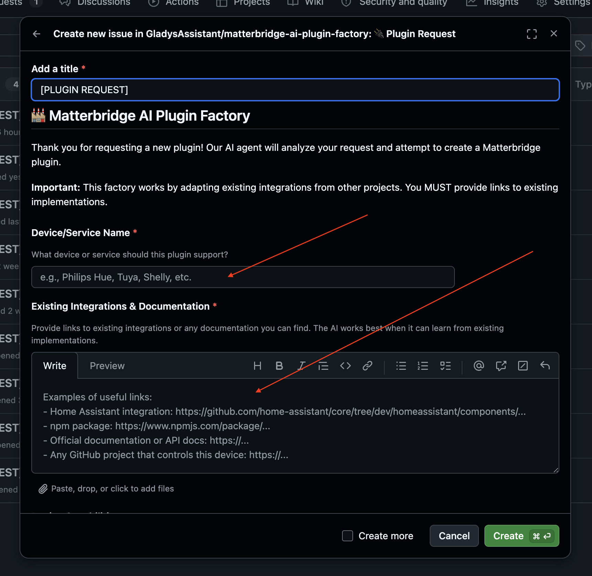
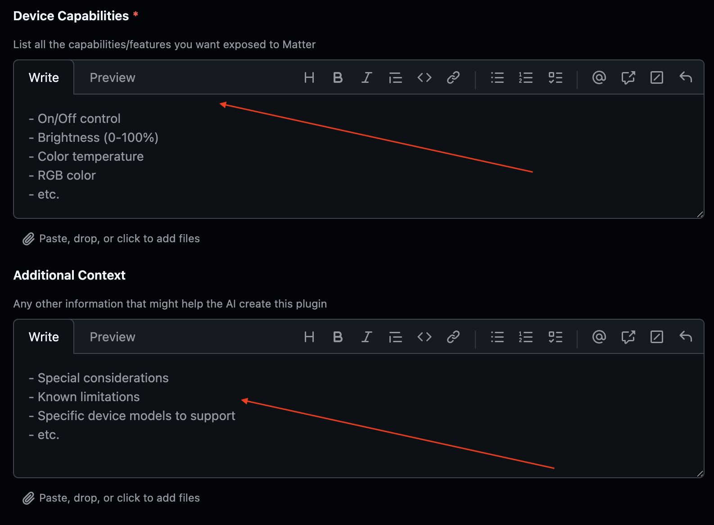
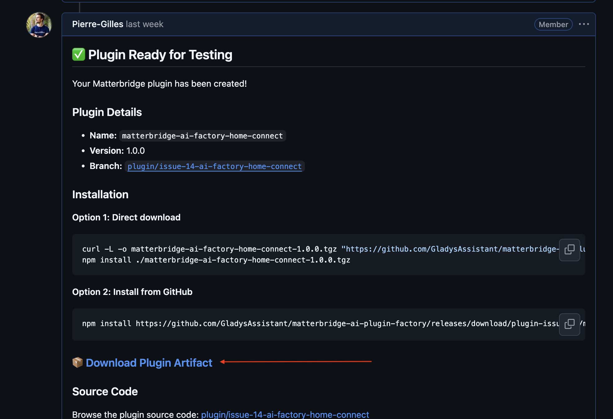
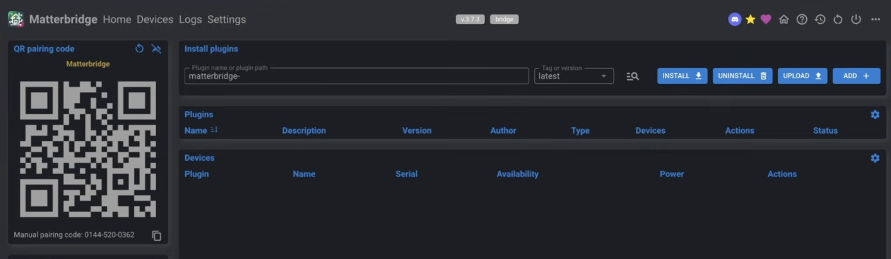
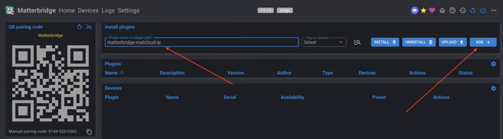
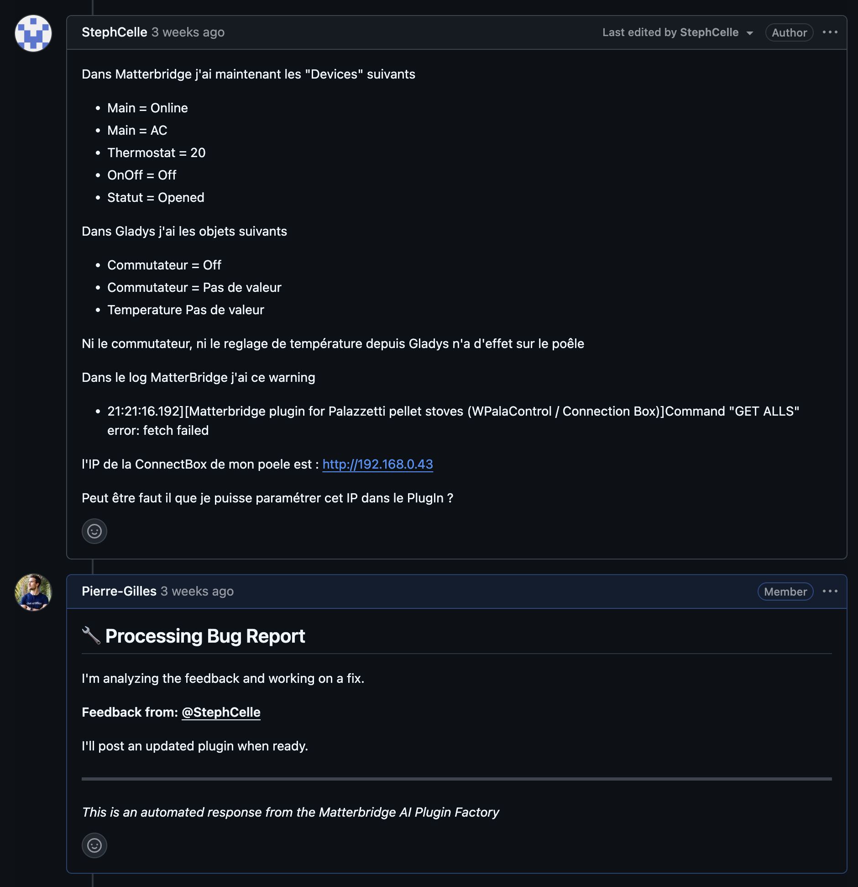

Hey everyone,

Do you have devices that aren't compatible with Gladys and don't use an open protocol like Zigbee or Matter? Don't worry. I've built an **AI-powered Matterbridge plugin factory** that automatically develops plugins for your devices. No development skills required.

{/* truncate */}

> **Prerequisite:** Matterbridge must be installed and configured. If it isn't yet, first follow [this tutorial in the documentation](/docs/integrations/matterbridge/).

## How does it work?

You open a GitHub ticket describing your device, the AI develops the plugin overnight, and all you have to do is test it. If something is wrong, you leave a comment and the AI iterates.

## Step 1: Create a GitHub ticket

Head over to the factory repository: 👉 [matterbridge-ai-plugin-factory/issues](https://github.com/GladysAssistant/matterbridge-ai-plugin-factory/issues)

Click **"New Issue"**:

Then select the **"Plugin Request"** template:

Fill in the form:

- **Title:** the name of the plugin you want
- **Links:** if you know of similar plugins on other projects (Home Assistant, Homebridge…), add the links. The more context you provide, the more relevant the result will be on the first try.
- **Features:** describe what you want to control. Examples: temperature, on/off, humidity, brightness…
- **Additional context:** optional, but useful if your device has any quirks.

> **Tip:** if you don't know what to put in the links, say so in the description and ask the AI to search on its own. But the more precise you are, the better the result.

## Step 2: Install and test the plugin

The factory runs **every morning** and processes **one plugin per run**. Once yours is developed, the AI replies directly on the ticket with a download link:

Download the file, then in Matterbridge click **"Upload +"**:

Then enter the plugin name in the **"Plugin Name"** field and click **"Add +"**:

The plugin is installed, you can test it!

## Step 3: Give feedback

If the plugin doesn't work as expected, leave a comment on the GitHub ticket. The AI will read your feedback and fix the plugin on the next run:

---

Don't hesitate to open tickets, that's exactly what it's for! And if you have questions about how the factory works, ask away.
