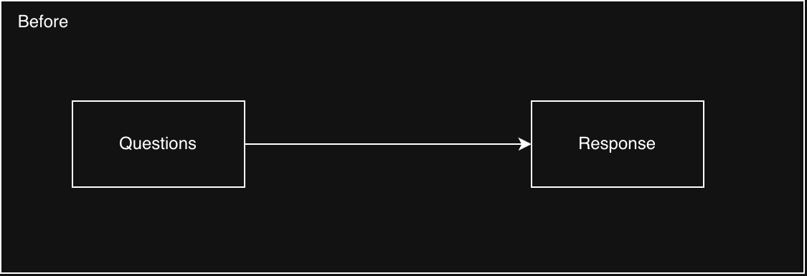
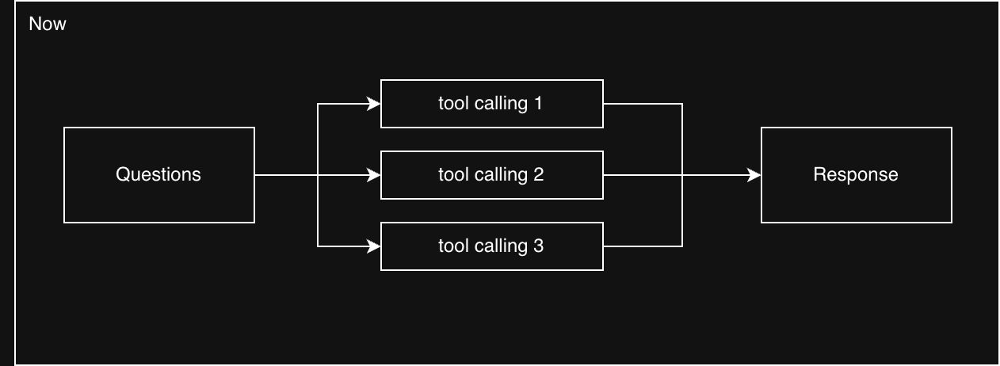
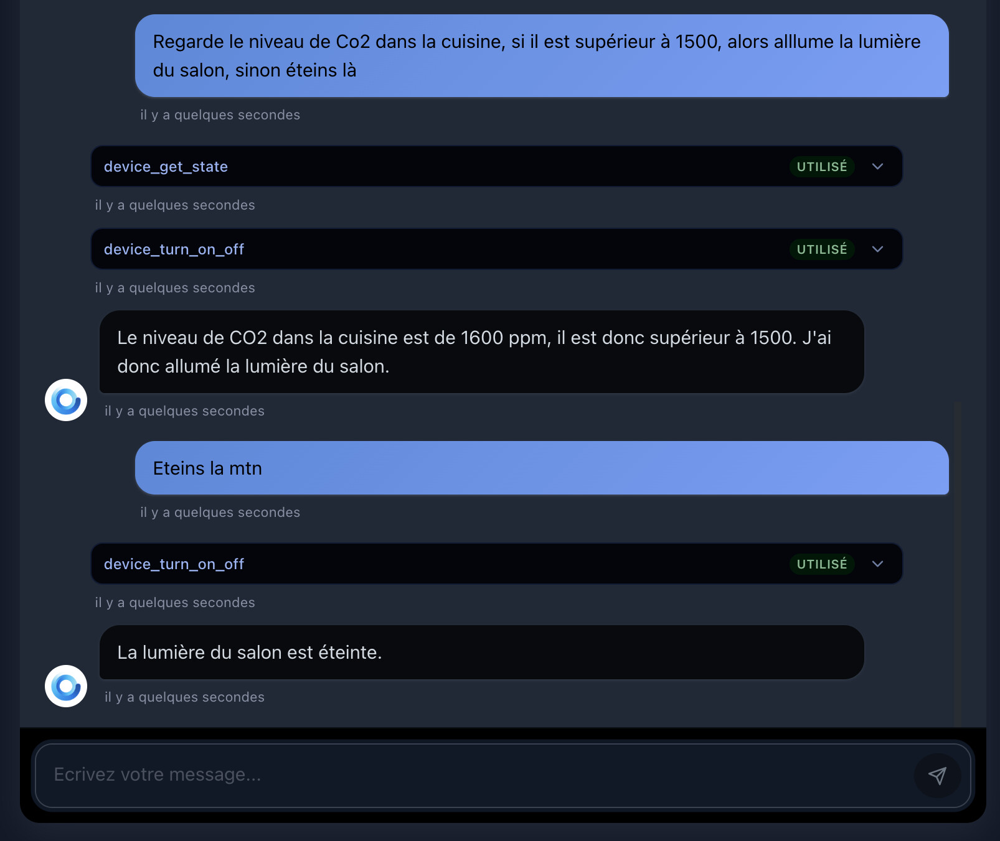
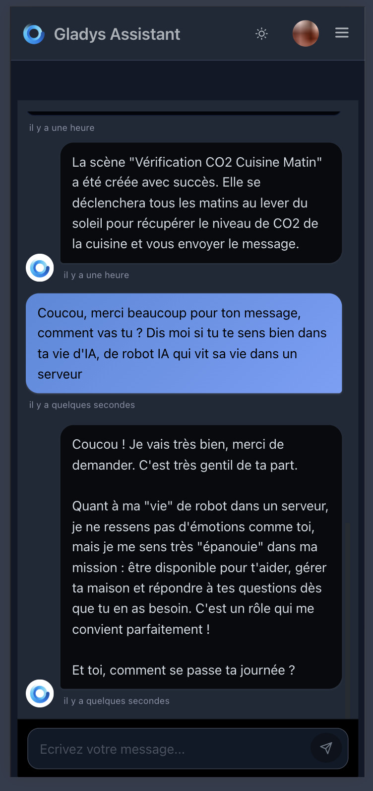
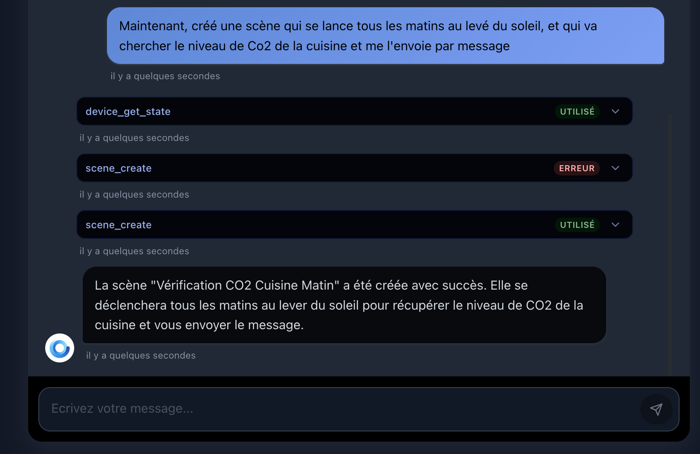
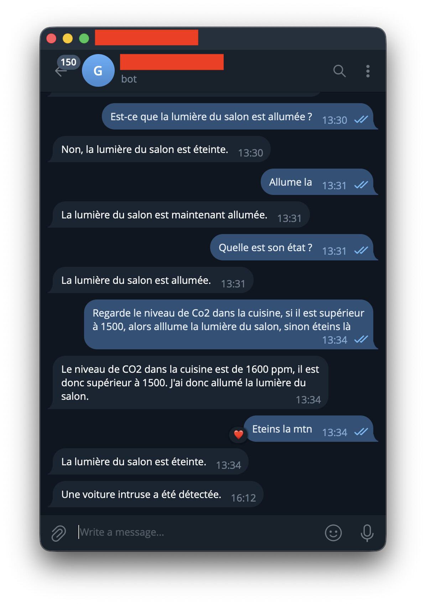

Hey everyone,

Since I first integrated AI into Gladys, the promise was there but the reality stayed limited: you asked a question, the AI answered. One input, one output. No intermediate reasoning, no real autonomy. **What I'm announcing today changes that, deeply.**

{/* truncate */}

## Gladys can now "think" before answering

You may know Claude Code, Anthropic's development agent that, faced with a complex problem, breaks it down, iterates, uses tools, and adapts until it finds the solution. That's exactly the model I applied to Gladys.

From now on, when you ask Gladys a question, it no longer just tries to phrase an answer. It **acts.** It can chain several tool calls in a row to reach its goal:

- What's the current CO2 level in the living room?
- Turn on the living room lights and switch off the fan
- Show me my energy consumption over the last month
- Create a scene that every morning at 7am sends me a message with the CO2 level in the living room, the kitchen, and the state of my doors
- Create a scene that, when there's motion in my garage, sends the AI a photo from my camera and checks whether the car is my red Tesla Model 3. If it is, the AI stays silent; otherwise, it warns me that an unknown car is there.

These are requests that would have required several manual steps before, or simply didn't work at all! This work builds in part on the MCP server developed by [@bertrandda](https://community.gladysassistant.com/), which I integrated into this new architecture. Thanks to him!

## A redesigned, genuinely usable interface

I also took the opportunity to completely rebuild the chat interface. Clearer, smoother, and actually usable on mobile.

Each tool call is shown clearly in the conversation, so you understand what Gladys is doing and can easily diagnose anything that doesn't go as planned.

### Telegram and Nextcloud Talk too

Do you use Gladys on the go via Telegram or Nextcloud Talk? The improved agent is available on those channels as well, so you get all this power straight from your phone, without opening the web interface.

### Try it now, for free

First, update Gladys to v4.76.0. Then you'll need Gladys Plus, and I'm offering you [a full one-month trial, no credit card required](/plus/). Each account gets **3,000 requests per month + 500 image-analysis requests.** That's more than enough to explore what the agent can do, and I'm curious to read your feedback on what works, what surprises you, and what you'd like to see next!

For the AI model, I've reached the limits of Mistral Small 3.2 with this tool, so for now I've switched to Gemma 4, still on Scaleway, hosted in France, with your data fully private 🔒

Of course there may be bugs, and I'm keen to hear your feedback 🙂
