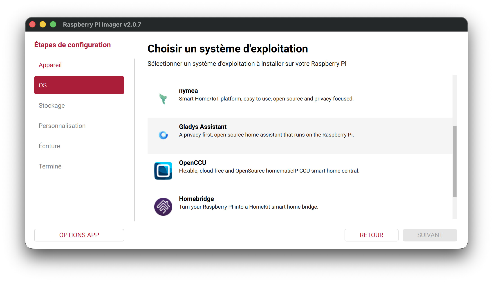

Hey everyone,

I've published a **new Gladys image for the Raspberry Pi**, compatible with the Pi 3, 4, and 5.

{/* truncate */}

This image is based on Raspberry Pi OS Trixie (Debian 13), 64-bit. It's available directly in Raspberry Pi Imager, under the *Home automation* category.

For the occasion, I also rewrote the installation tutorial on the site, with every step illustrated:

👉 [Install Gladys on a Raspberry Pi](/docs/installation/raspberry-pi/)

## My take on the Raspberry Pi

I'll be honest: I still don't think the Raspberry Pi is the best long-term option — a mini-PC remains more powerful and more reliable for a daily setup. I also strongly advise against using a microSD card: in practice, data corruption often happens after a few months. If you go with a Pi, plan for an NVMe SSD instead.

But for people who already have a Pi on hand, it's an excellent way to discover Gladys without dealing with Docker or the command line 🙂

## What's next

I'm keeping a strong focus on distribution and on finding ways to make Gladys easier to install, whatever hardware you have. The goal is for as many people as possible to be able to try Gladys and form their own opinion.

I'm working on an "Ubuntu + Gladys" image that would let you install Gladys on a mini-PC with fewer steps than a classic Ubuntu install. If you have ideas to make Gladys more accessible and easier to install, I'm all ears!

The repo: [raspberry-pi-os-gladys](https://github.com/GladysAssistant/raspberry-pi-os-gladys)
